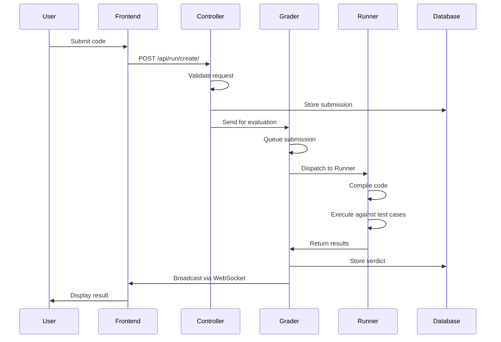

# System Internals

This document explains how omegaUp processes submissions from start to finish.

## Submission Flow

## Frontend Processing

When a submission is made:

1. Code, contest alias, problem, and language sent via HTTP POST to `/api/run/create/`
2. Nginx forwards to PHP (HHVM)
3. `bootstrap.php` loads configuration and initializes database
4. `Request` object created with parameters
5. URL tokenized: `/api/run/create/` → `['run', 'create']`
6. `RunController::apiCreate()` invoked

## Authentication & Validation

The controller:

1. Validates authentication token (cookie or POST parameter)
2. Retrieves user ID
3. Validates permissions:
   - Required elements present
   - Problem belongs to contest
   - Contest time limit not expired
   - Submission rate limit (60 seconds per problem)
   - Contest visibility (public or user listed)
4. Calculates penalty based on contest policy
5. Generates random GUID
6. Stores submission in database
7. Saves code to filesystem
8. Sends HTTP request to Grader

## Grader Processing

### Queue System

The Grader maintains eight queues:

1. **Urgent** - High-priority contests
2. **Slow Urgent** - Urgent but slow problems
3. **Contest** - Contest submissions
4. **Slow Contest** - Contest submissions for slow problems
5. **Normal** - Practice mode submissions
6. **Slow Normal** - Practice mode slow problems
7. **Rejudge** - Rejudge requests
8. **Slow Rejudge** - Rejudge for slow problems

### Queue Routing

- Contest submissions → Contest queue
- Practice submissions → Normal queue
- Rejudge requests → Rejudge queue
- Slow problems (>30s TLE) → Slow queues

Only 50% of Runners can process slow queues simultaneously to prevent monopolization.

### Dispatch Process

1. Submission added to appropriate queue
2. `RunnerDispatcher.dispatchLocked()` selects highest-priority submission
3. Free Runner selected (round-robin)
4. Dispatch time logged
5. `GradeTask.gradeTask()` invoked in thread pool
6. 10-minute deadline enforced

## Runner Processing

### Registration

- Runners register with Grader on startup
- Re-register every minute to signal liveness
- Deployed on cloud VMs

### Compilation

1. `Runner.compile()` invoked via HTTPS
2. Uses `Minijail` for secure compilation
3. Compiles main file (and validator if present)
4. Returns token (filesystem path) on success
5. Deletes temporary files on failure

### Execution

1. Grader sends compilation token + input SHA-1 hash
2. Runner checks cache for input files
3. If missing, requests `.zip` file from Grader
4. Executes compiled program against each `.in` file
5. Stores `.out` files and metadata
6. Compresses with bzip2
7. Sends results immediately to Grader
8. Validator run if present
9. Temporary files deleted

## Validation & Scoring

### Validator Types

All validators tokenize using spaces:

- **token**: Compare tokens one by one
- **token-caseless**: Case-insensitive comparison
- **token-numeric**: Compare numbers with tolerance
- **custom**: User-defined validator

### Scoring

1. Verdict determined for each test case
2. If `/testplan` exists, parse and normalize weights
3. Otherwise, equal weights (1/number of cases)
4. Cases grouped by filename prefix (before first `.`)
5. Group grants points only if all cases AC or PA
6. Total score = sum of group scores × problem points
7. Final verdict stored in database

## Broadcasting

The Broadcaster:

1. Maintains WebSocket connections for contest participants
2. Queues `RunContext` after evaluation
3. Calls `/api/scoreboard/refresh` for contest submissions
4. Updates scoreboard cache
5. Notifies all participants of scoreboard changes
6. Records timing data and destroys `RunContext`

## Related Documentation

- **[Architecture Overview](index.md)** - High-level architecture
- **[Grader](../features/grader.md)** - Grader system details
- **[Runner](../features/runner.md)** - Runner system details
