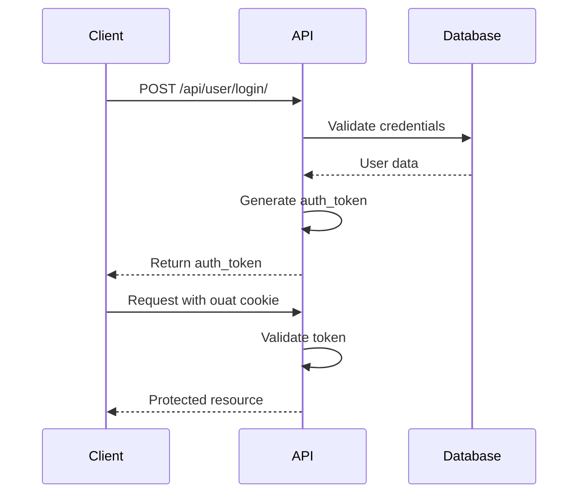

# API Authentication

omegaUp's API uses token-based authentication for secure access to protected endpoints.

## Authentication Flow



## Getting an Auth Token

### Login Endpoint

**Request:**
```bash
POST https://omegaup.com/api/user/login/
Content-Type: application/json

{
  "usernameOrEmail": "user@example.com",
  "password": "password"
}
```

**Response:**
```json
{
  "status": "ok",
  "auth_token": "abc123def456..."
}
```

## Using the Token

Include the token in a cookie named `ouat` (omegaUp Auth Token):

```bash
curl -X POST https://omegaup.com/api/problem/create/ \
  -H "Cookie: ouat=abc123def456..." \
  -H "Content-Type: application/json" \
  -d '{"title": "My Problem", ...}'
```

Alternatively, include as POST parameter:

```bash
curl -X POST https://omegaup.com/api/problem/create/ \
  -d "ouat=abc123def456..." \
  -d "title=My Problem" \
  ...
```

## Session Management

!!! important "Single Active Session"
    omegaUp supports only one active session at a time. Logging in programmatically will invalidate your browser session, and vice versa.

## Security Considerations

- **HTTPS Only**: All API communication must use HTTPS
- **Token Storage**: Store tokens securely, never commit to version control
- **Token Expiration**: Tokens may expire; handle authentication errors gracefully

## Related Documentation

- **[Users API](users.md)** - User management endpoints
- **[REST API](rest-api.md)** - General API information
