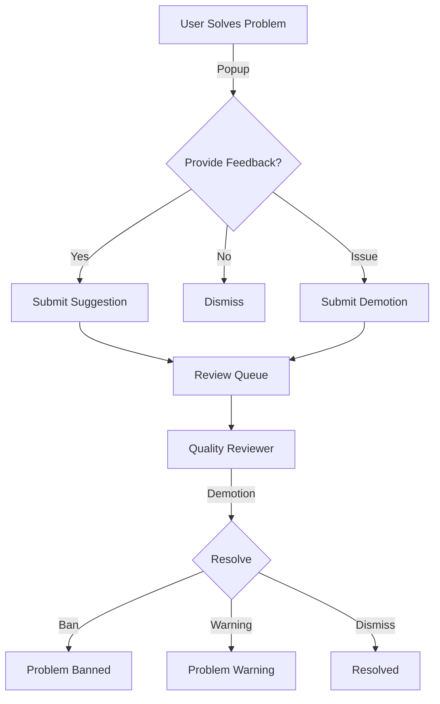

# Quality Nominations API

The Quality Nominations API allows users to provide feedback on problem quality, suggest improvements, and report issues. Quality reviewers can then process these nominations.

## Overview

The quality nomination system enables:

- **Suggestions**: Rate problem difficulty, quality, and tags
- **Promotions**: Nominate problems for quality status
- **Demotions**: Report problematic content
- **Dismissals**: Dismiss quality popups without feedback

## Nomination Types

| Type | Purpose | Who Can Submit |
|------|---------|----------------|
| `suggestion` | Rate difficulty, quality, tags | Users who solved the problem |
| `promotion` | Nominate for quality problem status | Users who solved the problem |
| `demotion` | Report issues (spam, offensive, etc.) | Any authenticated user |
| `dismissal` | Dismiss feedback request | Users who attempted/solved |
| `quality_tag` | Assign quality seal and tags | Quality reviewers only |

## Endpoints

### Create Nomination

Creates a new quality nomination.

**`POST /api/qualityNomination/create/`**

**Parameters:**

| Parameter | Type | Required | Description |
|-----------|------|----------|-------------|
| `problem_alias` | string | Yes | Problem alias |
| `nomination` | string | Yes | Type: `suggestion`, `promotion`, `demotion`, `dismissal`, `quality_tag` |
| `contents` | JSON | Yes | Nomination-specific content |

#### Suggestion Contents

```json
{
  "difficulty": 2,
  "quality": 3,
  "tags": ["problemTopicDynamicProgramming", "problemTopicGraphTheory"],
  "before_ac": false
}
```

- `difficulty`: 0-4 scale (0=trivial, 4=very hard)
- `quality`: 0-4 scale (0=poor, 4=excellent)
- `tags`: Array of allowed topic tags
- `before_ac`: True if submitted before solving

#### Promotion Contents

```json
{
  "statements": {
    "es": { "markdown": "# Problema\n\nDescripción..." },
    "en": { "markdown": "# Problem\n\nDescription..." }
  },
  "source": "Original problem by John Doe",
  "tags": ["problemTopicArrays", "problemTopicSorting"]
}
```

#### Demotion Contents

```json
{
  "reason": "duplicate",
  "original": "original-problem-alias",
  "rationale": "This is a duplicate of the original problem."
}
```

Valid reasons: `duplicate`, `no-problem-statement`, `offensive`, `other`, `spam`, `wrong-test-cases`, `poorly-described`

**Response:**

```json
{
  "qualitynomination_id": 12345
}
```

**Privileges:** Varies by nomination type (see above)

---

### List Nominations

Returns a paginated list of nominations (reviewers only).

**`GET /api/qualityNomination/list/`**

**Parameters:**

| Parameter | Type | Required | Description |
|-----------|------|----------|-------------|
| `offset` | int | No | Page number (default: 1) |
| `rowcount` | int | No | Items per page (default: 100) |
| `status` | string | No | Filter: `all`, `open`, `resolved`, `banned`, `warning` |
| `types` | array | No | Filter by type: `promotion`, `demotion` |
| `query` | string | No | Search term |
| `column` | string | No | Search column: `problem_alias`, `nominator_username`, `author_username` |

**Response:**

```json
{
  "nominations": [
    {
      "qualitynomination_id": 123,
      "problem": { "alias": "sum-two", "title": "Sum Two Numbers" },
      "nominator": { "username": "user1", "name": "User One" },
      "author": { "username": "author", "name": "Problem Author" },
      "nomination": "demotion",
      "status": "open",
      "time": { "time": 1609459200 },
      "contents": { "reason": "spam" },
      "votes": []
    }
  ],
  "pager_items": [...]
}
```

**Privileges:** Quality reviewer

---

### My Nominations

Returns nominations created by the current user.

**`GET /api/qualityNomination/myList/`**

**Parameters:**

| Parameter | Type | Required | Description |
|-----------|------|----------|-------------|
| `offset` | int | No | Page number |
| `rowcount` | int | No | Items per page |
| `types` | array | No | Filter by type |

**Privileges:** Authenticated user

---

### Assigned Nominations

Returns nominations assigned to the current reviewer.

**`GET /api/qualityNomination/myAssignedList/`**

**Parameters:**

| Parameter | Type | Required | Description |
|-----------|------|----------|-------------|
| `page` | int | No | Page number |
| `page_size` | int | No | Items per page |

**Privileges:** Quality reviewer

---

### Get Nomination Details

Returns detailed information about a nomination.

**`GET /api/qualityNomination/details/`**

**Parameters:**

| Parameter | Type | Required | Description |
|-----------|------|----------|-------------|
| `qualitynomination_id` | int | Yes | Nomination ID |

**Response:**

```json
{
  "qualitynomination_id": 123,
  "nomination": "promotion",
  "nomination_status": "open",
  "time": { "time": 1609459200 },
  "problem": { "alias": "my-problem", "title": "My Problem" },
  "nominator": { "username": "user1", "name": "User One" },
  "author": { "username": "author", "name": "Author" },
  "contents": {
    "statements": {...},
    "source": "Original",
    "tags": [...]
  },
  "original_contents": {
    "statements": {...},
    "source": "Current source",
    "tags": [...]
  },
  "reviewer": true,
  "votes": []
}
```

**Privileges:** Nominator or Quality reviewer

---

### Resolve Nomination

Resolves a demotion nomination (reviewers only).

**`POST /api/qualityNomination/resolve/`**

**Parameters:**

| Parameter | Type | Required | Description |
|-----------|------|----------|-------------|
| `qualitynomination_id` | int | Yes | Nomination ID |
| `problem_alias` | string | Yes | Problem alias |
| `status` | string | Yes | `open`, `resolved`, `banned`, `warning` |
| `rationale` | string | Yes | Explanation for decision |
| `all` | bool | No | Resolve all demotions for this problem |

**Response:**

```json
{
  "status": "ok"
}
```

**Status Effects:**

| Status | Problem Visibility |
|--------|-------------------|
| `banned` | Hidden from public |
| `warning` | Visible with warning |
| `resolved` | Normal visibility |
| `open` | No change |

**Privileges:** Quality reviewer

---

## Allowed Tags

### Topic Tags (for suggestions/promotions)

- `problemTopic2Sat`
- `problemTopicArrays`
- `problemTopicBinarySearch`
- `problemTopicDynamicProgramming`
- `problemTopicGraphTheory`
- `problemTopicGreedy`
- ... (see full list in source)

### Level Tags (for quality_tag)

- `problemLevelBasicKarel`
- `problemLevelBasicIntroductionToProgramming`
- `problemLevelIntermediateDataStructuresAndAlgorithms`
- `problemLevelAdvancedCompetitiveProgramming`
- ... (see full list in source)

---

## Workflow



---

## Use Cases

### Submit Quality Feedback

```bash
curl -X POST https://omegaup.com/api/qualityNomination/create/ \
  -d 'problem_alias=sum-two' \
  -d 'nomination=suggestion' \
  -d 'contents={"difficulty":1,"quality":3,"tags":["problemTopicArrays"]}'
```

### Report Duplicate Problem

```bash
curl -X POST https://omegaup.com/api/qualityNomination/create/ \
  -d 'problem_alias=duplicate-problem' \
  -d 'nomination=demotion' \
  -d 'contents={"reason":"duplicate","original":"original-problem"}'
```

---

## Related Documentation

- **[Problems API](problems.md)** - Problem management
- **[Users API](users.md)** - User roles and permissions

## Full Reference

For complete implementation and tag lists, see the [QualityNomination Controller](https://github.com/omegaup/omegaup/blob/main/frontend/server/src/Controllers/QualityNomination.php) source code.
