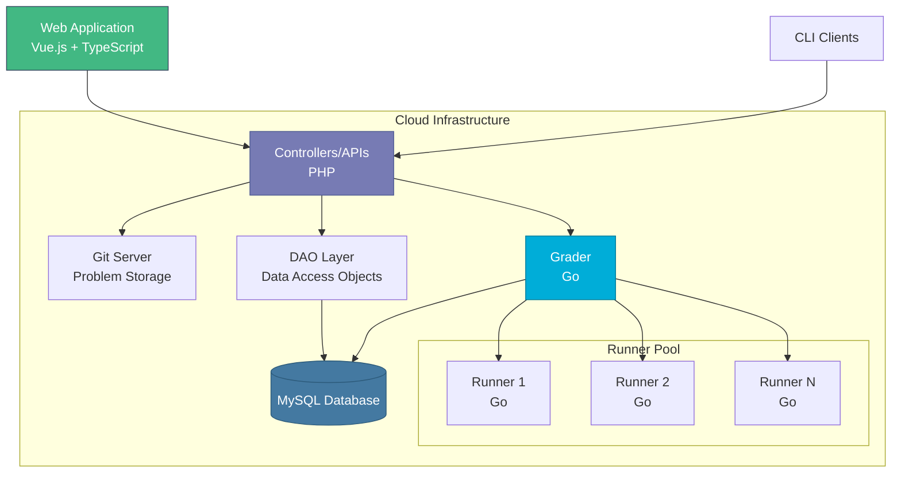

# Architecture Overview

omegaUp is built using the **Model-View-Controller (MVC)** architectural pattern, providing a clean separation of concerns between data, business logic, and presentation.

## Quick Navigation

-   :material-sitemap:{ .lg .middle } __[MVC Pattern](mvc-pattern.md)__

    ---

    Learn how omegaUp implements the MVC pattern and separates concerns.

    [:octicons-arrow-right-24: Learn More](mvc-pattern.md)

-   :material-code-tags:{ .lg .middle } __[Frontend Architecture](frontend.md)__

    ---

    Vue.js, TypeScript, and Bootstrap 4 frontend structure and organization.

    [:octicons-arrow-right-24: Explore](frontend.md)

-   :material-server:{ .lg .middle } __[Backend Architecture](backend.md)__

    ---

    PHP controllers, DAO/VO patterns, and API structure.

    [:octicons-arrow-right-24: Explore](backend.md)

-   :material-database:{ .lg .middle } __[Database Schema](database-schema.md)__

    ---

    Database structure, relationships, and data access patterns.

    [:octicons-arrow-right-24: Explore](database-schema.md)

## System Components

omegaUp consists of several key components:

### Frontend (PHP + MySQL)
The web application layer that handles user interactions, problem and contest administration, user management, rankings, and scoreboards. Written in PHP with MySQL database.

### Backend (Go)
The evaluation subsystem responsible for compiling and executing user submissions.

- **Grader**: Maintains the submission queue, dispatches to Runners, and determines verdicts
- **Runner**: Compiles and executes programs in a secure sandbox environment
- **Minijail**: Linux sandbox (forked from Chrome OS) for secure code execution

## High-Level Architecture

## Technology Stack

| Technology | Purpose | Version |
|------------|---------|---------|
| MySQL | Database | 8.0.39 |
| PHP | Controllers/API | 8.1.2 |
| Python | Cronjobs | 3.10.12 |
| TypeScript | Frontend | 4.4.4 |
| Vue.js | Frontend Framework | 2.5.22 |
| Bootstrap | UI Framework | 4.6.0 |
| Go | Grader & Runner | 20.0.1 |

!!! info "Version Updates"
    Technology versions are periodically updated to keep the platform supported and secure.

## Request Flow

When a user submits code, here's what happens:

1. **Frontend** sends HTTP POST to `/api/run/create/`
2. **Nginx** forwards request to PHP (HHVM)
3. **Bootstrap** loads configuration and initializes database
4. **Controller** (`RunController::apiCreate`) processes request
5. **Authentication** validates user token
6. **Validation** checks permissions, contest status, rate limits
7. **Database** stores submission with GUID
8. **Grader** receives submission for evaluation
9. **Runner** compiles and executes code
10. **Result** returned to frontend via WebSocket

For detailed information, see [System Internals](internals.md).

## Design Principles

### Security First
- All communication encrypted (HTTPS)
- Secure code execution via Minijail sandbox
- Authentication tokens for API access
- Rate limiting to prevent abuse

### Scalability
- Distributed Runner architecture
- Queue-based submission processing
- Caching for performance
- Database optimization

### Maintainability
- MVC pattern for separation of concerns
- DAO/VO pattern for data access
- Comprehensive test coverage
- Clear code organization

## Related Documentation

- **[MVC Pattern](mvc-pattern.md)** - Detailed MVC implementation
- **[Frontend Architecture](frontend.md)** - Frontend structure and components
- **[Backend Architecture](backend.md)** - Controllers and API design
- **[Database Schema](database-schema.md)** - Database structure and relationships
- **[System Internals](internals.md)** - Deep dive into system operation

## Academic References

omegaUp has been documented in academic papers:

- Luis Héctor CHÁVEZ, Alan GONZÁLEZ, Joemmanuel PONCE.  
  [omegaUp: Cloud-Based Contest Management System and Training Platform in the Mexican Olympiad in Informatics](http://ioinformatics.org/oi/pdf/v8_2014_169_178.pdf)
- Luis Héctor CHÁVEZ.  
  [libinteractive: A Better Way to Write Interactive Tasks](https://ioinformatics.org/journal/v9_2015_3_14.pdf)

---

**Next Steps:** Explore the [MVC Pattern](mvc-pattern.md) to understand how omegaUp organizes its code.
