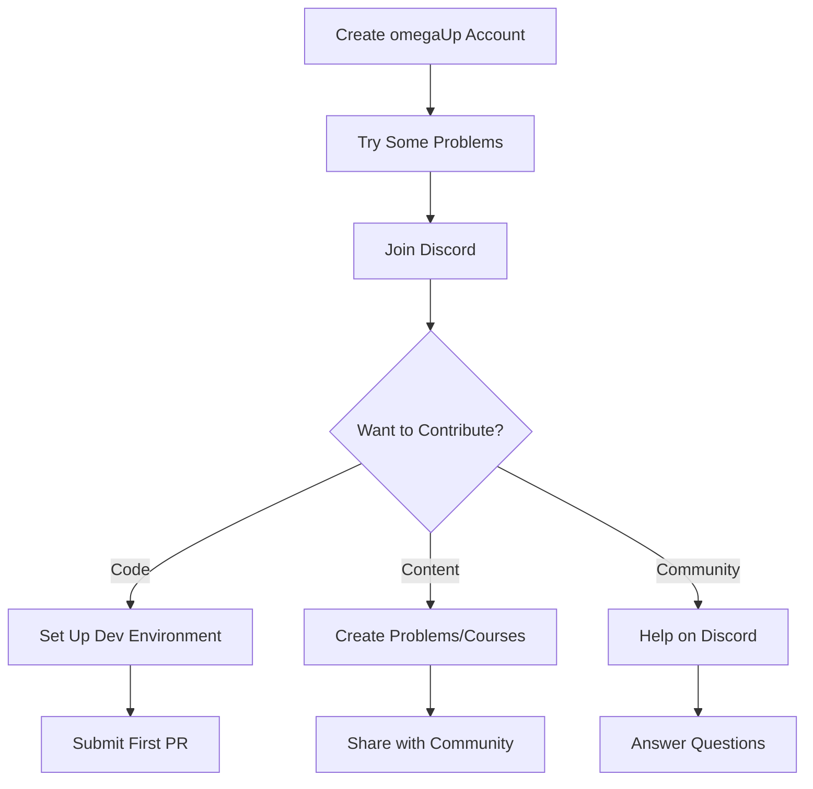

# Community

Welcome to the omegaUp community! We're a diverse group of developers, educators, and enthusiasts working together to make programming education accessible to everyone.

## About Our Community

omegaUp is an open-source project driven by volunteers who believe in the power of programming education. Our community spans multiple countries and includes:

- **Developers**: Contributing code, reviews, and technical expertise
- **Problem Setters**: Creating educational programming challenges
- **Translators**: Making content accessible in multiple languages
- **Educators**: Using omegaUp in classrooms and competitions

## Ways to Contribute

### Google Summer of Code

Our flagship program for student contributors:

| Year | Status | Description |
|------|--------|-------------|
| **[GSoC 2025](gsoc/2025.md)** | Active | 6 project ideas, mentors available |
| **[GSoC 2024](gsoc/2024.md)** | Completed | Problem Creator, Public Courses |
| **[GSoC 2023](gsoc/2023.md)** | Completed | Child accounts, Cypress migration |

[:octicons-arrow-right-24: Learn about GSoC](gsoc/index.md)

### Volunteer Development

Contribute code anytime, not just during GSoC:

1. **Set up** your [development environment](../getting-started/development-setup.md)
2. **Find** a [good first issue](https://github.com/omegaup/omegaup/labels/Good%20first%20issue)
3. **Submit** a pull request
4. **Become** a regular contributor

### Other Contributions

- **Documentation**: Improve our docs and tutorials
- **Translation**: Help translate content to more languages
- **Testing**: Report bugs and test new features
- **Problem Setting**: Create programming problems
- **Mentoring**: Help new contributors get started

## Communication Channels

### Discord (Primary)

Join our [Discord server](https://discord.gg/gMEMX7Mrwe) for:

- Real-time discussions
- Development help
- GSoC coordination
- Community announcements

### GitHub

- **[Issues](https://github.com/omegaup/omegaup/issues)**: Bug reports and feature requests
- **[Discussions](https://github.com/omegaup/omegaup/discussions)**: General conversations
- **[Pull Requests](https://github.com/omegaup/omegaup/pulls)**: Code contributions

### Blog

Visit our [blog](https://blog.omegaup.com/) for:

- Platform updates
- Technical deep-dives
- Community highlights
- Competition announcements

## Join the Team

Interested in becoming an official omegaUp team member?

- **[Recruitment](recruitment.md)** - How to join our core team

## Code of Conduct

We're committed to providing a welcoming environment for everyone:

- Be respectful and inclusive
- Help others learn and grow
- Focus on constructive feedback
- Celebrate diverse perspectives

## Getting Started

New to omegaUp? Here's your roadmap:

## Community Statistics

| Metric | Count |
|--------|-------|
| GitHub Stars | 300+ |
| GitHub Forks | 430+ |
| Contributors | 100+ |
| GSoC Participants | 10+ |

## Related Documentation

- **[Getting Started](../getting-started/index.md)** - Start contributing
- **[Contributing Guide](../getting-started/contributing.md)** - How to submit PRs
- **[Getting Help](../getting-started/getting-help.md)** - Where to ask questions
- **[Development Overview](../development/index.md)** - Technical resources
