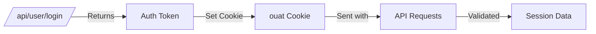
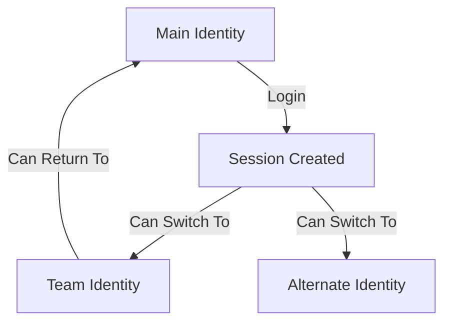

# Admin & System API

This page documents administrative endpoints and system utility APIs including session management, time synchronization, and platform statistics.

## Session API

### Get Current Session

Returns information about the current session and server time. Useful for synchronizing client time with server.

**`GET /api/session/currentSession/`**

**Parameters:**

| Parameter | Type | Required | Description |
|-----------|------|----------|-------------|
| `auth_token` | string | No | Authentication token (usually from cookie) |

**Response:**

```json
{
  "session": {
    "valid": true,
    "email": "user@example.com",
    "user": { ... },
    "identity": { ... },
    "classname": "user-rank-expert",
    "auth_token": "abc123...",
    "is_admin": false,
    "associated_identities": [
      { "username": "main-user", "default": true },
      { "username": "team:group:team1", "default": false }
    ],
    "api_tokens": [
      {
        "name": "CI Token",
        "timestamp": { "time": 1609459200 },
        "last_used": { "time": 1704067200 },
        "rate_limit": {
          "limit": 1000,
          "remaining": 950,
          "reset": { "time": 1704070800 }
        }
      }
    ]
  },
  "time": 1704067200
}
```

**Session Fields:**

| Field | Description |
|-------|-------------|
| `valid` | Whether session is authenticated |
| `email` | User's email address |
| `user` | Full user object |
| `identity` | Current active identity |
| `loginIdentity` | Original login identity |
| `classname` | CSS class for user rank display |
| `is_admin` | System administrator status |
| `associated_identities` | Linked identities (teams, etc.) |
| `api_tokens` | Active API tokens |

**Privileges:** Public (returns limited data if not authenticated)

---

## Time API

### Get Server Time

Returns the current server timestamp. Essential for arena time synchronization.

**`GET /api/time/get/`**

**Response:**

```json
{
  "time": 1704067200
}
```

**Use Cases:**

- Synchronize contest timers with server
- Calculate time drift between client and server
- Display accurate remaining time in contests

**Privileges:** Public (no authentication required)

---

## Admin API

### Platform Report Statistics

Returns aggregate platform statistics for administrative reporting.

**`GET /api/admin/platformReportStats/`**

**Parameters:**

| Parameter | Type | Required | Description |
|-----------|------|----------|-------------|
| `start_time` | int | No | Start timestamp (default: Jan 1 of current year) |
| `end_time` | int | No | End timestamp (default: current time) |

**Response:**

```json
{
  "report": {
    "activeUsers": {
      "male": 5000,
      "female": 2500,
      "other": 500,
      "decline": 1000
    },
    "acceptedSubmissions": 150000,
    "activeSchools": 500,
    "courses": 50,
    "omiCourse": {
      "attemptedUsers": 1000,
      "passedUsers": 700,
      "completedUsers": 500
    }
  }
}
```

**Metrics:**

| Metric | Description |
|--------|-------------|
| `activeUsers` | Users with activity, by gender |
| `acceptedSubmissions` | Total AC submissions |
| `activeSchools` | Schools with active users |
| `courses` | Number of courses |
| `omiCourse` | OMI course statistics |

**Privileges:** System administrator only

---

## Authentication Flow

### Cookie-Based Authentication

omegaUp uses the `ouat` (omegaUp Auth Token) cookie for session management.



### API Token Authentication

For programmatic access, use API tokens via the `Authorization` header:

```bash
# Simple token
curl -H "Authorization: token abc123..." https://omegaup.com/api/...

# Token with identity selection
curl -H "Authorization: token Credential=abc123,Username=team:group:team1" \
  https://omegaup.com/api/...
```

---

## Rate Limiting

API tokens have rate limits returned in response headers:

| Header | Description |
|--------|-------------|
| `X-RateLimit-Limit` | Maximum requests per period |
| `X-RateLimit-Remaining` | Requests remaining |
| `X-RateLimit-Reset` | Unix timestamp when limit resets |
| `Retry-After` | Seconds to wait (when limit exceeded) |

**Error Response (429):**

```json
{
  "status": "error",
  "error": "Rate limit exceeded",
  "errorcode": 429
}
```

---

## Identity Switching

Users with associated identities (teams, alternate identities) can switch between them:



This is handled internally when selecting an identity in the UI or via API token credentials.

---

## Use Cases

### Time Synchronization

```javascript
// Sync client time with server
async function syncTime() {
  const response = await fetch('/api/time/get/');
  const { time } = await response.json();
  const serverTime = time * 1000; // Convert to milliseconds
  const clientTime = Date.now();
  const drift = serverTime - clientTime;
  return drift;
}
```

### Check Session Status

```javascript
async function checkSession() {
  const response = await fetch('/api/session/currentSession/');
  const { session } = await response.json();
  
  if (!session.valid) {
    // Redirect to login
    window.location.href = '/login/';
    return;
  }
  
  console.log(`Logged in as: ${session.identity.username}`);
  console.log(`Admin: ${session.is_admin}`);
}
```

---

## Related Documentation

- **[Authentication](authentication.md)** - Detailed authentication guide
- **[Users API](users.md)** - User management and login

## Full Reference

For complete implementation details, see:

- [Session Controller](https://github.com/omegaup/omegaup/blob/main/frontend/server/src/Controllers/Session.php)
- [Time Controller](https://github.com/omegaup/omegaup/blob/main/frontend/server/src/Controllers/Time.php)
- [Admin Controller](https://github.com/omegaup/omegaup/blob/main/frontend/server/src/Controllers/Admin.php)
