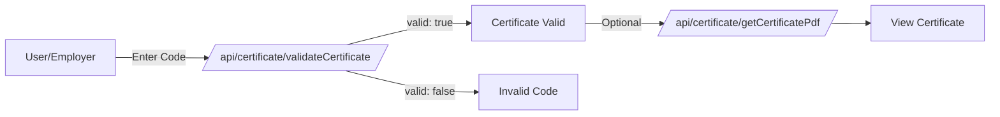

# Certificates API

Certificates are PDF documents that recognize user achievements in contests and courses. This API provides endpoints for generating, retrieving, and validating certificates.

## Overview

omegaUp issues certificates for:

- **Contest Participation**: Recognizing contest placement or participation
- **Course Completion**: Completing educational courses
- **Coder of the Month**: Monthly recognition awards

Each certificate has a unique verification code that can be validated.

## Endpoints

### Generate Contest Certificates

Generates certificates for all qualifying participants in a contest.

**`POST /api/certificate/generateContestCertificates/`**

**Parameters:**

| Parameter | Type | Required | Description |
|-----------|------|----------|-------------|
| `contest_alias` | string | Yes | Contest alias |
| `certificates_cutoff` | int | No | Rank cutoff for certificates |

**Response:**

```json
{
  "status": "ok"
}
```

**Privileges:** Certificate generator + Contest admin

**Requirements:**

- Contest must have ended
- Certificates must not already be generated (`uninitiated` or `retryable_error` status)

**Process:**

1. Request is queued via RabbitMQ
2. Certificates are generated asynchronously
3. Status changes to `queued` → `generated`

---

### Get Certificate PDF

Retrieves the PDF for a certificate by verification code.

**`GET /api/certificate/getCertificatePdf/`**

**Parameters:**

| Parameter | Type | Required | Description |
|-----------|------|----------|-------------|
| `verification_code` | string | Yes | Certificate verification code |

**Response:**

```json
{
  "certificate": "base64-encoded-pdf-content"
}
```

Returns `null` for `certificate` if the verification code is invalid.

**Privileges:** Public

---

### Get User's Certificates

Returns all certificates belonging to a user.

**`GET /api/certificate/getUserCertificates/`**

**Parameters:**

| Parameter | Type | Required | Description |
|-----------|------|----------|-------------|
| `user_id` | int | Yes | User ID |

**Response:**

```json
{
  "certificates": [
    {
      "certificate_type": "contest",
      "name": "Annual Programming Contest 2024",
      "date": { "time": 1704067200 },
      "verification_code": "ABC123XYZ"
    },
    {
      "certificate_type": "course",
      "name": "Introduction to Algorithms",
      "date": { "time": 1701388800 },
      "verification_code": "DEF456UVW"
    }
  ]
}
```

**Privileges:** Own certificates or System admin

---

### Validate Certificate

Verifies if a certificate is valid.

**`GET /api/certificate/validateCertificate/`**

**Parameters:**

| Parameter | Type | Required | Description |
|-----------|------|----------|-------------|
| `verification_code` | string | Yes | Certificate verification code |

**Response:**

```json
{
  "valid": true
}
```

**Privileges:** Public

---

## Certificate Types

### Contest Certificates

Issued for:
- **Placement**: 1st, 2nd, 3rd place (with place suffix)
- **Participation**: General participation recognition

Certificate includes:
- Participant name
- Contest name
- Placement (if applicable)
- Date
- Verification code

### Course Certificates

Issued upon course completion.

Certificate includes:
- Student name
- Course name
- Completion date
- Verification code

### Coder of the Month

Issued to monthly winners.

Certificate includes:
- Winner name
- Month/Year
- Verification code

---

## Certificate PDF Structure

Certificates are generated using a standard template with:

- omegaUp header and logo
- Recognition text
- Recipient name (prominent)
- Achievement description
- Date and place
- Director signature
- Verification code and URL

---

## Verification Flow



---

## Certificate Statuses

For contest certificates:

| Status | Description |
|--------|-------------|
| `uninitiated` | Not yet generated |
| `queued` | Generation in progress |
| `generated` | Successfully created |
| `retryable_error` | Failed, can retry |

---

## Use Cases

### Verify a Certificate

```bash
# Check if certificate is valid
curl "https://omegaup.com/api/certificate/validateCertificate/?verification_code=ABC123XYZ"

# Download PDF if valid
curl "https://omegaup.com/api/certificate/getCertificatePdf/?verification_code=ABC123XYZ" \
  | jq -r '.certificate' | base64 -d > certificate.pdf
```

### Contest Admin: Generate Certificates

```bash
# Generate certificates for top 10 finishers
curl -X POST https://omegaup.com/api/certificate/generateContestCertificates/ \
  -d "contest_alias=annual-contest-2024&certificates_cutoff=10"
```

---

## Related Documentation

- **[Contests API](contests.md)** - Contest management
- **[Users API](users.md)** - User information

## Full Reference

For complete implementation details, see the [Certificate Controller](https://github.com/omegaup/omegaup/blob/main/frontend/server/src/Controllers/Certificate.php) source code.
