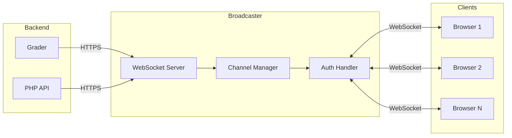
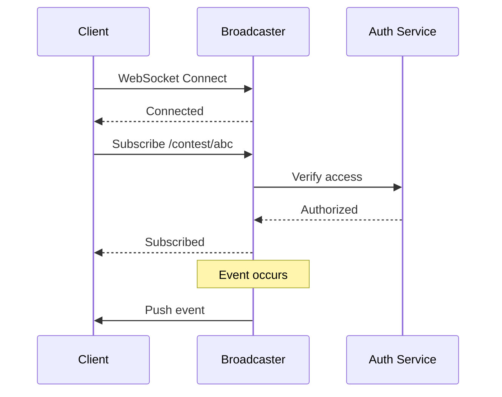
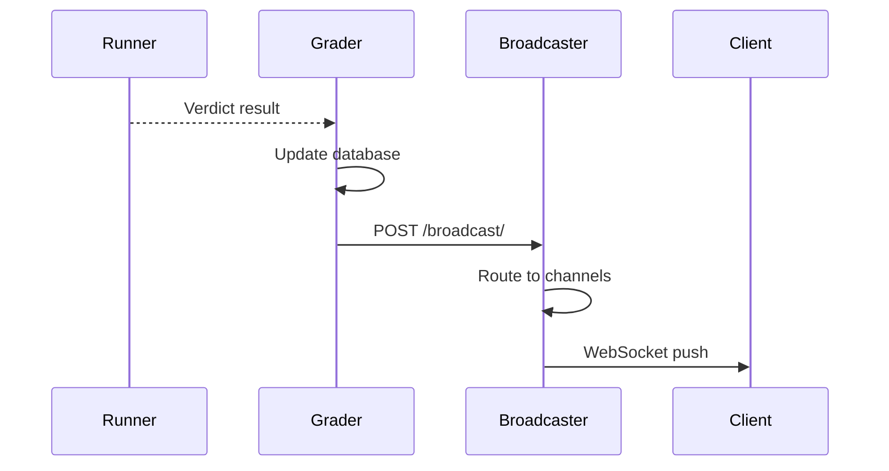
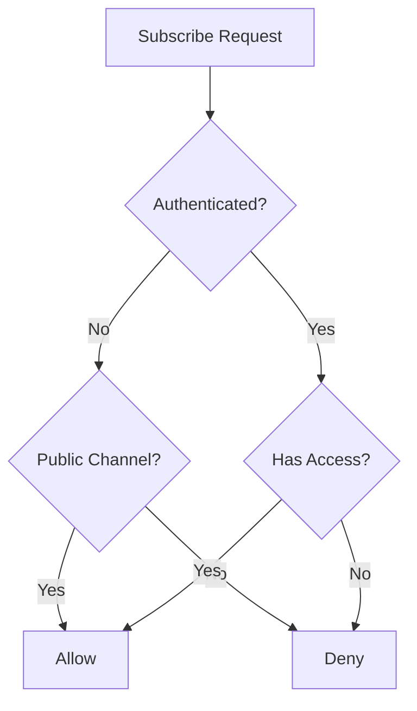
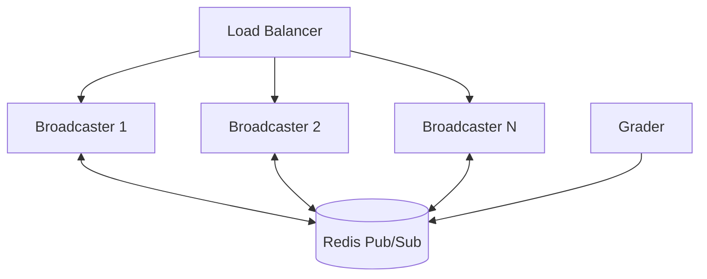

# Broadcaster Architecture

The Broadcaster is a WebSocket server that enables real-time communication between the backend and web clients. It powers live scoreboards, submission updates, and clarification notifications.

## Overview



## Real-Time Events

### Event Types

| Event | Description | Channel |
|-------|-------------|---------|
| `run_update` | Submission verdict changed | User, Contest |
| `scoreboard_update` | Scoreboard changed | Contest |
| `clarification` | New clarification | Contest, Problem |
| `contest_update` | Contest settings changed | Contest |

### Event Payload Structure

```json
{
  "type": "run_update",
  "timestamp": 1704067200,
  "data": {
    "run_id": 12345,
    "verdict": "AC",
    "score": 1.0,
    "contest_alias": "contest-2024",
    "problem_alias": "sum-two"
  }
}
```

## Channel System

### Channel Types

| Channel Pattern | Description | Auth Required |
|-----------------|-------------|---------------|
| `/user/{username}` | User-specific events | Yes (owner) |
| `/contest/{alias}` | Contest events | Contest access |
| `/contest/{alias}/admin` | Admin events | Contest admin |
| `/problem/{alias}` | Problem events | Problem access |
| `/scoreboard/{token}` | Public scoreboard | Token valid |

### Channel Subscription Flow



## WebSocket Protocol

### Connection

```javascript
const ws = new WebSocket('wss://omegaup.com/events/');

ws.onopen = () => {
  // Authenticate
  ws.send(JSON.stringify({
    type: 'auth',
    token: authToken
  }));
};
```

### Subscribe to Channel

```javascript
ws.send(JSON.stringify({
  type: 'subscribe',
  channel: '/contest/annual-2024'
}));
```

### Unsubscribe

```javascript
ws.send(JSON.stringify({
  type: 'unsubscribe',
  channel: '/contest/annual-2024'
}));
```

### Receive Events

```javascript
ws.onmessage = (event) => {
  const data = JSON.parse(event.data);
  
  switch (data.type) {
    case 'run_update':
      updateSubmissionStatus(data.data);
      break;
    case 'scoreboard_update':
      refreshScoreboard();
      break;
    case 'clarification':
      showClarificationNotification(data.data);
      break;
  }
};
```

## Backend Integration

### Grader to Broadcaster

When a submission is graded:



### PHP to Broadcaster

For clarifications and contest updates:

```php
// In Clarification Controller
\OmegaUp\Grader::getInstance()->broadcast(
    contestAlias: $contest->alias,
    problemAlias: $problem->alias,
    message: json_encode([
        'type' => 'clarification',
        'data' => $clarification
    ]),
    public: false,
    username: $identity->username
);
```

## Authentication

### Token-Based Auth

WebSocket connections authenticate using:

1. **Auth Token**: Same token as REST API (from `ouat` cookie)
2. **Scoreboard Token**: For public scoreboard URLs

### Permission Verification

For each subscription:



## Scalability

### Connection Handling

- Each Broadcaster instance handles thousands of connections
- Connections are stateless (subscriptions stored in memory)
- Heartbeat every 30 seconds to detect dead connections

### Horizontal Scaling



With multiple instances:
- Load balancer distributes WebSocket connections
- Redis Pub/Sub distributes events across instances
- Any instance can publish to any channel

## Configuration

### Broadcaster Config

```json
{
  "Broadcaster": {
    "Port": 32672,
    "TLS": {
      "CertFile": "/etc/omegaup/ssl/broadcaster.crt",
      "KeyFile": "/etc/omegaup/ssl/broadcaster.key"
    },
    "EventsPort": 39613,
    "PingInterval": 30,
    "WriteTimeout": 10
  },
  "Redis": {
    "URL": "redis://redis:6379",
    "Channel": "omegaup:events"
  }
}
```

### Docker Compose

```yaml
broadcaster:
  image: omegaup/broadcaster
  ports:
    - "32672:32672"  # Internal API
    - "39613:39613"  # WebSocket
  depends_on:
    - redis
  environment:
    - REDIS_URL=redis://redis:6379
```

## Client Implementation

### Frontend Service

The Vue.js frontend uses a WebSocket service:

```typescript
class EventService {
  private ws: WebSocket | null = null;
  private subscriptions: Map<string, Set<Function>> = new Map();
  
  connect(authToken: string): void {
    this.ws = new WebSocket(EVENTS_URL);
    this.ws.onopen = () => this.authenticate(authToken);
    this.ws.onmessage = (e) => this.handleMessage(e);
  }
  
  subscribe(channel: string, callback: Function): void {
    if (!this.subscriptions.has(channel)) {
      this.subscriptions.set(channel, new Set());
      this.ws?.send(JSON.stringify({
        type: 'subscribe',
        channel
      }));
    }
    this.subscriptions.get(channel)!.add(callback);
  }
  
  private handleMessage(event: MessageEvent): void {
    const data = JSON.parse(event.data);
    const callbacks = this.subscriptions.get(data.channel);
    callbacks?.forEach(cb => cb(data));
  }
}
```

## Monitoring

### Health Check

```bash
curl https://broadcaster:32672/health
```

### Metrics

Available at `/metrics`:

| Metric | Description |
|--------|-------------|
| `connections_active` | Current WebSocket connections |
| `subscriptions_total` | Total active subscriptions |
| `messages_sent_total` | Messages sent to clients |
| `messages_received_total` | Messages from backends |

## Troubleshooting

### Connection Issues

| Issue | Cause | Solution |
|-------|-------|----------|
| Connection refused | Broadcaster down | Check service status |
| Auth failed | Invalid token | Re-authenticate |
| No events | Not subscribed | Verify subscription |
| Delayed events | Network latency | Check connection |

### Debug Mode

Enable verbose logging:

```json
{
  "Logging": {
    "Level": "debug",
    "IncludeMessages": true
  }
}
```

## Source Code

The Broadcaster is part of the [`quark`](https://github.com/omegaup/quark) repository:

- `cmd/omegaup-broadcaster/` - Main entry point
- `broadcaster/` - Core WebSocket logic

## Related Documentation

- **[Real-time Features](../features/realtime.md)** - Feature overview
- **[Grader Internals](grader-internals.md)** - Event source
- **[Infrastructure](infrastructure.md)** - Redis integration
