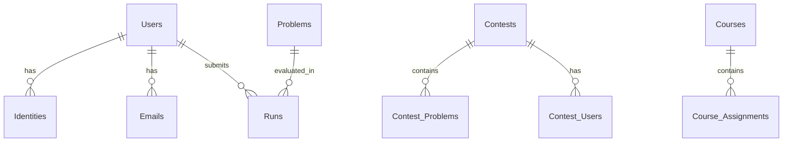

# Database Schema

omegaUp uses MySQL 8.0.39 as its database system. The schema consists of 77+ tables organized around core entities.

## Core Entities

### Users and Identities
- **Users**: Main user accounts
- **Identities**: User identities (supports multiple identities per user)
- **Emails**: Email addresses linked to users
- **Schools**: Educational institutions

### Problems
- **Problems**: Problem definitions
- **Problem_Tags**: Problem categorization
- **Problem_Of_The_Week**: Featured problems

### Contests
- **Contests**: Contest definitions
- **Contest_Problems**: Problems in contests
- **Contest_Users**: Contest participants
- **Contest_Clarifications**: Contest Q&A

### Submissions
- **Runs**: Submission records
- **Runs_Groups**: Grouped test case results
- **Submissions**: Submission metadata

### Courses
- **Courses**: Course definitions
- **Course_Assignments**: Course assignments
- **Course_Problems**: Problems in courses

## Key Relationships

## Database Migrations

Database schema changes are managed through migration files in `frontend/database/`:

- Migration files: `00001_initial_schema.sql`, `00002_*.sql`, etc.
- Main schema: `schema.sql` (generated from migrations)
- Apply migrations: `./stuff/db-migrate.py migrate`

## Related Documentation

- **[Database Patterns](../development/database-patterns.md)** - DAO/VO usage
- **[Backend Architecture](backend.md)** - Backend structure
- **[Useful Commands](../development/useful-commands.md)** - Database commands
