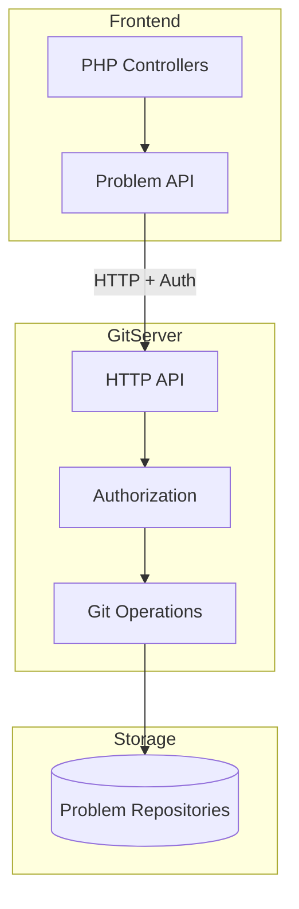
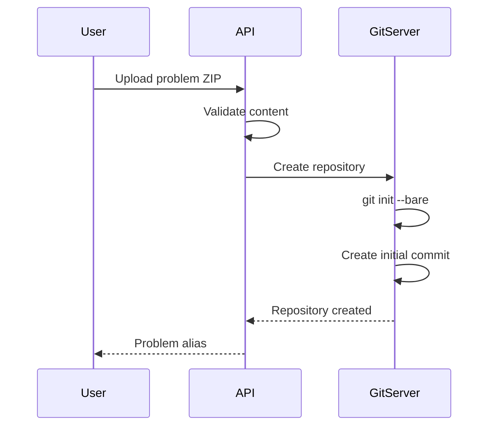
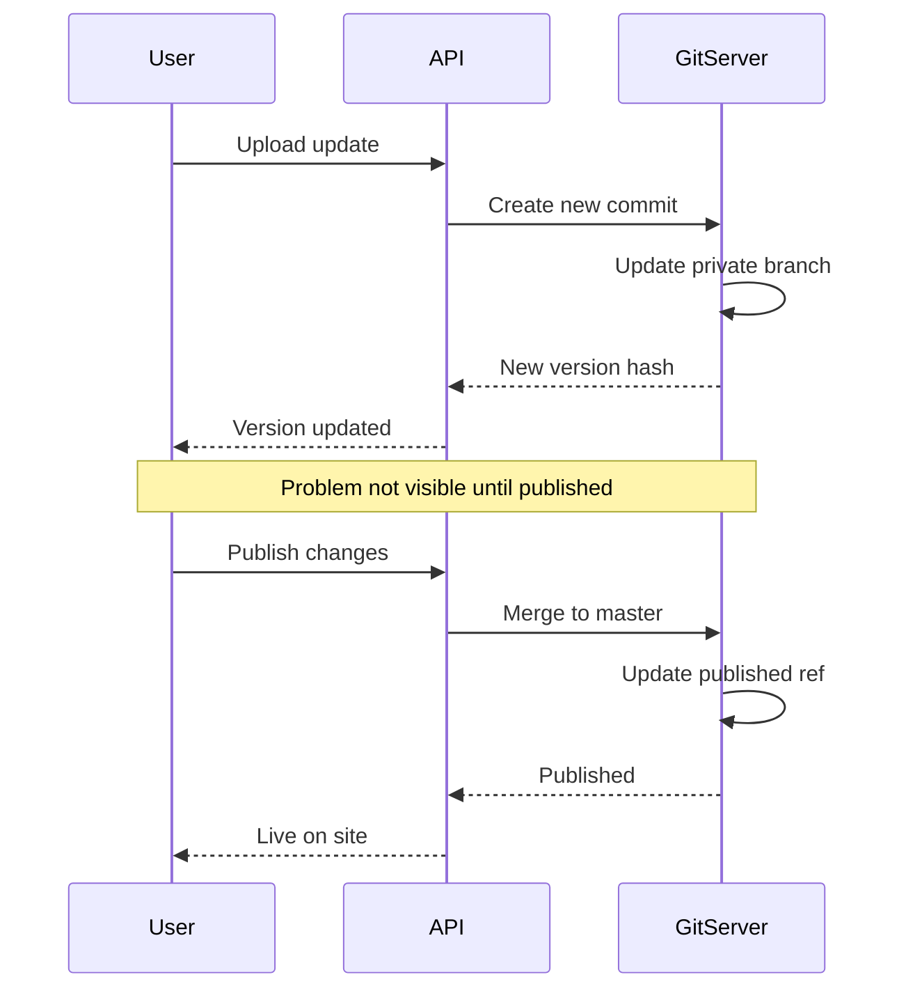
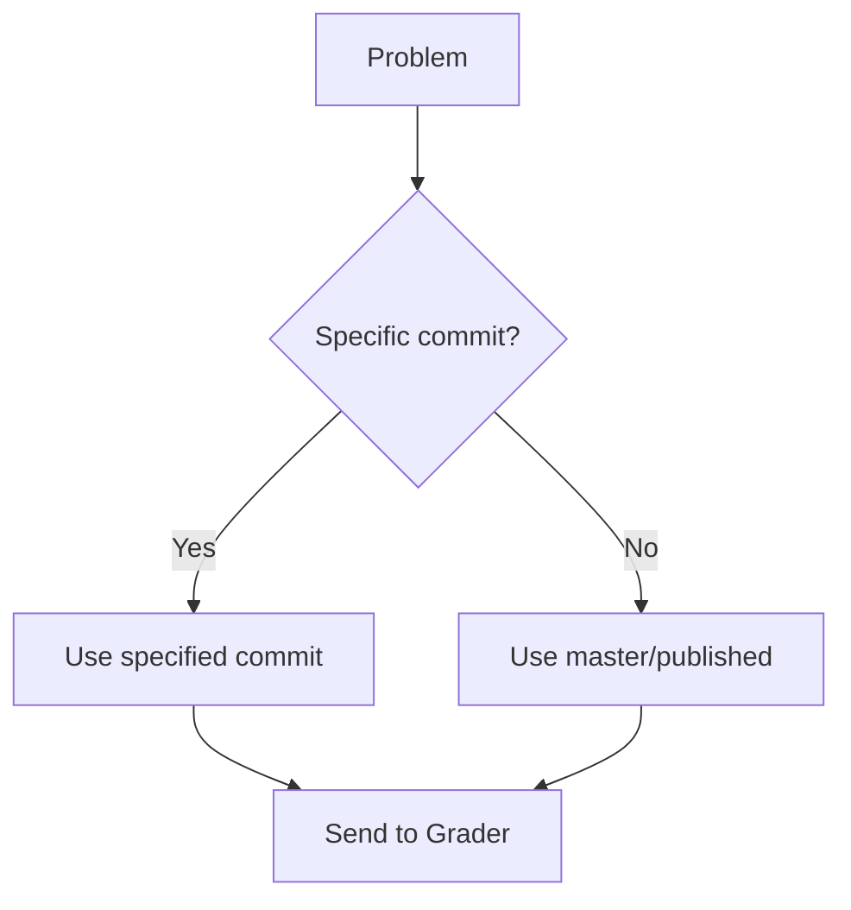

# GitServer Architecture

The GitServer manages problem repositories, providing version control for problem statements, test cases, and validators. It enables problem versioning, rollback, and concurrent editing.

## Overview

Every problem in omegaUp is stored as a Git repository, allowing:

- **Version history**: Track all changes to problems
- **Atomic updates**: All-or-nothing problem updates
- **Rollback**: Revert to any previous version
- **Branching**: Maintain multiple problem versions

## Architecture



## Repository Structure

Each problem is stored in a bare Git repository:

```
/var/lib/omegaup/problems/{problem_alias}.git/
├── HEAD
├── config
├── objects/
│   ├── pack/
│   └── info/
└── refs/
    ├── heads/
    │   ├── master        # Current published version
    │   ├── private       # Private (draft) version
    │   └── published     # Alias for master
    └── tags/
        ├── v1
        └── v2
```

## Problem Content Structure

Within each repository, problem content follows this structure:

```
problem/
├── statements/
│   ├── es.markdown      # Spanish statement
│   ├── en.markdown      # English statement
│   └── images/
│       └── diagram.png
├── cases/
│   ├── 1.in             # Test input
│   ├── 1.out            # Expected output
│   ├── 2.in
│   ├── 2.out
│   └── ...
├── solutions/
│   └── solution.cpp     # Official solution
├── validators/
│   └── validator.cpp    # Custom validator (optional)
├── interactive/
│   └── Main.cpp         # Interactive problem (optional)
├── settings.json        # Problem configuration
└── testplan            # Test case weights (optional)
```

## Problem Settings

The `settings.json` file defines problem configuration:

```json
{
  "Limits": {
    "TimeLimit": "1s",
    "MemoryLimit": "64MiB",
    "OverallWallTimeLimit": "30s",
    "OutputLimit": "10240KiB"
  },
  "Validator": {
    "Name": "token-caseless"
  },
  "Interactive": {
    "IdlName": "Main",
    "ModuleName": "Main"
  },
  "Cases": [
    {
      "Name": "group1",
      "Cases": ["1", "2", "3"],
      "Weight": 50
    },
    {
      "Name": "group2", 
      "Cases": ["4", "5"],
      "Weight": 50
    }
  ]
}
```

## API Endpoints

### Problem Operations

| Endpoint | Method | Description |
|----------|--------|-------------|
| `/problem/{alias}/` | GET | Get problem info |
| `/problem/{alias}/tree/{ref}/` | GET | Get directory listing |
| `/problem/{alias}/blob/{ref}/{path}` | GET | Get file content |
| `/problem/{alias}/archive/{ref}.zip` | GET | Download as ZIP |

### Version Operations

| Endpoint | Method | Description |
|----------|--------|-------------|
| `/problem/{alias}/versions/` | GET | List all versions |
| `/problem/{alias}/log/` | GET | Git commit history |
| `/problem/{alias}/refs/` | GET | List branches/tags |

### Update Operations

| Endpoint | Method | Description |
|----------|--------|-------------|
| `/problem/{alias}/update/` | POST | Update problem content |
| `/problem/{alias}/publish/` | POST | Publish draft version |
| `/problem/{alias}/git-upload-pack` | POST | Git push protocol |

## Version Control Flow

### Creating a New Problem



### Updating a Problem



### Version Selection for Contests



## Authentication

### Authorization Header

Requests to GitServer include:

```
Authorization: OmegaUpSharedSecret secret {service}:{identity}
```

Components:
- `secret`: Shared secret configured in both services
- `service`: Calling service (e.g., `grader`, `frontend`)
- `identity`: User or service identity

### Permission Levels

| Level | Capabilities |
|-------|-------------|
| **Admin** | Full access, can publish |
| **Collaborator** | Can update private branch |
| **Viewer** | Read published version |
| **Public** | Read public problems |

## Caching

### Grader Cache

The Grader maintains a local cache of problem files:

```
/var/lib/omegaup/problems/cache/
└── {problem_alias}/
    └── {commit_hash}/
        ├── cases/
        ├── validator
        └── settings.json
```

Cache invalidation:
- On problem update notification
- TTL-based expiration
- Manual refresh on rejudge

### Frontend Cache

Problem statements are cached in Redis:

- Key: `problem:{alias}:statement:{lang}:{commit}`
- TTL: 1 hour
- Invalidated on publish

## Problem ZIP Format

When uploading problems, use this ZIP structure:

```
problem.zip
├── statements/
│   └── es.markdown
├── cases/
│   ├── easy.1.in
│   ├── easy.1.out
│   ├── hard.1.in
│   └── hard.1.out
└── testplan           # Optional
```

### Testplan Format

```
# Weights for test groups
easy 30
hard 70

# Test case listing
easy.1
easy.2
hard.1
hard.2
```

## Configuration

### GitServer Config

```json
{
  "GitServer": {
    "RootPath": "/var/lib/omegaup/problems",
    "SecretToken": "shared-secret-token",
    "AllowDirectPushToMaster": false,
    "LibinteractivePath": "/usr/lib/libinteractive",
    "MaxCommitSize": 104857600
  },
  "HTTP": {
    "Port": 33861,
    "TLS": {
      "CertFile": "/etc/omegaup/ssl/gitserver.crt",
      "KeyFile": "/etc/omegaup/ssl/gitserver.key"
    }
  }
}
```

### Docker Compose

```yaml
gitserver:
  image: omegaup/gitserver
  ports:
    - "33861:33861"  # HTTP API
    - "33862:33862"  # Git protocol
  volumes:
    - problems:/var/lib/omegaup/problems
  environment:
    - OMEGAUP_SECRET_TOKEN=shared-secret
```

## Monitoring

### Health Check

```bash
curl http://gitserver:33861/health
```

Response:
```json
{
  "status": "ok",
  "repositories": 1500,
  "disk_usage": "10GB"
}
```

### Metrics

Available at `/metrics`:
- Repository count
- Request latency
- Git operation timing
- Error rates

## Security

### Access Control

- All writes require authentication
- Public problems readable by anyone
- Private problems require explicit access
- Admin actions logged

### Input Validation

- Maximum ZIP size: 100MB
- Maximum file count: 1000
- Filename sanitization
- Content-type validation

## Source Code

The GitServer is part of the [`gitserver`](https://github.com/omegaup/gitserver) repository:

- `cmd/omegaup-gitserver/` - Main entry point
- `githttp/` - HTTP API handlers
- `gitserver/` - Core Git operations

## Related Documentation

- **[Problem Versioning](../features/problem-versioning.md)** - Version management guide
- **[Problems API](../api/problems.md)** - Problem API reference
- **[Grader Internals](grader-internals.md)** - How Grader uses GitServer
