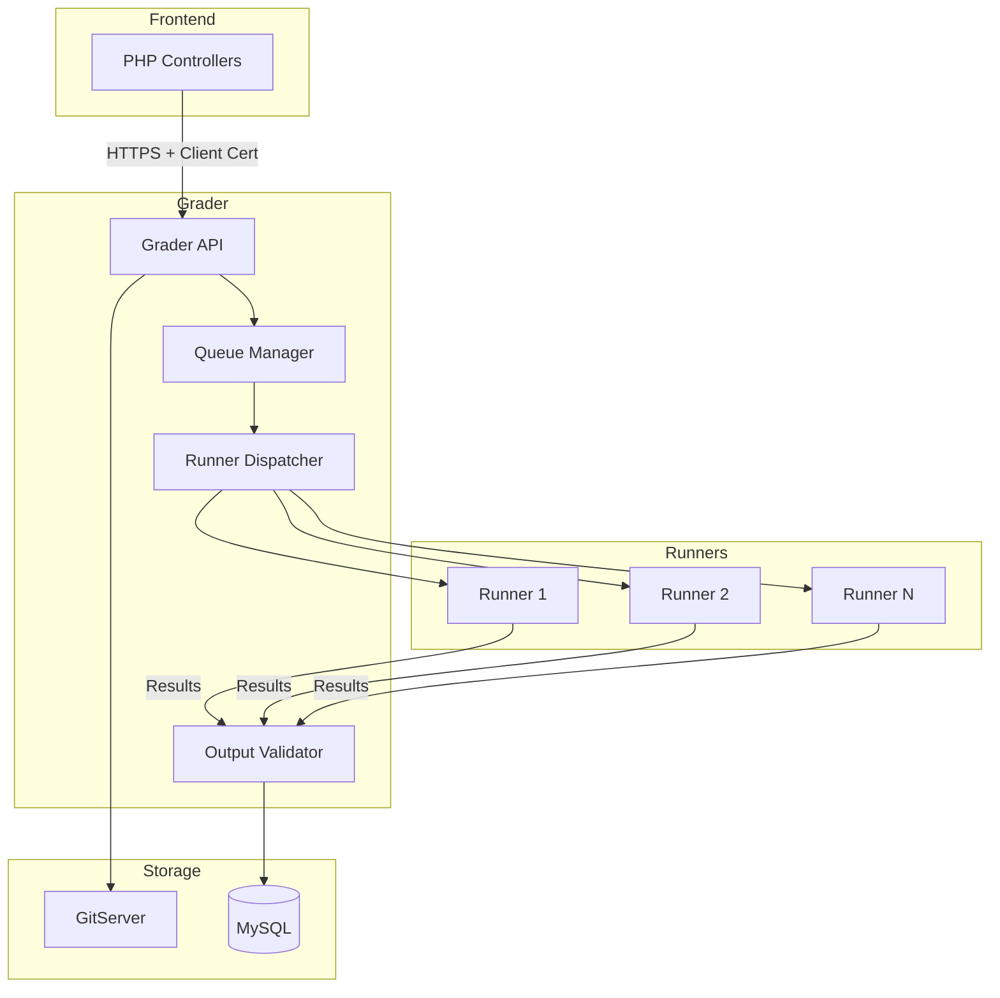
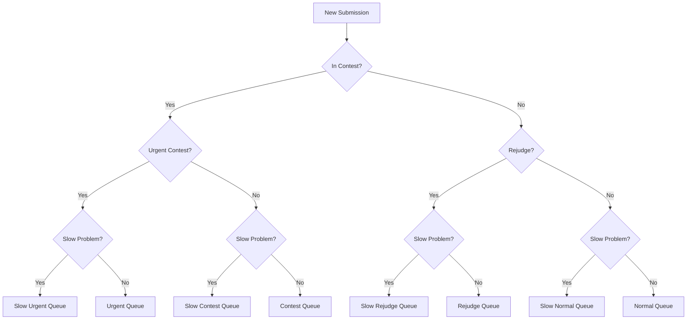
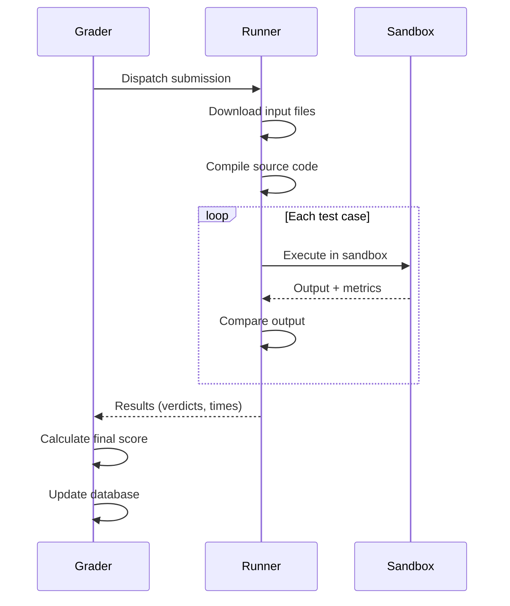

# Grader Internals

The Grader is the central orchestration component of omegaUp's evaluation system. Written in Go, it manages submission queues, coordinates Runners, and determines final verdicts.

## Architecture Overview



## Queue System

The Grader maintains eight priority queues to handle different submission types:

### Queue Types

| Queue | Priority | Purpose |
|-------|----------|---------|
| **Urgent** | 1 (highest) | High-priority contests marked as urgent |
| **Slow Urgent** | 2 | Urgent submissions for slow problems |
| **Contest** | 3 | Regular contest submissions |
| **Slow Contest** | 4 | Contest submissions for slow problems |
| **Normal** | 5 | Practice mode submissions |
| **Slow Normal** | 6 | Practice submissions for slow problems |
| **Rejudge** | 7 | Rejudge requests |
| **Slow Rejudge** | 8 (lowest) | Rejudge for slow problems |

### Queue Routing Logic



### Slow Problem Definition

A problem is considered "slow" if:
- Time limit exceeds 30 seconds
- Or problem is explicitly marked as slow

**Slow Queue Constraint**: Only 50% of Runners can simultaneously process slow queue submissions to prevent resource starvation.

## Runner Coordination

### Runner Registration

1. Runners connect to Grader on startup
2. Register with their capabilities (memory, CPU)
3. Re-register every 60 seconds as a heartbeat
4. Grader removes Runners that miss heartbeats

### Dispatch Algorithm

The `RunnerDispatcher.dispatchLocked()` method:

1. Selects highest-priority submission from queues
2. Finds an available Runner (round-robin, no affinity)
3. Creates a `GradeTask` with 10-minute deadline
4. Dispatches to Runner via HTTPS

```
Priority Order:
Urgent → Slow Urgent → Contest → Slow Contest → 
Normal → Slow Normal → Rejudge → Slow Rejudge
```

### Execution Flow



## Verdict Determination

### Verdict Types

| Verdict | Code | Description |
|---------|------|-------------|
| Accepted | `AC` | Correct answer |
| Partial Accepted | `PA` | Some test cases passed |
| Presentation Error | `PE` | Output format issues |
| Wrong Answer | `WA` | Incorrect output |
| Time Limit Exceeded | `TLE` | Exceeded time limit |
| Output Limit Exceeded | `OLE` | Too much output |
| Memory Limit Exceeded | `MLE` | Exceeded memory limit |
| Runtime Error | `RTE` | Program crashed |
| Restricted Function Error | `RFE` | Used forbidden syscall |
| Compilation Error | `CE` | Failed to compile |
| Judge Error | `JE` | Internal grading error |
| Validator Error | `VE` | Validator crashed |

### Scoring Logic

1. **Per-test-case verdict**: Each test case gets a verdict
2. **Weight assignment**:
   - If `/testplan` exists: parse explicit weights
   - Otherwise: equal weights (1/N for N cases)
3. **Group scoring**: Cases grouped by filename prefix (before first `.`)
4. **Final score**: Weighted sum of group scores

### Testplan Format

```
# Group weights (optional)
[group1]
weight = 30

[group2]  
weight = 70

# Test case to group mapping
group1.case1.in
group1.case2.in
group2.case1.in
group2.case2.in
```

## API Endpoints

The Grader exposes these internal APIs (accessed via HTTPS with client certificates):

### Submission Management

| Endpoint | Method | Description |
|----------|--------|-------------|
| `/run/new/{run_id}/` | POST | Submit new run for grading |
| `/run/grade/` | POST | Grade/rejudge runs |
| `/submission/source/{guid}/` | GET | Retrieve submission source |
| `/run/resource/` | GET | Get run resources |

### Status & Control

| Endpoint | Method | Description |
|----------|--------|-------------|
| `/grader/status/` | GET | Get grader status and queue lengths |
| `/broadcast/` | POST | Broadcast messages to clients |

## Configuration

The Grader is configured via JSON:

```json
{
  "Grader": {
    "BroadcasterURL": "https://broadcaster:32672/broadcast/",
    "GitserverURL": "http://gitserver:33861",
    "GitserverAuthorization": "OmegaUpSharedSecret secret omegaup:grader",
    "V1": {
      "Enabled": true
    }
  },
  "Runner": {
    "PreserveFiles": false
  },
  "Logging": {
    "Level": "info"
  }
}
```

### Key Settings

| Setting | Description |
|---------|-------------|
| `BroadcasterURL` | WebSocket server for real-time updates |
| `GitserverURL` | Problem repository server |
| `GitserverAuthorization` | Auth header for GitServer |
| `PreserveFiles` | Keep files after grading (debugging) |

## Monitoring

### Status Endpoint Response

```json
{
  "status": "ok",
  "grader": {
    "running": true,
    "queue_length": {
      "urgent": 0,
      "contest": 5,
      "normal": 12,
      "rejudge": 3
    },
    "runners": {
      "total": 4,
      "available": 2
    }
  }
}
```

### Metrics Port

The Grader exposes Prometheus metrics on port 6060:

- Queue lengths by type
- Runner availability
- Grading latencies
- Error rates

## Security

### Authentication

- PHP Frontend uses client certificates to authenticate
- Shared secret for internal service communication
- All traffic encrypted via HTTPS

### Sandboxing

All code execution happens in sandboxed Runners (see [Runner Internals](runner-internals.md)).

## Source Code

The Grader is implemented in the [`quark`](https://github.com/omegaup/quark) repository:

- `cmd/omegaup-grader/` - Main entry point
- `grader/` - Core grading logic
- `runner/` - Runner coordination

## Related Documentation

- **[Runner Internals](runner-internals.md)** - Code execution details
- **[System Internals](internals.md)** - Full request flow
- **[Features: Grader](../features/grader.md)** - High-level overview
