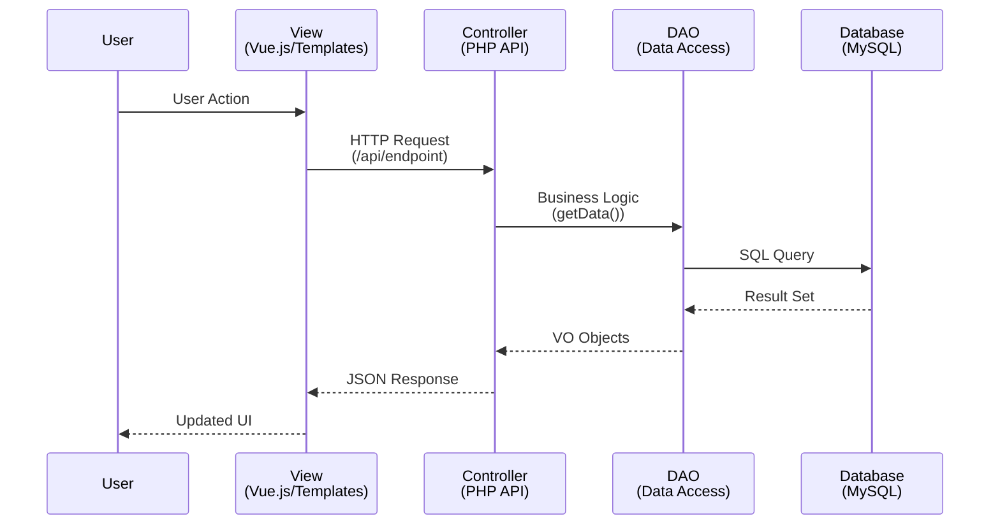
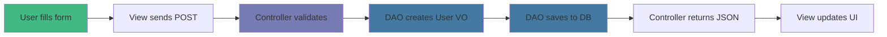

# MVC Pattern in omegaUp

omegaUp follows the **Model-View-Controller (MVC)** architectural pattern, which separates an application into three main logical components.

## MVC Components

### Model
Represents the data and business logic. In omegaUp:
- **DAOs (Data Access Objects)**: Classes for database interaction
- **VOs (Value Objects)**: Classes that map to database tables
- Located in `frontend/server/src/DAO/`

### View
Represents the user interface. In omegaUp:
- **Templates**: Smarty templates (being migrated to Vue.js)
- **Vue Components**: Modern UI components
- **TypeScript**: Frontend logic
- Located in `frontend/www/` and `frontend/templates/`

### Controller
Acts as intermediary between Model and View. In omegaUp:
- **API Controllers**: Handle HTTP requests and business logic
- Located in `frontend/server/src/Controllers/`
- Never directly access database (uses DAOs)
- Never render HTML (returns JSON)

## MVC Flow Diagram



## Data Flow Example

Here's how a user registration works:



## Key Principles

### Separation of Concerns
- **Model**: Data and business rules only
- **View**: Presentation only
- **Controller**: Coordination only

### No Direct Database Access
Controllers never write SQL directly. They use DAOs:

```php
// ✅ Good: Using DAO
$user = new Users();
$user->setEmail('user@example.com');
$results = UsersDAO::search($user);

// ❌ Bad: Direct SQL in Controller
$results = $conn->query("SELECT * FROM Users WHERE email = ...");
```

### API-First Design
Controllers return JSON, making them reusable:
- Web frontend
- CLI tools
- Mobile apps
- Third-party integrations

## Benefits

1. **Maintainability**: Clear separation makes code easier to understand
2. **Testability**: Each component can be tested independently
3. **Reusability**: Controllers serve as API endpoints
4. **Scalability**: Easy to add new views or modify existing ones

## Related Documentation

- **[Backend Architecture](backend.md)** - Detailed controller and DAO structure
- **[Frontend Architecture](frontend.md)** - View layer implementation
- **[Database Schema](database-schema.md)** - Model layer structure
