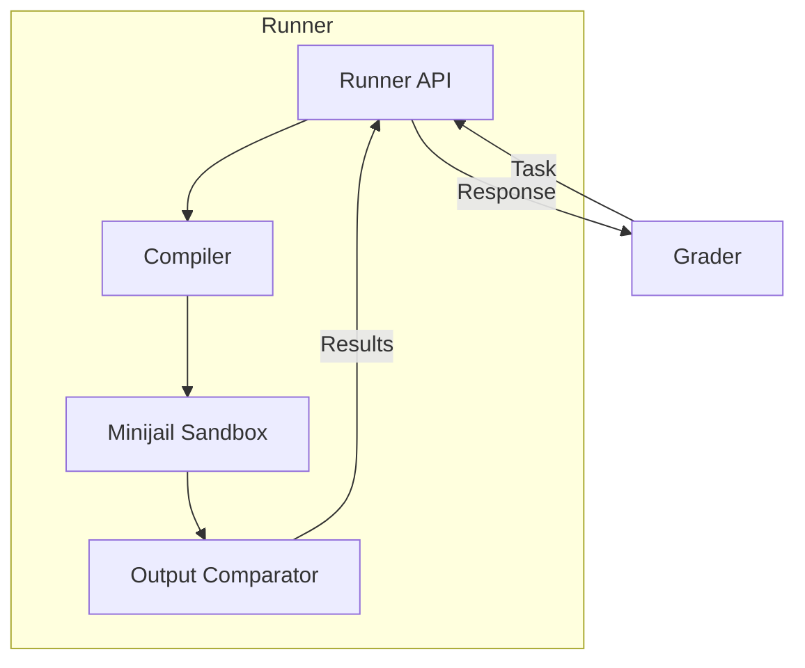
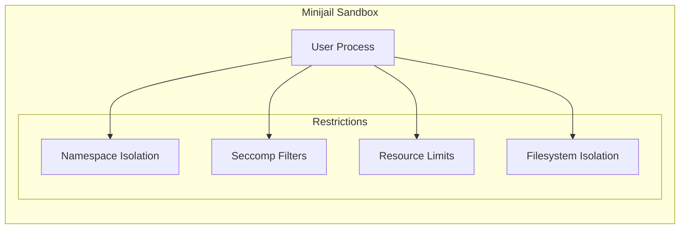
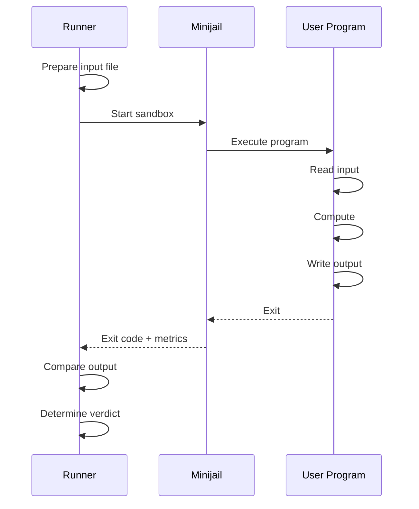
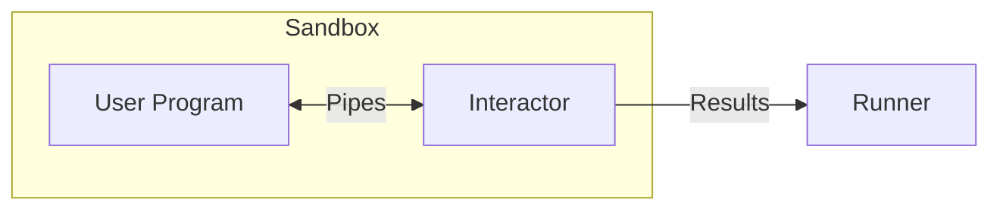

# Runner Internals

Runners are responsible for compiling and executing user submissions in a secure, sandboxed environment. They receive tasks from the Grader and return execution results.

## Architecture



## Compilation

### Supported Languages

| Language | Compiler/Interpreter | Version |
|----------|---------------------|---------|
| C | GCC | 10+ |
| C++ (11/14/17/20) | G++ | 10+ |
| Java | OpenJDK | 17+ |
| Python 3 | CPython | 3.10+ |
| Python 2 (legacy) | CPython | 2.7 |
| Karel (pascal/java) | Custom | - |
| Ruby | Ruby | 3.0+ |
| Pascal | Free Pascal | 3.2+ |
| Haskell | GHC | 8.10+ |
| C# | Mono | 6.12+ |
| Lua | Lua | 5.4+ |

### Compilation Flags

#### C/C++

```bash
# C
gcc -std=c11 -O2 -lm -o program program.c

# C++17 (default)
g++ -std=c++17 -O2 -lm -o program program.cpp

# C++20
g++ -std=c++20 -O2 -lm -o program program.cpp
```

#### Java

```bash
# Compile
javac -encoding UTF-8 Main.java

# Run
java -Xmx{memory}m Main
```

#### Python

```bash
# Python 3 (no compilation)
python3 program.py

# Byte-compile check
python3 -m py_compile program.py
```

### Compilation Limits

| Resource | Limit |
|----------|-------|
| Time | 30 seconds |
| Memory | 512 MB |
| Output | 64 MB |
| Processes | 32 |

## Sandbox (Minijail)

The Runner uses [Minijail](https://android.googlesource.com/platform/external/minijail/), forked from Chrome OS, for secure code execution.

### Security Features



### Isolation Mechanisms

| Mechanism | Description |
|-----------|-------------|
| **PID Namespace** | Process sees only itself |
| **Network Namespace** | No network access |
| **Mount Namespace** | Limited filesystem view |
| **Seccomp** | Syscall whitelist |
| **cgroups** | Resource limits |

### Allowed Syscalls

The seccomp filter allows only essential syscalls:

- File operations: `read`, `write`, `open`, `close`
- Memory: `mmap`, `munmap`, `brk`
- Process: `exit`, `exit_group`
- Time: `clock_gettime` (limited)

Forbidden operations:
- Network syscalls (`socket`, `connect`, etc.)
- Process creation (`fork`, `clone`, `execve`)
- IPC (`shmget`, `msgget`, etc.)

### Resource Limits

Enforced via cgroups and rlimits:

| Resource | Mechanism | Description |
|----------|-----------|-------------|
| CPU Time | cgroup | Hard limit per test |
| Wall Time | Timer | 2x CPU limit |
| Memory | cgroup | Problem-specific |
| File Size | rlimit | Output limit |
| Processes | cgroup | 1 (no forking) |

## Execution Flow

### Per-Test-Case Execution



### Resource Measurement

The Runner measures:

- **CPU Time**: Actual CPU cycles used
- **Wall Time**: Real elapsed time
- **Memory**: Peak memory usage (via cgroup)
- **Output Size**: Bytes written to stdout

## Output Validation

### Comparison Modes

| Mode | Description |
|------|-------------|
| **Exact** | Byte-for-byte match |
| **Token** | Whitespace-normalized tokens |
| **Numeric** | Floating-point tolerance |
| **Custom** | Problem-specific validator |

### Token Comparison

Default comparison mode:
1. Split output into tokens (whitespace-separated)
2. Compare token sequences
3. Ignore trailing whitespace
4. Ignore trailing newlines

### Custom Validators

Problems can include custom validators:

```
problem/
├── cases/
│   ├── 1.in
│   └── 1.out
└── validator
    └── validator.cpp
```

Validator receives:
- Input file path
- Expected output path
- User output path
- Score limit

Returns:
- Score (0.0 to 1.0)
- Verdict message

## Interactive Problems

For interactive problems, the Runner uses `libinteractive`:



The interactor:
1. Runs alongside user program
2. Communicates via stdin/stdout pipes
3. Validates responses in real-time
4. Reports final verdict

## Error Handling

### Verdict Determination

| Condition | Verdict |
|-----------|---------|
| Correct output | AC |
| Wrong output | WA |
| CPU time exceeded | TLE |
| Wall time exceeded | TLE |
| Memory exceeded | MLE |
| Output too large | OLE |
| Non-zero exit | RTE |
| Signal received | RTE |
| Forbidden syscall | RFE |
| Compilation failed | CE |

### Runtime Error Details

The Runner captures:
- Exit code
- Signal number (if killed)
- Last syscall (if RFE)
- Memory at crash

## Configuration

### Runner Config

```json
{
  "Runner": {
    "RuntimePath": "/var/lib/omegaup/runner",
    "GraderURL": "https://grader:21680/",
    "CompileTimeLimit": 30,
    "CompileMemoryLimit": 536870912,
    "PreserveFiles": false
  },
  "Sandbox": {
    "Path": "/usr/bin/minijail0",
    "TimeLimit": 60,
    "OutputLimit": 67108864
  }
}
```

### Directory Structure

```
/var/lib/omegaup/runner/
├── cache/           # Compiled binaries cache
├── input/           # Test input files
├── runs/            # Active execution directories
│   └── {guid}/
│       ├── source   # User source code
│       ├── program  # Compiled binary
│       ├── input    # Current test input
│       ├── output   # User output
│       └── error    # Stderr capture
└── problems/        # Problem files cache
```

## Performance

### Caching

- **Compilation cache**: Reuse binaries for identical source
- **Input cache**: Problem test files cached locally
- **Problem cache**: Problem metadata and validators

### Parallel Execution

- Each Runner handles one submission at a time
- Test cases within a submission may run in parallel
- Multiple Runners provide horizontal scaling

## Security Considerations

### Defense in Depth

1. **Code validation**: Basic source code checks
2. **Compilation sandbox**: Limited compilation environment
3. **Execution sandbox**: Full Minijail isolation
4. **Resource limits**: Hard caps on all resources
5. **Network isolation**: No external communication

### Known Limitations

- Timing attacks possible (CPU time visible)
- Memory side-channels not fully mitigated
- Interactive problems have larger attack surface

## Source Code

The Runner is part of the [`quark`](https://github.com/omegaup/quark) repository:

- `runner/` - Main runner logic
- `sandbox/` - Minijail integration
- `compiler/` - Language-specific compilation

## Related Documentation

- **[Grader Internals](grader-internals.md)** - Queue and dispatch
- **[Sandbox Feature](../features/sandbox.md)** - Sandbox overview
- **[Verdicts](../features/verdicts.md)** - Verdict types
