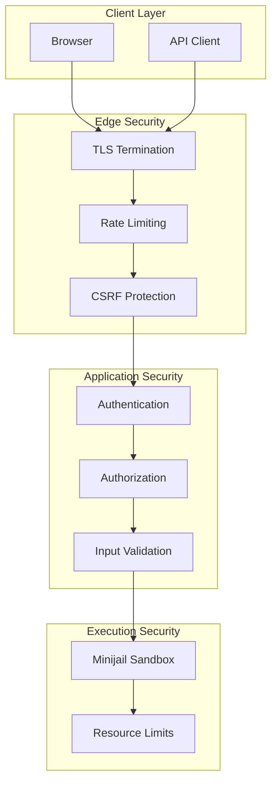
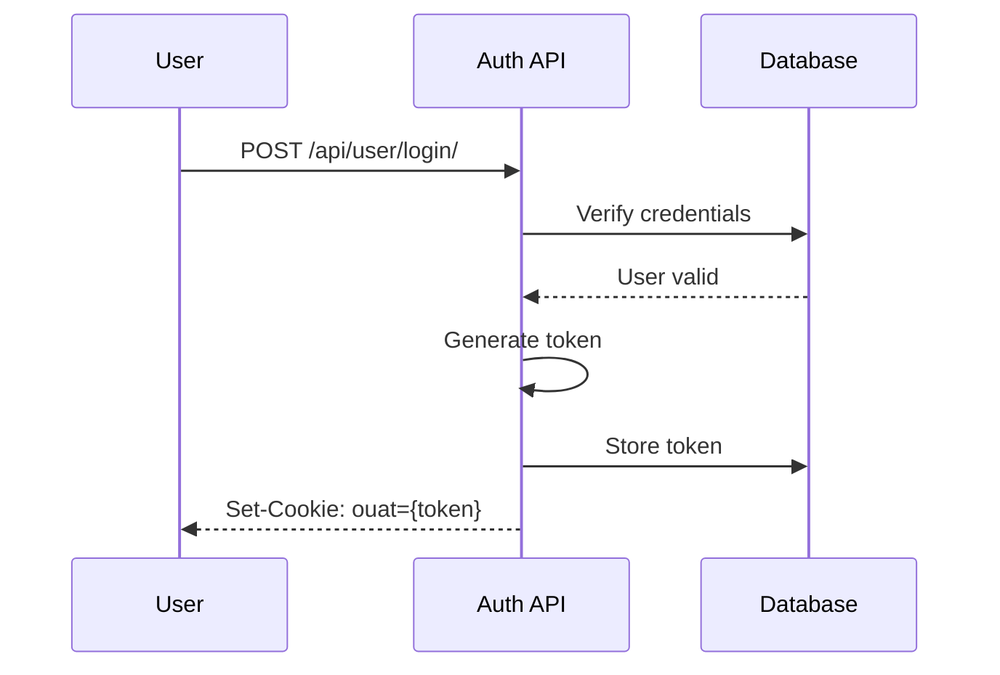
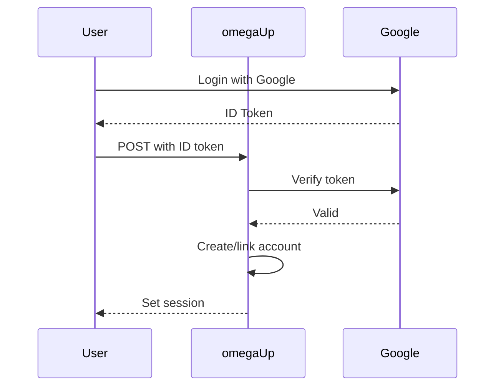
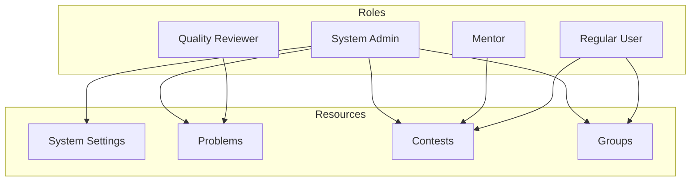
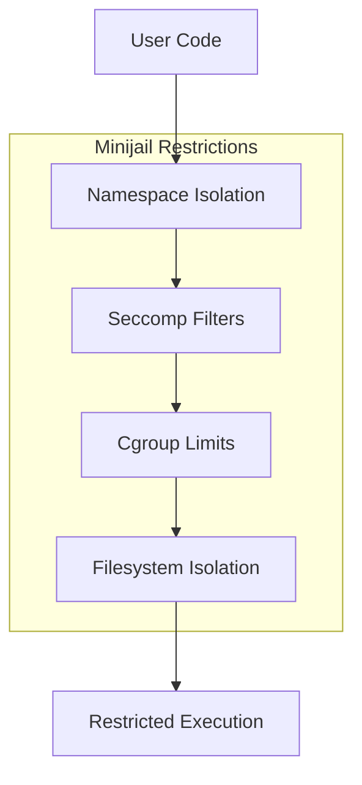

# Security Architecture

This page documents omegaUp's security architecture, including authentication mechanisms, authorization model, rate limiting, and the sandboxing system for code execution.

## Security Overview



## Authentication

### Token-Based Authentication

omegaUp uses token-based authentication via the `ouat` (omegaUp Auth Token) cookie.

#### Token Generation



#### Token Structure

```
{entropy}-{identity_id}-{hash}
```

- `entropy`: 15 bytes of random data (hex encoded)
- `identity_id`: User's identity ID
- `hash`: SHA-256(salt + identity_id + entropy)

#### Token Validation

```php
// Token validated on each request
$identityExt = \OmegaUp\DAO\AuthTokens::getIdentityByToken($authToken);
if (is_null($identityExt)) {
    throw new UnauthorizedException('loginRequired');
}
```

### API Token Authentication

For programmatic access, users can create API tokens:

```bash
# Authorization header format
Authorization: token {api_token}

# With identity selection
Authorization: token Credential={api_token},Username={identity}
```

#### Rate Limits

API tokens have configurable rate limits:

| Limit Type | Default | Headers |
|------------|---------|---------|
| Requests/hour | 1000 | `X-RateLimit-Limit` |
| Remaining | - | `X-RateLimit-Remaining` |
| Reset time | - | `X-RateLimit-Reset` |

### OAuth Integration

Third-party authentication via:

- **Google**: OAuth 2.0 with ID token verification
- **Facebook**: OAuth 2.0 with access token



## Authorization

### Role-Based Access Control



### Permission Levels

| Level | Description | Example |
|-------|-------------|---------|
| System Admin | Full platform access | Site configuration |
| Quality Reviewer | Review problem quality | Quality nominations |
| Mentor | Guide coders of month | Select winners |
| Contest Admin | Manage specific contest | Add problems, users |
| Problem Admin | Manage specific problem | Update statements |
| Group Admin | Manage group | Add members |

### Authorization Checks

```php
// Check system admin
if (!\OmegaUp\Authorization::isSystemAdmin($identity)) {
    throw new ForbiddenAccessException();
}

// Check contest admin
if (!\OmegaUp\Authorization::isContestAdmin($identity, $contest)) {
    throw new ForbiddenAccessException();
}

// Check group membership
if (!\OmegaUp\Authorization::isGroupAdmin($identity, $group)) {
    throw new ForbiddenAccessException();
}
```

### ACL System

Resources use Access Control Lists:

```sql
-- ACL table
CREATE TABLE `ACLs` (
    `acl_id` int NOT NULL AUTO_INCREMENT,
    `owner_id` int NOT NULL,
    PRIMARY KEY (`acl_id`)
);

-- User permissions
CREATE TABLE `User_Roles` (
    `user_id` int NOT NULL,
    `role_id` int NOT NULL,
    `acl_id` int NOT NULL,
    PRIMARY KEY (`user_id`, `role_id`, `acl_id`)
);

-- Group permissions
CREATE TABLE `Group_Roles` (
    `group_id` int NOT NULL,
    `role_id` int NOT NULL,
    `acl_id` int NOT NULL,
    PRIMARY KEY (`group_id`, `role_id`, `acl_id`)
);
```

## Input Validation

### Parameter Validation

All API inputs are validated:

```php
// Required string
$alias = $r->ensureString('alias', 
    fn ($alias) => \OmegaUp\Validators::alias($alias)
);

// Optional int with bounds
$page = $r->ensureOptionalInt('page', 
    lowerBound: 1, 
    upperBound: 1000
);

// Enum validation
$status = $r->ensureEnum('status', 
    ['open', 'resolved', 'banned']
);
```

### SQL Injection Prevention

All database queries use prepared statements:

```php
// Safe query with parameters
$result = \OmegaUp\MySQLConnection::getInstance()->GetAll(
    'SELECT * FROM Problems WHERE alias = ?',
    [$problemAlias]
);
```

### XSS Prevention

Output is escaped by default in templates:

```twig
{# Auto-escaped #}
{{ problem.title }}

{# Raw HTML (explicit) #}
{{ problem.description | raw }}
```

## Rate Limiting

### Endpoint Rate Limits

| Endpoint | Limit | Window |
|----------|-------|--------|
| `/api/user/login/` | 10 | 1 minute |
| `/api/run/create/` | 1 per problem | 60 seconds |
| `/api/*` (default) | 100 | 1 minute |

### Implementation

```php
// Check rate limit
$key = "ratelimit:{$ip}:{$endpoint}";
$count = $redis->incr($key);

if ($count === 1) {
    $redis->expire($key, 60);
}

if ($count > $limit) {
    throw new RateLimitExceededException();
}
```

### Bypass for Contests

During contests, submission rate limits are relaxed:

- Normal: 1 submission per 60 seconds per problem
- Contest: Configurable `submissions_gap`

## CSRF Protection

### Token Validation

Forms include CSRF tokens:

```html
<input type="hidden" name="csrf_token" value="{{ csrf_token }}">
```

```php
// Validate on POST
if ($request->method === 'POST') {
    if ($request['csrf_token'] !== $session['csrf_token']) {
        throw new CSRFException();
    }
}
```

### SameSite Cookies

Session cookies use SameSite attribute:

```php
setcookie(
    OMEGAUP_AUTH_TOKEN_COOKIE_NAME,
    $token,
    [
        'path' => '/',
        'secure' => true,
        'httponly' => true,
        'samesite' => 'Lax'
    ]
);
```

## Code Execution Sandboxing

### Minijail Sandbox

User code executes in a heavily restricted environment:



### Namespace Isolation

| Namespace | Restriction |
|-----------|-------------|
| PID | Cannot see other processes |
| Network | No network access |
| Mount | Read-only root, limited writes |
| User | Non-root user |
| IPC | No shared memory |

### Seccomp Whitelist

Only essential syscalls allowed:

```c
// Allowed syscalls
read, write, open, close, fstat, mmap, mprotect,
munmap, brk, rt_sigaction, rt_sigprocmask, 
ioctl, access, exit_group, arch_prctl

// Blocked (examples)
socket, connect, fork, execve, ptrace, 
shmget, msgget, semget
```

### Resource Limits

| Resource | Limit | Enforcement |
|----------|-------|-------------|
| CPU Time | Problem-specific | cgroup |
| Wall Time | 2x CPU limit | Timer |
| Memory | Problem-specific | cgroup |
| File Size | 10 MB | rlimit |
| Processes | 1 | cgroup |
| Open Files | 10 | rlimit |

## TLS Configuration

### Certificate Requirements

- TLS 1.2 minimum
- Strong cipher suites only
- HSTS enabled

### Nginx Configuration

```nginx
ssl_protocols TLSv1.2 TLSv1.3;
ssl_ciphers ECDHE-ECDSA-AES128-GCM-SHA256:ECDHE-RSA-AES128-GCM-SHA256;
ssl_prefer_server_ciphers on;

add_header Strict-Transport-Security "max-age=31536000" always;
```

### Internal Service TLS

Services use mutual TLS:

```yaml
grader:
  volumes:
    - ./ssl/grader.crt:/etc/omegaup/ssl/grader.crt
    - ./ssl/grader.key:/etc/omegaup/ssl/grader.key
    - ./ssl/ca.crt:/etc/omegaup/ssl/ca.crt
```

## Security Headers

```nginx
# Security headers
add_header X-Content-Type-Options "nosniff" always;
add_header X-Frame-Options "SAMEORIGIN" always;
add_header X-XSS-Protection "1; mode=block" always;
add_header Content-Security-Policy "default-src 'self'" always;
add_header Referrer-Policy "strict-origin-when-cross-origin" always;
```

## Audit Logging

### Login Events

```sql
CREATE TABLE `Identity_Login_Log` (
    `identity_id` int NOT NULL,
    `ip` int UNSIGNED NOT NULL,
    `time` timestamp NOT NULL DEFAULT CURRENT_TIMESTAMP
);
```

### Administrative Actions

Critical actions are logged:

- User role changes
- Problem visibility changes
- Contest modifications
- Quality nomination resolutions

## Incident Response

### Lockdown Mode

Emergency lockdown disables sensitive operations:

```php
if (OMEGAUP_LOCKDOWN) {
    throw new ForbiddenAccessException('forbiddenInLockdown');
}
```

### Session Invalidation

Force logout of all sessions:

```php
// Delete all auth tokens for user
\OmegaUp\DAO\AuthTokens::deleteAllByUser($userId);
```

## Related Documentation

- **[Authentication API](../api/authentication.md)** - Auth endpoints
- **[Runner Internals](runner-internals.md)** - Sandbox details
- **[Error Codes](../api/error-codes.md)** - Security error codes
