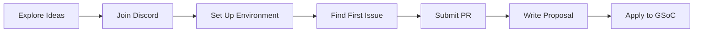

# Google Summer of Code

omegaUp has been participating in Google Summer of Code (GSoC), providing opportunities for students worldwide to contribute to open-source education technology while gaining valuable experience in software development.

## About GSoC at omegaUp

Google Summer of Code is a global program that brings student developers into open source software development. Since joining GSoC, omegaUp has mentored numerous students who have made significant contributions to our platform.

### Why Work with omegaUp?

- **Impact**: Your code helps millions of students learn programming
- **Learning**: Work with experienced mentors on real-world problems
- **Community**: Join a welcoming, international team
- **Technology**: Modern stack (Vue.js, TypeScript, PHP, Go, Python)
- **Flexibility**: Remote work with flexible hours

## Program Years

### Current Program

-   :material-rocket-launch: **[GSoC 2025](2025.md)**

    ---

    Current year program with 6 project ideas including AI Teaching Assistant, Problem Editorial Generation, and more.

    [:octicons-arrow-right-24: View Ideas](2025.md)

### Previous Years

| Year | Projects | Highlights |
|------|----------|------------|
| **[2024](2024.md)** | 2 | Problem Creator migration to Vue.js, Public Courses on GitHub |
| **[2023](2023.md)** | 2 | COPPA-compliant child accounts, Cypress test migration |

## Getting Involved

### Step-by-Step Guide

### 1. Explore Project Ideas

Review the current year's [project ideas](2025.md) to find something that interests you. You're also welcome to propose your own ideas!

### 2. Join Our Community

Connect with us on [Discord](https://discord.gg/gMEMX7Mrwe) - our main communication channel. Don't hesitate to ask questions!

### 3. Set Up Your Environment

Follow the [development setup guide](../../getting-started/development-setup.md) to get omegaUp running locally.

### 4. Make Your First Contribution

Find an issue tagged ["Good first issue"](https://github.com/omegaup/omegaup/labels/Good%20first%20issue) and submit a pull request. Getting a PR merged demonstrates your ability to work with our codebase.

### 5. Write Your Proposal

Use our [proposal template](https://docs.google.com/document/d/1_FKfpc2M3VLDVYqvT8ZgsgwIJ3zaZnyUVmSm-H3h6UQ/edit) to craft a detailed design document for your chosen project.

### 6. Apply to Google

Submit your final proposal through the [official GSoC website](https://summerofcode.withgoogle.com/).

## Timeline (Typical)

| Phase | Period | Activities |
|-------|--------|------------|
| Organization Application | Jan-Feb | omegaUp applies to GSoC |
| Student Exploration | Feb-Mar | Students explore projects, join Discord |
| Contribution Period | Mar-Apr | Students contribute, get PRs merged |
| Proposal Submission | Late Mar-Apr | Students submit proposals |
| Review & Selection | Apr-May | Mentors review, interviews conducted |
| Community Bonding | May | Selected students meet mentors |
| Coding Period 1 | Jun-Jul | First half of coding |
| Midterm Evaluation | Jul | Progress check |
| Coding Period 2 | Jul-Aug | Second half of coding |
| Final Evaluation | Aug-Sep | Final submission and evaluation |

## Success Stories

### Problem Creator (GSoC 2024)

Aritra Chakraborty migrated the Problem Creator to Vue.js + TypeScript, enabling visual problem creation directly on omegaUp.com.

**Impact**: Simplified problem creation workflow for thousands of problem setters.

### Cypress Migration (GSoC 2023)

Migrated 100+ Selenium tests to Cypress, improving test reliability from ~80% to ~98%.

**Impact**: Faster CI/CD pipelines and more confident deployments.

## FAQs

**Do I need to speak Spanish?**
: No! We welcome contributors who speak any language. All technical discussions can be in English.

**How many contributors do you accept?**
: Typically 2-3 per year, depending on Google's allocation.

**Can I propose my own project?**
: Yes! We encourage original ideas. Discuss them with mentors on Discord first.

**What if I'm not selected?**
: We welcome ongoing volunteers! Many non-GSoC contributors have become valued team members.

## Related Documentation

- **[Contributing Guide](../../getting-started/contributing.md)** - How to contribute
- **[Getting Help](../../getting-started/getting-help.md)** - Community support
- **[Development Setup](../../getting-started/development-setup.md)** - Environment setup
- **[Architecture Overview](../../architecture/index.md)** - System architecture
