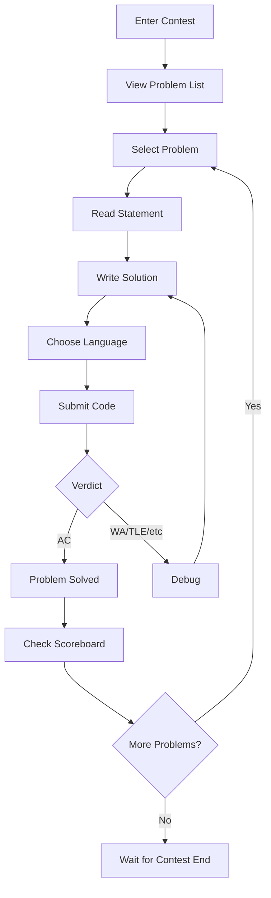

# Arena

Arena is the contest interface where participants solve problems during competitions. It provides a real-time problem-solving environment with live scoreboard updates, code submission, and instant feedback.

## Overview

The Arena is the heart of the omegaUp contest experience, providing:

- **Problem Display**: View problem statements with math rendering
- **Code Editor**: Monaco-based editor with syntax highlighting
- **Submission System**: Submit solutions and view detailed results
- **Live Scoreboard**: Real-time contest rankings
- **Clarifications**: Q&A system for contest questions
- **Timer**: Contest countdown and time tracking

## Arena Layout

```
┌─────────────────────────────────────────────────────────────┐
│  Contest Title                              Timer: 01:30:00 │
├─────────┬───────────────────────────────────────────────────┤
│         │                                                   │
│ Problem │              Problem Statement                    │
│  List   │                                                   │
│         │  - Description                                    │
│  [A]    │  - Input/Output format                           │
│  [B]    │  - Constraints                                   │
│  [C]    │  - Examples                                      │
│         │                                                   │
│─────────┼───────────────────────────────────────────────────│
│         │                                                   │
│ Submit  │              Code Editor                          │
│ History │                                                   │
│         │  [Language: C++17 ▼]  [Submit]                   │
│         │                                                   │
├─────────┴───────────────────────────────────────────────────┤
│                    Scoreboard / Clarifications              │
└─────────────────────────────────────────────────────────────┘
```

## User Flow



## Key Components

### Problem Panel

The problem panel displays:

| Element | Description |
|---------|-------------|
| **Statement** | Problem description with LaTeX math support |
| **Input Format** | Expected input specification |
| **Output Format** | Required output format |
| **Constraints** | Time limit, memory limit, input bounds |
| **Examples** | Sample input/output pairs |
| **Notes** | Additional hints or clarifications |

**Math Rendering**:
```latex
$$ \sum_{i=1}^{n} a_i \leq 10^9 $$
```

### Code Editor

Monaco Editor features:

- **Syntax Highlighting**: Language-specific coloring
- **Auto-completion**: Basic code completion
- **Line Numbers**: Easy reference
- **Keyboard Shortcuts**: Standard editor shortcuts
- **Theme**: Light/dark mode support

**Supported Languages**:

| Language | Extension | Version |
|----------|-----------|---------|
| C++ 17 | `.cpp` | GCC 10+ |
| C++ 11 | `.cpp` | GCC 10+ |
| Java | `.java` | OpenJDK 17 |
| Python 3 | `.py` | 3.10+ |
| Python 2 | `.py` | 2.7 |
| C | `.c` | GCC 10+ |
| Karel | `.kp`, `.kj` | Custom |
| Pascal | `.pas` | FPC 3.2 |

### Submission System

#### Submit Flow

1. Select language from dropdown
2. Paste or type code in editor
3. Click "Submit" button
4. Wait for verdict (real-time updates)

#### Verdict Display

| Verdict | Color | Meaning |
|---------|-------|---------|
| AC | Green | Accepted - all tests passed |
| PA | Yellow | Partial - some tests passed |
| WA | Red | Wrong Answer |
| TLE | Orange | Time Limit Exceeded |
| MLE | Orange | Memory Limit Exceeded |
| RTE | Red | Runtime Error |
| CE | Gray | Compilation Error |

#### Submission Details

Clicking a submission shows:

- **Verdict per test case** (if allowed)
- **Runtime and memory usage**
- **Compilation output** (if CE)
- **Score breakdown** (partial scoring)

### Scoreboard

Real-time scoreboard showing:

| Column | Description |
|--------|-------------|
| Rank | Current position |
| User | Participant name |
| Score | Total points |
| Penalty | Time penalty (ICPC) |
| Per-problem | Status per problem |

**Problem Status Icons**:

- ✓ (green): Accepted
- ✗ (red): Wrong Answer attempts
- ? (yellow): Pending judgment
- - (gray): Not attempted

### Clarifications

Q&A system for contests:

1. **Ask**: Submit question about a problem
2. **View**: See public clarifications
3. **Notifications**: Real-time alerts for answers

**Clarification Types**:

- **Public**: Visible to all participants
- **Private**: Only for the asking participant

## Contest Modes

### Practice Mode

Outside contest times:

- No time pressure
- Full verdict details visible
- No scoreboard impact
- Unlimited submissions

### Contest Mode

During contest:

- Timer counting down
- Limited verdict info (configurable)
- Live scoreboard
- Submission limits may apply

### Virtual Contest

Simulate past contests:

- Original time limits
- Original problems
- Personal timer
- Compare with original results

## Real-time Features

### WebSocket Updates

Arena uses WebSocket for real-time updates:

```javascript
// Events received
- 'run_update': Submission verdict changed
- 'scoreboard_update': Scoreboard refreshed
- 'clarification': New clarification posted
```

### Notifications

Desktop notifications for:

- Submission judged
- New clarification
- Contest ending soon (15 min, 5 min)

## Keyboard Shortcuts

| Shortcut | Action |
|----------|--------|
| `Ctrl+Enter` | Submit code |
| `Ctrl+S` | Save draft (local) |
| `Esc` | Close modal |
| `1-9` | Switch to problem 1-9 |

## Contest Admin View

Contest admins see additional features:

- **All Submissions**: View all participant submissions
- **Rejudge**: Rejudge specific submissions
- **Broadcast**: Send announcements
- **Answer Clarifications**: Respond to questions
- **Extend Time**: Add contest time

## Mobile Support

Arena is responsive and supports:

- Tablet viewing (problem reading)
- Mobile submission (limited)
- Scoreboard viewing

## Performance

Arena optimizations:

- **Lazy Loading**: Problems loaded on demand
- **Caching**: Scoreboard cached and diff-updated
- **Compression**: Gzipped responses
- **CDN**: Static assets on CDN

## Related Documentation

- **[Contests](contests/index.md)** - Contest management
- **[Problems](problems/index.md)** - Problem creation
- **[Real-time Updates](realtime.md)** - WebSocket system
- **[Verdicts](verdicts.md)** - Verdict explanations
- **[Contests API](../api/contests.md)** - API endpoints
