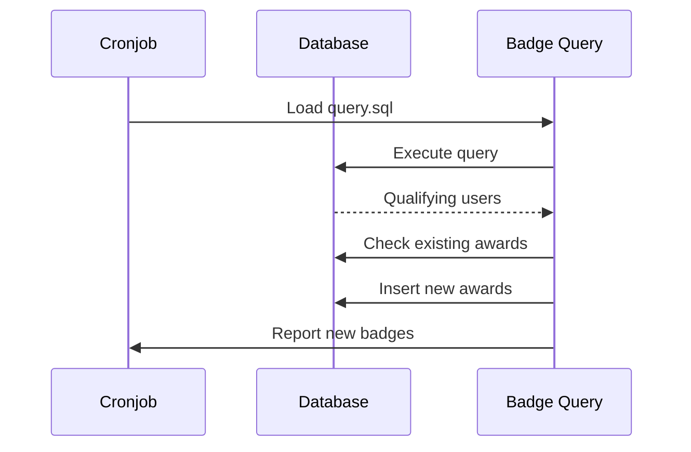

# Badges

omegaUp includes a comprehensive badge system to recognize user achievements, milestones, and contributions to the platform.

## Overview

Badges are awarded automatically based on SQL queries that run periodically via cronjobs. Each badge has its own directory containing the query logic, localized descriptions, and test cases.

## Badge Categories

### Problem Solving Milestones

| Badge | Requirement | Description |
|-------|-------------|-------------|
| **100 Solved Problems** | Solve 100+ problems | Recognizes dedicated problem solvers |
| **500 Score** | Achieve 500+ total score | Overall score milestone |

### Streak Badges

| Badge | Requirement | Description |
|-------|-------------|-------------|
| **7-Day Streak** | Solve problems 7 consecutive days | One week consistency |
| **15-Day Streak** | Solve problems 15 consecutive days | Two week dedication |
| **30-Day Streak** | Solve problems 30 consecutive days | One month commitment |

### Language Expert Badges

| Badge | Requirement | Description |
|-------|-------------|-------------|
| **C++ Expert** | Solve 10+ problems in C++ | C++ proficiency |
| **Java Expert** | Solve 10+ problems in Java | Java proficiency |
| **Python Expert** | Solve 10+ problems in Python | Python proficiency |
| **Pascal Expert** | Solve 10+ problems in Pascal | Pascal proficiency |
| **Karel Expert** | Solve 10+ problems in Karel | Karel proficiency |

### Course Completion

| Badge | Requirement | Description |
|-------|-------------|-------------|
| **C++ Course Graduate** | Complete C++ course | Course completion |
| **Python Course Graduate** | Complete Python course | Course completion |
| **Intro to Algorithms Graduate** | Complete algorithms course | Course completion |
| **Intro to Algorithms 2 Graduate** | Complete advanced course | Course completion |

### Community & Contribution

| Badge | Requirement | Description |
|-------|-------------|-------------|
| **Problem Setter** | Create a public problem | Content creator |
| **Contest Manager** | Organize a contest | Contest organizer |
| **Virtual Contest Manager** | Create virtual contests | Practice facilitator |
| **Feedback Provider** | Submit quality nominations | Community contributor |
| **Coder of the Month** | Be selected as Coder of the Month | Monthly recognition |

### Special Badges

| Badge | Requirement | Description |
|-------|-------------|-------------|
| **Legacy User** | Account created before 2020 | Early adopter |
| **Updated User** | Complete profile information | Profile completion |
| **Problem of the Week** | Solve featured problem | Weekly challenge |
| **Christmas Problem 2021** | Solve holiday problem | Event participation |

## Badge Implementation

### Directory Structure

Each badge is defined in `frontend/badges/[badge-name]/`:

```
frontend/badges/
├── 100solvedProblems/
│   ├── icon.svg          # Badge icon
│   ├── localizations.json # Translations
│   ├── query.sql         # Award criteria
│   └── test.json         # Test cases
├── cppExpert/
│   └── ...
└── default_icon.svg      # Fallback icon
```

### Query Structure

Badge queries return user IDs who qualify:

```sql
-- Example: 100solvedProblems/query.sql
SELECT DISTINCT
    i.user_id
FROM
    Identities i
INNER JOIN
    (
        SELECT
            s.identity_id,
            COUNT(DISTINCT s.problem_id) AS solved_count
        FROM
            Submissions s
        INNER JOIN
            Runs r ON s.current_run_id = r.run_id
        WHERE
            r.verdict = 'AC'
        GROUP BY
            s.identity_id
        HAVING
            solved_count >= 100
    ) AS solved ON i.identity_id = solved.identity_id
WHERE
    i.user_id IS NOT NULL;
```

### Localization Format

Multi-language support in `localizations.json`:

```json
{
  "es": {
    "name": "100 Problemas resueltos",
    "description": "Otorgado a personas que han resuelto 100 problemas o más."
  },
  "en": {
    "name": "100 Solved Problems",
    "description": "User has solved 100 or more problems."
  },
  "pt": {
    "name": "100 Problemas Resolvidos",
    "description": "Concedido a pessoas que resolveram 100 ou mais problemas."
  }
}
```

### Test Cases

Validation in `test.json`:

```json
{
  "users": ["test_user_1", "test_user_2"],
  "expected": {
    "test_user_1": true,
    "test_user_2": false
  }
}
```

## Badge Processing

### Cronjob Execution

Badges are awarded via the badge assignment cronjob:

```bash
# Run badge assignment
python3 stuff/cron/assign_badges.py
```

### Processing Flow



## Badge Display

### User Profile

Badges appear on user profiles at `/profile/{username}/`:

- Badge icon (SVG)
- Localized name
- Award date
- Badge description on hover

### Badge API

Retrieve badges programmatically:

```bash
# Get all badges
GET /api/Badge/list/

# Get user's badges
GET /api/Badge/myList/

# Get specific user's badges
GET /api/Badge/userList/?target_user={username}

# Get badge details
GET /api/Badge/badgeDetails/?badge_alias={alias}
```

## Creating New Badges

### Step 1: Create Directory

```bash
mkdir frontend/badges/newBadgeName
```

### Step 2: Write Query

Create `query.sql` that returns qualifying `user_id` values:

```sql
SELECT DISTINCT
    i.user_id
FROM
    Identities i
WHERE
    -- Your criteria here
    i.user_id IS NOT NULL;
```

### Step 3: Add Localizations

Create `localizations.json`:

```json
{
  "es": {
    "name": "Nuevo Badge",
    "description": "Descripción del badge."
  },
  "en": {
    "name": "New Badge",
    "description": "Badge description."
  }
}
```

### Step 4: Add Icon (Optional)

Create `icon.svg` or use the default icon.

### Step 5: Add Tests

Create `test.json` with expected results.

### Step 6: Test Locally

```bash
# Run badge tests
python3 stuff/cron/assign_badges.py --dry-run --badge=newBadgeName
```

## Related Documentation

- **[Badges API](../api/badges.md)** - API endpoints for badges
- **[Database Patterns](../development/database-patterns.md)** - Query patterns
- **[Cronjobs](../architecture/infrastructure.md)** - Background processing
