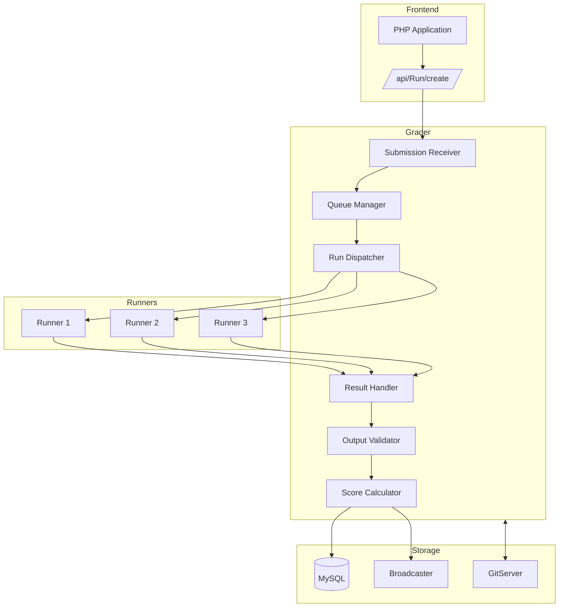
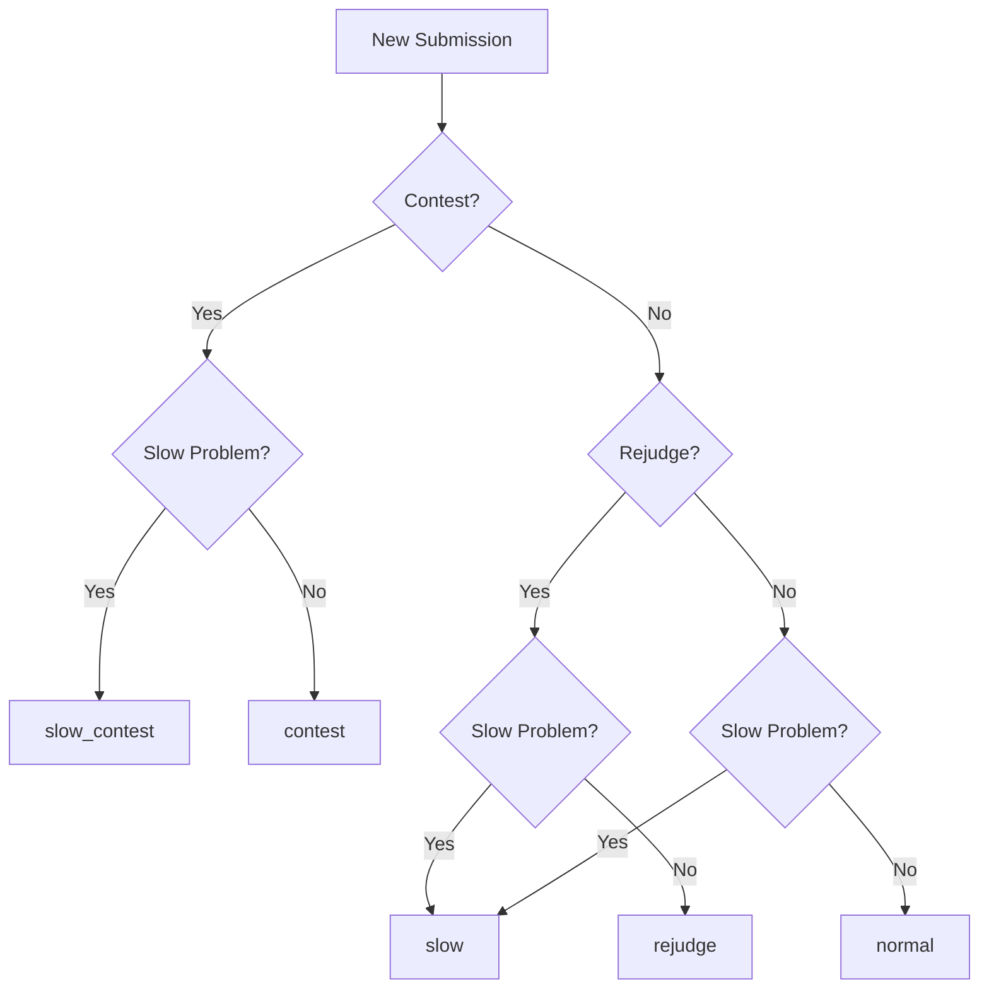
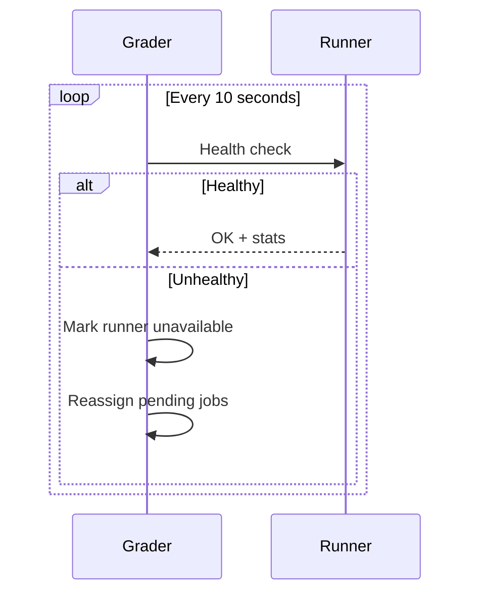
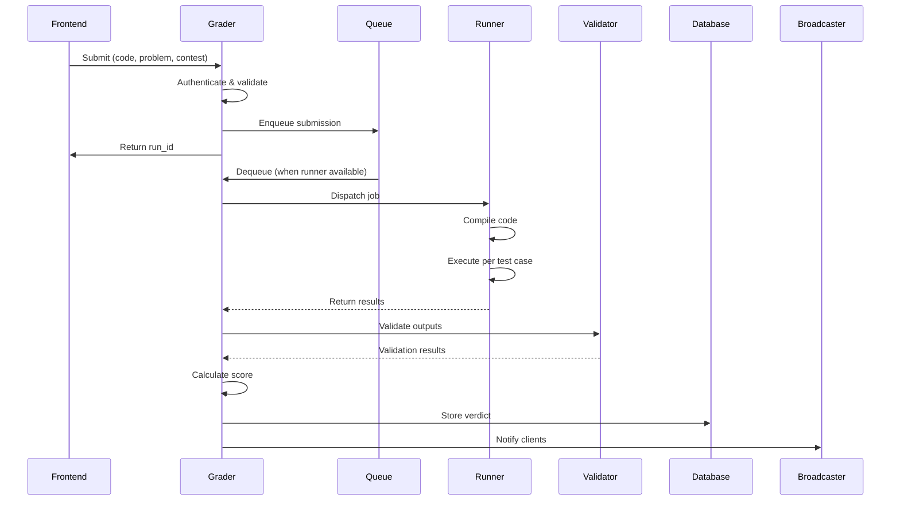

# Grader

The Grader is the central Go microservice responsible for managing submission queues, coordinating code evaluation across multiple Runners, and determining final verdicts. It acts as the dispatcher between the PHP frontend and the execution infrastructure.

## Overview

The Grader handles the entire submission lifecycle:

1. Receives submissions from the frontend
2. Places them in appropriate priority queues
3. Dispatches to available Runners
4. Collects execution results
5. Runs validators and computes scores
6. Stores results and notifies clients

## Architecture



## Queue System

### Queue Types

The Grader maintains 8 different queues for prioritization:

| Queue | Priority | Purpose |
|-------|----------|---------|
| `contest` | 1 (Highest) | Active contest submissions |
| `urgent` | 2 | High-priority contests |
| `contest_rejudge` | 3 | Contest rejudge requests |
| `normal` | 4 | Practice mode submissions |
| `rejudge` | 5 | General rejudge requests |
| `slow_contest` | 6 | Slow problems in contests |
| `slow_urgent` | 7 | Slow problems (high-priority) |
| `slow` | 8 (Lowest) | Slow problems (general) |

### Queue Routing Logic



### Slow Problem Detection

Problems are marked as "slow" if they have:

- Time limit > 30 seconds
- Memory limit > 512 MB
- History of long execution times

## Runner Management

### Runner Registration

Runners register with the Grader on startup:

```go
type RunnerInfo struct {
    Name     string
    Hostname string
    Port     int
    MaxJobs  int
    Features []string  // e.g., ["cpp", "java", "python"]
}
```

### Load Balancing

The Dispatcher uses weighted round-robin:

1. Check runner availability
2. Consider current load per runner
3. Match runner capabilities to submission language
4. Dispatch to least-loaded suitable runner

### Health Monitoring



## Evaluation Flow

### Detailed Sequence



### Result Structure

```json
{
  "run_id": 12345,
  "verdict": "PA",
  "score": 0.75,
  "contest_score": 75.0,
  "runtime": 0.234,
  "memory": 16384,
  "compile_error": null,
  "cases": [
    {"name": "1", "verdict": "AC", "score": 1.0, "runtime": 0.05},
    {"name": "2", "verdict": "AC", "score": 1.0, "runtime": 0.08},
    {"name": "3", "verdict": "WA", "score": 0.0, "runtime": 0.06},
    {"name": "4", "verdict": "AC", "score": 1.0, "runtime": 0.05}
  ]
}
```

## Validation

### Validator Types

| Type | Description | Use Case |
|------|-------------|----------|
| `token-caseless` | Tokenize, case-insensitive compare | Most problems |
| `token-numeric` | Compare numbers with tolerance | Floating-point |
| `literal` | Exact byte-by-byte match | Precise output |
| `custom` | User-provided validator program | Multiple answers |

### Custom Validator Interface

```cpp
// validator.cpp
#include <iostream>
#include <fstream>

int main(int argc, char* argv[]) {
    // argv[1] = input file
    // argv[2] = expected output (may be empty)
    // argv[3] = contestant output
    
    std::ifstream input(argv[1]);
    std::ifstream expected(argv[2]);
    std::ifstream contestant(argv[3]);
    
    // Validation logic...
    
    // Output score (0.0 to 1.0)
    std::cout << 1.0 << std::endl;
    return 0;
}
```

## Scoring Logic

### Score Calculation

```python
def calculate_score(test_results, scoring_mode):
    if scoring_mode == "all_or_nothing":
        # All tests must pass
        return 1.0 if all(r.verdict == "AC" for r in test_results) else 0.0
    
    elif scoring_mode == "partial":
        # Sum of individual test scores
        return sum(r.score * r.weight for r in test_results)
    
    elif scoring_mode == "max_per_group":
        # Group tests, take max per group
        groups = group_by(test_results, lambda r: r.group)
        return sum(max(r.score for r in g) * g.weight for g in groups)
```

### Verdict Hierarchy

When combining test case verdicts:

```
1. CE (Compilation Error) - if compile failed
2. JE (Judge Error) - if judge had issues
3. TLE - if any test exceeded time
4. MLE - if any test exceeded memory
5. RTE - if any test crashed
6. WA - if any test wrong answer
7. PA - if partial score > 0 but < 1
8. AC - if all tests passed
```

## API Endpoints

### Internal API (Runners)

| Endpoint | Method | Description |
|----------|--------|-------------|
| `/register` | POST | Runner registration |
| `/job` | GET | Get next job |
| `/result` | POST | Submit results |
| `/health` | GET | Health check |

### Web Interface

Access at `http://grader:36663/grader/`:

- Queue status and lengths
- Runner status
- Recent submissions
- Error logs

## Configuration

### Key Settings

```json
{
  "grader": {
    "port": 21680,
    "web_port": 36663,
    "max_queue_length": 10000,
    "runner_timeout": 300,
    "validation_timeout": 60,
    "db_connection_pool": 20
  },
  "queues": {
    "contest": {"workers": 4},
    "normal": {"workers": 8},
    "slow": {"workers": 2}
  }
}
```

### Environment Variables

| Variable | Default | Description |
|----------|---------|-------------|
| `GRADER_DB_HOST` | localhost | MySQL host |
| `GRADER_DB_NAME` | omegaup | Database name |
| `GRADER_LOG_LEVEL` | info | Log verbosity |
| `GRADER_METRICS_PORT` | 6060 | Prometheus metrics |

## Monitoring

### Key Metrics

| Metric | Type | Description |
|--------|------|-------------|
| `grader_queue_length` | Gauge | Items per queue |
| `grader_runs_total` | Counter | Total processed |
| `grader_run_duration` | Histogram | Processing time |
| `grader_runners_active` | Gauge | Active runners |
| `grader_validation_errors` | Counter | Validator failures |

### Alerts

```yaml
- alert: GraderQueueBacklog
  expr: grader_queue_length{queue="contest"} > 50
  for: 5m
  annotations:
    summary: "Contest queue backlog"

- alert: NoRunnersAvailable  
  expr: grader_runners_active == 0
  for: 1m
  annotations:
    summary: "No runners available"
```

## Troubleshooting

### Common Issues

**Submissions stuck in queue**:
```bash
# Check queue status
curl http://grader:36663/grader/status/

# Check runner connectivity
curl http://runner1:port/health
```

**Validator errors**:
```bash
# Check grader logs
docker-compose logs grader | grep -i validator
```

**Slow processing**:
```bash
# Check metrics
curl http://grader:6060/metrics | grep queue
```

## Related Documentation

- **[Grader Internals](../architecture/grader-internals.md)** - Deep technical details
- **[Runner](runner.md)** - Code execution system
- **[Verdicts](verdicts.md)** - Verdict explanations
- **[Architecture](../architecture/index.md)** - System overview
