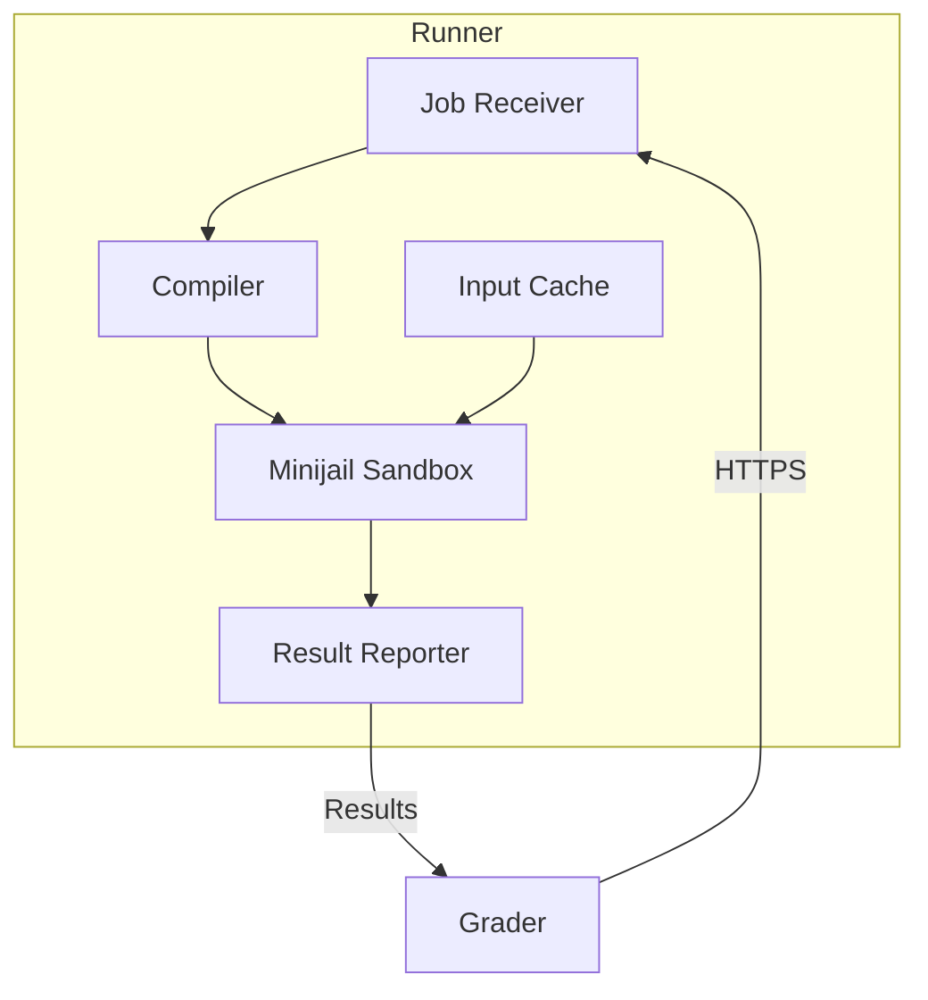
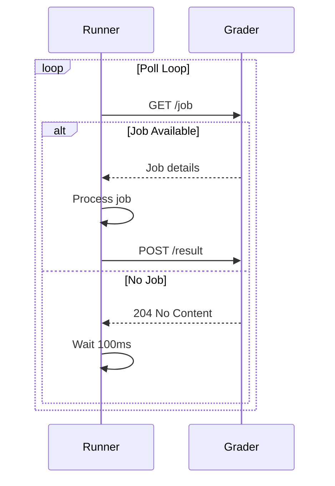
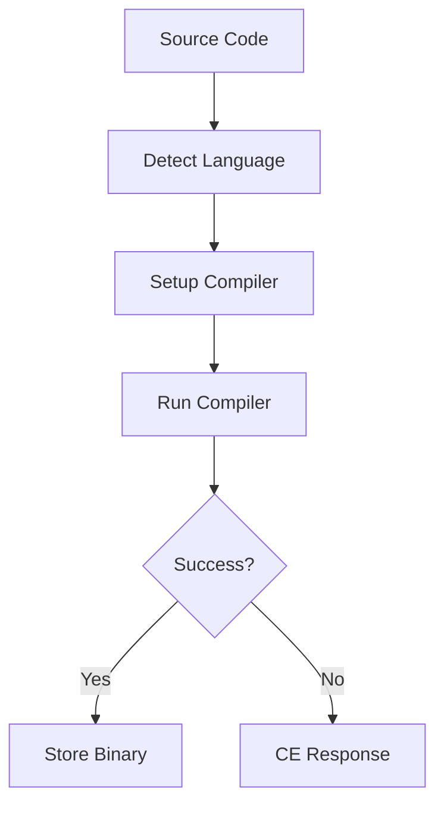
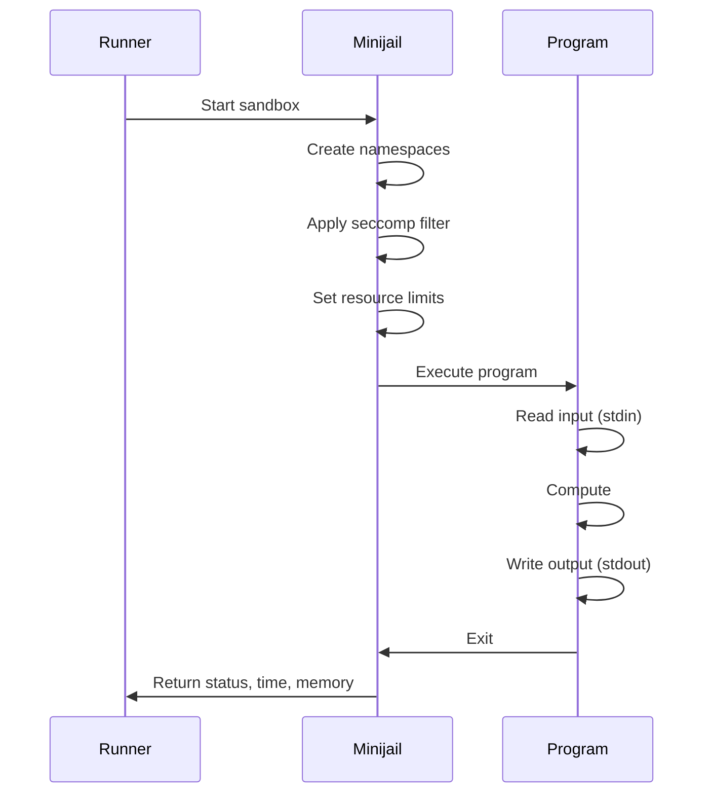

# Runner

Runners are distributed Go services responsible for compiling and executing user-submitted code in a secure sandbox environment. Multiple Runners work in parallel to handle submission load during contests.

## Overview

Each Runner is deployed on a cloud virtual machine and communicates with the Grader via HTTPS using mutual certificate authentication. Runners handle the complete execution lifecycle: compilation, sandboxed execution, and result collection.

## Architecture



## Key Features

- **Secure Execution**: Uses Minijail sandbox for process isolation
- **Distributed**: Multiple Runners for horizontal scalability
- **Language Support**: 10+ programming languages
- **Caching**: Test case inputs cached for efficiency
- **Mutual Auth**: Certificate-based authentication with Grader

## Supported Languages

| Language | Compiler/Interpreter | Version | Extensions |
|----------|---------------------|---------|------------|
| C | GCC | 10+ | `.c` |
| C++ 11/14/17/20 | G++ | 10+ | `.cpp` |
| Java | OpenJDK | 17+ | `.java` |
| Python 3 | CPython | 3.10+ | `.py` |
| Python 2 | CPython | 2.7 | `.py` |
| Ruby | MRI | 3.0+ | `.rb` |
| Pascal | Free Pascal | 3.2+ | `.pas` |
| Karel (Pascal) | Custom | - | `.kp` |
| Karel (Java) | Custom | - | `.kj` |
| Haskell | GHC | 8.10+ | `.hs` |
| C# | Mono | 6.12+ | `.cs` |
| Lua | Lua | 5.4+ | `.lua` |

## Execution Flow

### 1. Job Reception

The Runner polls the Grader for available jobs:



### 2. Compilation



**Compilation Commands by Language**:

```bash
# C++17
g++ -std=c++17 -O2 -lm -o program main.cpp

# Java
javac -encoding UTF-8 Main.java

# Python (no compilation, syntax check)
python3 -m py_compile solution.py

# Pascal
fpc -O2 program.pas
```

### 3. Sandboxed Execution

For each test case:



### 4. Result Collection

Runner collects per-test-case results:

```json
{
  "verdict": "OK",
  "runtime_ms": 45,
  "memory_kb": 16384,
  "output_hash": "d41d8cd98f00b204e9800998ecf8427e",
  "wall_time_ms": 50,
  "signal": 0
}
```

## API Endpoints

### `/compile/`

Compiles a submission synchronously.

**Request**:
```json
{
  "lang": "cpp17",
  "code": {
    "main.cpp": "#include <iostream>\nint main() { ... }"
  }
}
```

**Response (Success)**:
```json
{
  "token": "ABJdfoeKFPer9183409dsfDFPOfkaR834JFDJF=",
  "compile_time_ms": 1234
}
```

**Response (Error)**:
```json
{
  "error": "main.cpp:5:1: error: expected ';' before '}'"
}
```

### `/run/`

Executes compiled program against test cases.

**Request**:
```json
{
  "token": "ABJdfoeKFPer9183409dsfDFPOfkaR834JFDJF=",
  "input_hash": "d41d8cd98f00b204e9800998ecf8427e",
  "time_limit_ms": 1000,
  "memory_limit_kb": 262144,
  "output_limit_kb": 65536
}
```

**Response**:
```json
{
  "results": [
    {
      "name": "1",
      "status": "OK",
      "time_ms": 45,
      "memory_kb": 16384,
      "output_hash": "abc123..."
    },
    {
      "name": "2",
      "status": "TLE",
      "time_ms": 1000,
      "memory_kb": 16384
    }
  ]
}
```

### `/input/`

Uploads test case inputs to cache.

**Request**:
```json
{
  "hash": "d41d8cd98f00b204e9800998ecf8427e",
  "cases": [
    {"name": "1", "input": "5\n1 2 3 4 5"},
    {"name": "2", "input": "3\n10 20 30"}
  ]
}
```

### `/health`

Health check endpoint.

**Response**:
```json
{
  "status": "healthy",
  "uptime_seconds": 86400,
  "jobs_completed": 12345,
  "current_jobs": 2
}
```

## Resource Limits

### Default Limits

| Resource | Default | Max Configurable |
|----------|---------|------------------|
| Time | 1 second | 60 seconds |
| Memory | 256 MB | 1 GB |
| Output | 64 MB | 256 MB |
| File Size | 64 MB | 256 MB |
| Processes | 1 | 1 (no fork) |
| Open Files | 20 | 50 |

### Time Measurement

Three time metrics are tracked:

- **CPU Time**: Actual CPU cycles used
- **Wall Time**: Real elapsed time
- **System Time**: Kernel time (should be minimal)

```
Total Time = User Time + System Time
Wall Time >= Total Time (due to I/O waits)
```

## Caching

### Input Cache

Test cases are cached to avoid redundant transfers:

```
/var/lib/omegaup/runner/cache/
├── d41d8cd98f00b204e9800998ecf8427e/
│   ├── 1.in
│   ├── 2.in
│   └── 3.in
└── abc123.../
    └── ...
```

### Cache Eviction

- **LRU Policy**: Least recently used inputs evicted first
- **Max Size**: Configurable (default 10 GB)
- **TTL**: Inputs expire after 24 hours

### Compiled Binary Cache

Compiled binaries cached for rejudging:

```
/var/lib/omegaup/runner/compiled/
└── {token}/
    └── program
```

## Security

### Sandbox Configuration

See [Sandbox documentation](sandbox.md) for details:

- Process isolation via Linux namespaces
- Syscall filtering via seccomp-BPF
- Resource limits via cgroups/setrlimit
- Filesystem isolation

### Network Security

- **HTTPS Only**: All communication encrypted
- **Mutual TLS**: Certificate-based authentication
- **No Internet**: Runners isolated from internet

### Authentication

```yaml
# Runner certificate configuration
tls:
  cert_file: /etc/omegaup/runner.crt
  key_file: /etc/omegaup/runner.key
  ca_file: /etc/omegaup/ca.crt
```

## Configuration

### Runner Config

```json
{
  "runner": {
    "port": 6161,
    "grader_url": "https://grader:21680",
    "sandbox_path": "/usr/bin/minijail0",
    "cache_dir": "/var/lib/omegaup/runner/cache",
    "max_cache_size_gb": 10,
    "max_concurrent_jobs": 4
  },
  "languages": {
    "cpp17": {
      "compiler": "/usr/bin/g++",
      "flags": ["-std=c++17", "-O2", "-lm"]
    }
  }
}
```

### Environment Variables

| Variable | Default | Description |
|----------|---------|-------------|
| `RUNNER_GRADER_URL` | - | Grader URL (required) |
| `RUNNER_PORT` | 6161 | HTTP listen port |
| `RUNNER_MAX_JOBS` | 4 | Concurrent jobs |
| `RUNNER_CACHE_DIR` | `/var/lib/omegaup/runner` | Cache directory |

## Monitoring

### Metrics

| Metric | Type | Description |
|--------|------|-------------|
| `runner_jobs_total` | Counter | Total jobs processed |
| `runner_job_duration_seconds` | Histogram | Job processing time |
| `runner_compilation_errors` | Counter | Compilation failures |
| `runner_execution_errors` | Counter | Runtime errors |
| `runner_cache_hits` | Counter | Cache hit count |
| `runner_cache_size_bytes` | Gauge | Current cache size |

## Troubleshooting

### Common Issues

**Compilation timeout**:
```bash
# Check compiler is working
docker exec runner /usr/bin/g++ --version
```

**Sandbox failures**:
```bash
# Check kernel features
cat /proc/sys/kernel/unprivileged_userns_clone
```

**Cache issues**:
```bash
# Check cache disk space
df -h /var/lib/omegaup/runner
```

## Related Documentation

- **[Runner Internals](../architecture/runner-internals.md)** - Deep technical details
- **[Grader](grader.md)** - Queue management system
- **[Sandbox](sandbox.md)** - Security and isolation
- **[Languages](../reference/languages.md)** - Language specifics
