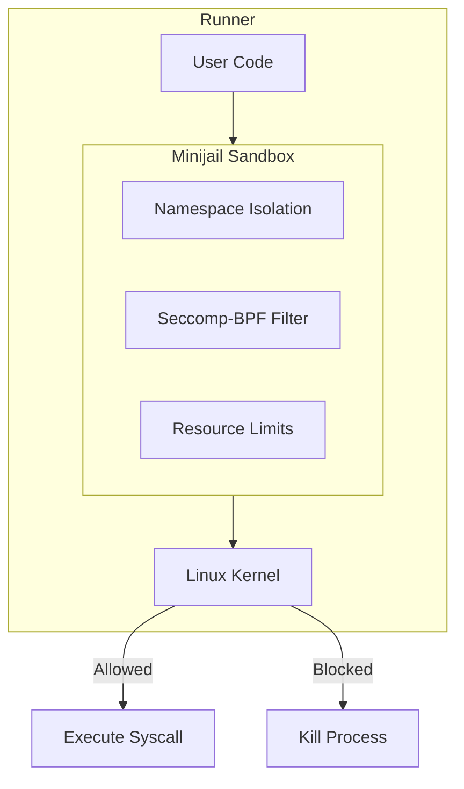
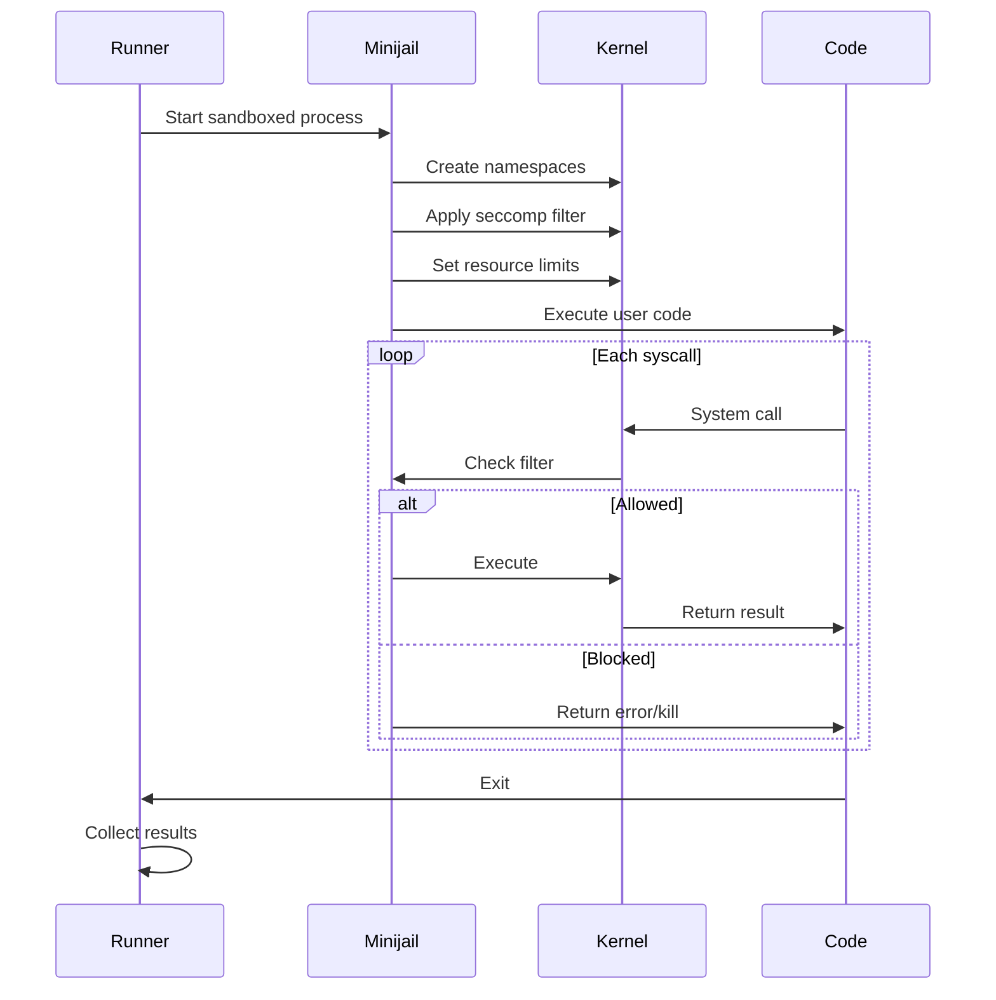

# Sandbox

omegaUp uses **Minijail**, a sandboxing tool originally developed by Google for Chrome OS, to securely execute user-submitted code. The sandbox provides robust isolation to prevent malicious code from affecting the system.

## Overview

The sandbox intercepts and controls all system interactions from user code, ensuring:

- **Process Isolation**: Code runs in isolated namespaces
- **Syscall Filtering**: Dangerous system calls are blocked
- **Resource Limits**: Memory, CPU, and file access are restricted
- **Network Blocking**: No network access from submitted code

## Architecture



## Security Layers

### 1. Linux Namespaces

Minijail uses namespaces to isolate the process:

| Namespace | Isolation Provided |
|-----------|-------------------|
| **PID** | Process ID isolation - can't see other processes |
| **NET** | Network isolation - no network access |
| **MNT** | Mount isolation - restricted filesystem view |
| **IPC** | Inter-process communication isolation |
| **USER** | User ID mapping - runs as unprivileged user |
| **UTS** | Hostname isolation |

### 2. Seccomp-BPF Filtering

System calls are filtered using seccomp-BPF:

```c
// Allowed syscalls (essential for execution)
read, write, open, close, fstat, mmap, mprotect, 
munmap, brk, exit_group, arch_prctl, access, 
execve, getpid, getuid, getgid, geteuid, getegid

// Blocked syscalls (dangerous operations)
socket, connect, bind, listen, accept,  // No networking
fork, clone, vfork,                      // No process creation
kill, tkill, tgkill,                     // No signal sending
ptrace,                                  // No debugging
mount, umount, pivot_root,               // No filesystem changes
```

### 3. Resource Limits

Enforced limits using `setrlimit`:

| Resource | Typical Limit | Purpose |
|----------|--------------|---------|
| **CPU Time** | 1-60 seconds | Prevent infinite loops |
| **Memory** | 256 MB | Prevent memory exhaustion |
| **File Size** | 64 MB | Limit output |
| **Open Files** | 20 | Prevent file descriptor exhaustion |
| **Processes** | 1 | No forking |
| **Stack Size** | 8 MB | Prevent stack overflow |

## Syscall Handling

The sandbox can handle system calls in three ways:

### Allow

Harmless syscalls proceed normally:

```
read() → Allow (needed for input)
write() → Allow (needed for output)
mmap() → Allow (needed for memory allocation)
```

### Block/Kill

Dangerous syscalls terminate the process:

```
socket() → EPERM (no networking)
fork() → EPERM (no process creation)
ptrace() → SIGKILL (no debugging)
```

### Replace/Emulate

Some syscalls are replaced with safe alternatives:

```
getpid() → Returns fixed value
gettimeofday() → Returns controlled time
```

## Execution Flow



## Filesystem Isolation

### Visible Paths

User code can only see:

```
/usr/lib/          # Shared libraries (read-only)
/lib/              # System libraries (read-only)
/tmp/              # Temporary files (read-write, limited)
/dev/null          # Null device
/dev/urandom       # Random numbers (limited)
```

### Hidden Paths

Protected from user code:

```
/home/             # User data
/etc/              # System configuration
/proc/             # Process information (mostly)
/sys/              # System information
/var/              # Variable data
```

## Language-Specific Configurations

Different languages require different sandbox profiles:

### C/C++

```
Syscalls: minimal set
Filesystem: standard libraries only
Memory: direct allocation
```

### Java

```
Syscalls: extended for JVM
Filesystem: JRE paths added
Memory: JVM heap management
```

### Python

```
Syscalls: interpreter requirements
Filesystem: Python stdlib paths
Memory: interpreter overhead
```

### Interpreted Languages

Additional considerations:

- Interpreter binaries accessible
- Standard libraries in path
- Module import restrictions

## Minijail Configuration

### Command Line Options

```bash
minijail0 \
    -c 0                    # No capabilities
    -n                      # No new privileges
    -v                      # Mount namespace
    -p                      # PID namespace
    -l                      # IPC namespace
    -e                      # Network namespace
    -r                      # Remount /proc read-only
    -t                      # Mount tmpfs at /tmp
    -b /usr/lib,/usr/lib,0  # Bind mount (read-only)
    -S /path/to/policy.bpf  # Seccomp policy
    -T static               # Static seccomp
    -- /path/to/program     # Program to run
```

### Seccomp Policy File

```bpf
# policy.bpf - Example seccomp policy
read: 1
write: 1
open: 1
close: 1
fstat: 1
mmap: arg2 in ~0x4  # No PROT_EXEC with PROT_WRITE
munmap: 1
brk: 1
exit_group: 1
```

## Error Detection

### Runtime Error Signals

| Signal | Meaning | Common Cause |
|--------|---------|--------------|
| SIGSEGV | Segmentation fault | Invalid memory access |
| SIGFPE | Floating point exception | Division by zero |
| SIGABRT | Abort | Assertion failure |
| SIGKILL | Killed | Syscall violation |
| SIGXCPU | CPU time exceeded | Infinite loop |

### Sandbox Violations

Detected and reported as RTE with details:

```
Syscall violation: socket (blocked)
Memory limit exceeded: 267386880 > 268435456
Time limit exceeded: 1.023s > 1.000s
```

## Comparison with Alternatives

| Feature | Minijail | Docker | chroot | ptrace |
|---------|----------|--------|--------|--------|
| Overhead | Very Low | Low | Very Low | High |
| Isolation | Strong | Strong | Weak | Medium |
| Syscall Filter | Yes | Yes | No | Yes |
| Namespace Support | Yes | Yes | No | No |
| Resource Limits | Yes | Yes | No | No |
| Setup Complexity | Medium | Low | Low | High |

## Security Considerations

### Defense in Depth

The sandbox is one layer of multiple security measures:

1. **Sandbox** (Minijail) - Process isolation
2. **Container** (Docker) - Service isolation  
3. **Network** - Firewall rules
4. **Authentication** - Access control

### Known Limitations

- Cannot prevent all timing attacks
- Some information leakage through resource usage
- Requires Linux kernel features

### Escape Prevention

Regular security audits check for:

- Syscall filter bypasses
- Namespace escape techniques
- Resource limit circumvention

## Troubleshooting

### Common Issues

**Sandbox initialization failed**:
```bash
# Check kernel capabilities
cat /proc/sys/kernel/unprivileged_userns_clone
# Should be 1
```

**Syscall blocked unexpectedly**:
```bash
# Run with verbose logging
minijail0 -L -- /path/to/program
```

**Memory limit issues**:
```bash
# Check cgroup limits
cat /sys/fs/cgroup/memory/omegaup/memory.limit_in_bytes
```

## Related Documentation

- **[Runner Internals](../architecture/runner-internals.md)** - Code execution details
- **[Grader Internals](../architecture/grader-internals.md)** - Submission processing
- **[Security](../architecture/security.md)** - Overall security architecture
- **[Verdicts](verdicts.md)** - Understanding execution results
