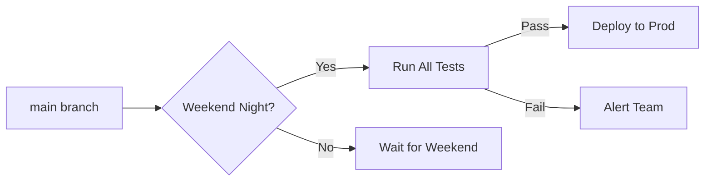
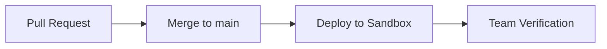
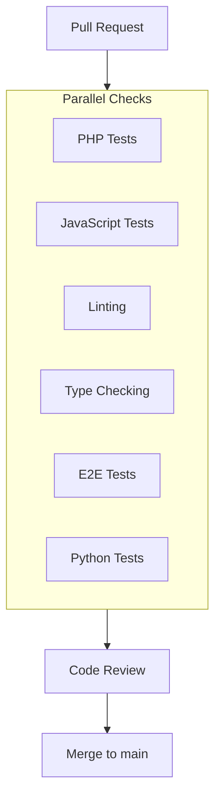
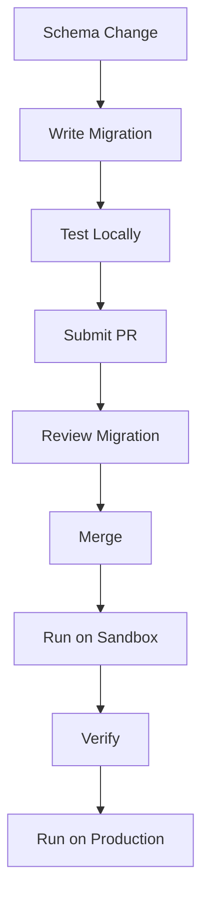

# Release and Deployment

omegaUp uses GitHub Actions for continuous integration and automated deployments. This guide covers the deployment process, environments, and release procedures.

## Deployment Environments

### Production

| Attribute | Value |
|-----------|-------|
| **URL** | [omegaup.com](https://omegaup.com) |
| **Schedule** | Automatic weekend nights (Central Mexico time) |
| **Trigger** | Scheduled GitHub Action |
| **Requirements** | All tests pass, no blocking issues |

Production deployments are scheduled to minimize user impact:



### Sandbox (Staging)

| Attribute | Value |
|-----------|-------|
| **URL** | [sandbox.omegaup.com](https://sandbox.omegaup.com) |
| **Trigger** | Every merge to `main` branch |
| **Purpose** | Pre-production testing |
| **Data** | Subset of production data |

Sandbox deployments happen automatically:



### Hotfixes

For critical production issues:

| Attribute | Value |
|-----------|-------|
| **Trigger** | Manual deployment |
| **Process** | Internal validation required |
| **Approval** | 2 team members minimum |

## CI/CD Pipeline

### Pull Request Checks

Every PR must pass these checks before merging:



### Test Suites

| Suite | Tool | Coverage | Time |
|-------|------|----------|------|
| PHP Unit Tests | PHPUnit | Controllers, Libs | ~5 min |
| JavaScript Tests | Jest | Vue components | ~3 min |
| End-to-End Tests | Cypress | Critical flows | ~15 min |
| Python Tests | pytest | Cronjobs, scripts | ~2 min |
| Type Checking | Psalm | PHP types | ~2 min |
| Linting | ESLint, PHP-CS-Fixer | Style | ~1 min |

### Linting Rules

Enforced standards:

```yaml
# PHP
- PSR-12 coding standard
- Strict types required
- Psalm type annotations

# TypeScript
- ESLint strict mode
- Prettier formatting
- No any types (where possible)

# Python
- PEP 8 style
- Type hints required
```

## Code Coverage

We use **Codecov** to track test coverage:

| Language | Current Coverage | Target |
|----------|-----------------|--------|
| PHP | ~70% | 80% |
| TypeScript | ~60% | 70% |
| Cypress E2E | Not measured | TBD |

Coverage requirements:

- PRs should not decrease coverage
- New code should have tests
- Critical paths require >80% coverage

## Deployment Process

### Automated Production Deployment

```yaml
# .github/workflows/deploy-production.yml (simplified)
name: Deploy Production

on:
  schedule:
    - cron: '0 6 * * 0'  # Sunday 6 AM UTC (midnight CDT)

jobs:
  deploy:
    runs-on: ubuntu-latest
    steps:
      - name: Run All Tests
        run: ./stuff/run-tests.sh
        
      - name: Build Assets
        run: yarn build
        
      - name: Deploy to Production
        run: ./stuff/deploy.sh production
        
      - name: Smoke Tests
        run: ./stuff/smoke-tests.sh
        
      - name: Notify Team
        run: ./stuff/notify.sh
```

### Manual Hotfix Deployment

1. **Create hotfix branch**:
   ```bash
   git checkout -b hotfix/critical-bug main
   ```

2. **Apply fix and test**:
   ```bash
   # Make changes
   ./stuff/run-tests.sh
   ```

3. **Request approval**:
   - Create PR with `hotfix` label
   - Get 2 approvals

4. **Deploy manually**:
   ```bash
   ./stuff/deploy.sh production --hotfix
   ```

## Deployment Checklist

### Pre-Deployment

- [ ] All CI checks pass
- [ ] Code review approved
- [ ] Database migrations tested
- [ ] No blocking issues in backlog
- [ ] Rollback plan documented

### Post-Deployment

- [ ] Smoke tests pass
- [ ] Monitor error rates
- [ ] Check key metrics
- [ ] Verify critical flows
- [ ] Update status page

## Database Migrations

### Migration Process



### Best Practices

1. **Backwards compatible**: Migrations should not break running code
2. **Reversible**: Include down migration
3. **Small changes**: One schema change per migration
4. **Tested**: Run locally before PR

```php
// Example migration
class AddUserPreferences extends Migration {
    public function up() {
        $this->execute('
            ALTER TABLE Users 
            ADD COLUMN preferences JSON DEFAULT NULL
        ');
    }
    
    public function down() {
        $this->execute('
            ALTER TABLE Users 
            DROP COLUMN preferences
        ');
    }
}
```

## Rollback Procedures

### Quick Rollback

If issues detected immediately:

```bash
# Revert to previous deployment
./stuff/deploy.sh production --rollback

# Verify rollback
./stuff/smoke-tests.sh
```

### Database Rollback

If migration caused issues:

```bash
# Run down migration
docker-compose exec frontend php stuff/database/migrate.php down

# Verify schema
docker-compose exec mysql mysql -u omegaup -p omegaup -e "DESCRIBE Users"
```

## Monitoring After Deploy

### Key Metrics to Watch

| Metric | Normal | Warning | Critical |
|--------|--------|---------|----------|
| Error Rate | <0.1% | >1% | >5% |
| Response Time (p95) | <500ms | >1s | >3s |
| Queue Length | <10 | >50 | >100 |

### Alerts

Automated alerts trigger for:

- Error rate spike (>5x normal)
- Response time degradation
- Service unavailability
- Database connection issues

## Related Documentation

- **[Monitoring](monitoring.md)** - Monitoring setup
- **[Troubleshooting](troubleshooting.md)** - Common issues
- **[Docker Setup](docker-setup.md)** - Container configuration
- **[Testing](../development/testing.md)** - Test guidelines
