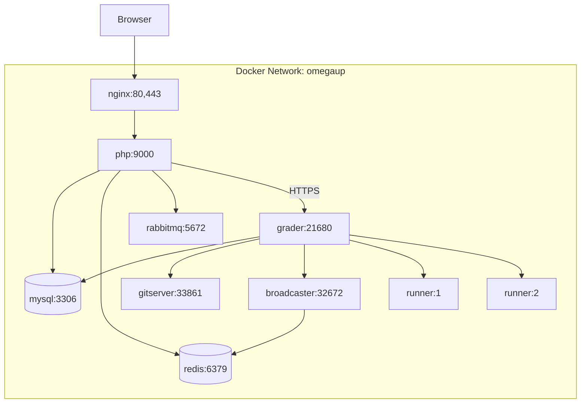

# Docker Setup

This guide covers the Docker Compose configuration for running omegaUp locally, including all services, networking, and common troubleshooting.

## Prerequisites

- Docker Engine 20.10+
- Docker Compose 2.0+
- 8GB+ RAM recommended
- 20GB+ disk space

## Quick Start

```bash
# Clone the repository
git clone https://github.com/omegaup/omegaup.git
cd omegaup

# Start all services
docker-compose up -d

# View logs
docker-compose logs -f

# Access at http://localhost:8001
```

## Architecture Overview



## Service Configuration

### Frontend (Nginx + PHP-FPM)

```yaml
services:
  frontend:
    image: omegaup/frontend
    ports:
      - "8001:80"
      - "8443:443"
    volumes:
      - ./frontend:/opt/omegaup
      - ./stuff/docker/etc/omegaup:/etc/omegaup:ro
    depends_on:
      mysql:
        condition: service_healthy
      redis:
        condition: service_started
    environment:
      - OMEGAUP_DB_HOST=mysql
      - OMEGAUP_DB_NAME=omegaup
      - OMEGAUP_DB_USER=omegaup
      - OMEGAUP_DB_PASS=omegaup
```

### MySQL Database

```yaml
services:
  mysql:
    image: mysql:8.0
    ports:
      - "13306:3306"
    volumes:
      - mysql_data:/var/lib/mysql
      - ./stuff/docker/mysql/init:/docker-entrypoint-initdb.d:ro
    environment:
      - MYSQL_ROOT_PASSWORD=omegaup
      - MYSQL_DATABASE=omegaup
      - MYSQL_USER=omegaup
      - MYSQL_PASSWORD=omegaup
    healthcheck:
      test: ["CMD", "mysqladmin", "ping", "-h", "localhost"]
      interval: 10s
      timeout: 5s
      retries: 5
    command: >
      --default-authentication-plugin=mysql_native_password
      --character-set-server=utf8mb4
      --collation-server=utf8mb4_unicode_ci
```

### Redis Cache

```yaml
services:
  redis:
    image: redis:7-alpine
    ports:
      - "6379:6379"
    volumes:
      - redis_data:/data
    command: redis-server --appendonly yes
```

### RabbitMQ

```yaml
services:
  rabbitmq:
    image: rabbitmq:3-management
    ports:
      - "5672:5672"    # AMQP
      - "15672:15672"  # Management UI
    volumes:
      - rabbitmq_data:/var/lib/rabbitmq
    environment:
      - RABBITMQ_DEFAULT_USER=omegaup
      - RABBITMQ_DEFAULT_PASS=omegaup
```

### Grader

```yaml
services:
  grader:
    image: omegaup/backend
    ports:
      - "21680:21680"  # HTTPS API
      - "6060:6060"    # Metrics
    volumes:
      - ./stuff/docker/etc/omegaup/grader:/etc/omegaup/grader:ro
      - grader_data:/var/lib/omegaup
    depends_on:
      - mysql
      - gitserver
    entrypoint: >
      wait-for-it mysql:3306 -- 
      /usr/bin/omegaup-grader
```

### GitServer

```yaml
services:
  gitserver:
    image: omegaup/gitserver
    ports:
      - "33861:33861"  # HTTP API
      - "33862:33862"  # Git protocol
    volumes:
      - problems_data:/var/lib/omegaup/problems
      - ./stuff/docker/etc/omegaup/gitserver:/etc/omegaup/gitserver:ro
```

### Broadcaster

```yaml
services:
  broadcaster:
    image: omegaup/backend
    ports:
      - "32672:32672"  # Internal API
      - "39613:39613"  # WebSocket
    depends_on:
      - redis
    entrypoint: /usr/bin/omegaup-broadcaster
```

### Runners

```yaml
services:
  runner:
    image: omegaup/runner
    deploy:
      replicas: 2
    volumes:
      - runner_data:/var/lib/omegaup/runner
    cap_add:
      - SYS_PTRACE
    security_opt:
      - seccomp:unconfined
    depends_on:
      - grader
```

## Volumes

```yaml
volumes:
  mysql_data:
    driver: local
  redis_data:
    driver: local
  rabbitmq_data:
    driver: local
  grader_data:
    driver: local
  problems_data:
    driver: local
  runner_data:
    driver: local
```

## Networks

```yaml
networks:
  default:
    name: omegaup
    driver: bridge
```

## Environment Variables

### Frontend Variables

| Variable | Default | Description |
|----------|---------|-------------|
| `OMEGAUP_DB_HOST` | `mysql` | MySQL hostname |
| `OMEGAUP_DB_NAME` | `omegaup` | Database name |
| `OMEGAUP_DB_USER` | `omegaup` | Database user |
| `OMEGAUP_DB_PASS` | `omegaup` | Database password |
| `OMEGAUP_GRADER_URL` | `https://grader:21680` | Grader URL |
| `OMEGAUP_GITSERVER_URL` | `http://gitserver:33861` | GitServer URL |

### Grader Variables

| Variable | Default | Description |
|----------|---------|-------------|
| `OMEGAUP_DB_HOST` | `mysql` | MySQL hostname |
| `OMEGAUP_BROADCASTER_URL` | `https://broadcaster:32672` | Broadcaster URL |
| `OMEGAUP_GITSERVER_URL` | `http://gitserver:33861` | GitServer URL |

## Common Commands

### Start Services

```bash
# Start all services
docker-compose up -d

# Start specific service
docker-compose up -d frontend

# Rebuild and start
docker-compose up -d --build
```

### View Logs

```bash
# All services
docker-compose logs -f

# Specific service
docker-compose logs -f grader

# Last 100 lines
docker-compose logs --tail 100 frontend
```

### Service Management

```bash
# Stop all services
docker-compose down

# Stop and remove volumes
docker-compose down -v

# Restart specific service
docker-compose restart frontend

# Scale runners
docker-compose up -d --scale runner=4
```

### Database Operations

```bash
# Connect to MySQL
docker-compose exec mysql mysql -u omegaup -p omegaup

# Import database
docker-compose exec -T mysql mysql -u omegaup -p omegaup < backup.sql

# Run migrations
docker-compose exec frontend php /opt/omegaup/stuff/database/migrate.php
```

### Debugging

```bash
# Shell into container
docker-compose exec frontend bash

# Check container status
docker-compose ps

# Inspect container
docker inspect omegaup_frontend_1
```

## Configuration Files

### Directory Structure

```
stuff/docker/
├── etc/
│   └── omegaup/
│       ├── frontend/
│       │   └── config.php
│       ├── grader/
│       │   └── config.json
│       ├── gitserver/
│       │   └── config.json
│       └── ssl/
│           ├── ca.crt
│           ├── frontend.crt
│           └── frontend.key
├── mysql/
│   └── init/
│       └── 00-init.sql
└── nginx/
    └── default.conf
```

### Frontend Config

```php
// stuff/docker/etc/omegaup/frontend/config.php
<?php
define('OMEGAUP_DB_HOST', 'mysql');
define('OMEGAUP_DB_NAME', 'omegaup');
define('OMEGAUP_DB_USER', 'omegaup');
define('OMEGAUP_DB_PASS', 'omegaup');

define('OMEGAUP_GRADER_URL', 'https://grader:21680/');
define('OMEGAUP_GITSERVER_URL', 'http://gitserver:33861/');

define('REDIS_HOST', 'redis');
define('REDIS_PORT', 6379);
```

## Health Checks

### Check All Services

```bash
#!/bin/bash

# Frontend
curl -sf http://localhost:8001/health/ && echo "Frontend: OK" || echo "Frontend: FAIL"

# MySQL
docker-compose exec mysql mysqladmin ping -h localhost && echo "MySQL: OK" || echo "MySQL: FAIL"

# Redis
docker-compose exec redis redis-cli ping && echo "Redis: OK" || echo "Redis: FAIL"

# Grader (internal)
docker-compose exec frontend curl -sf https://grader:21680/health && echo "Grader: OK" || echo "Grader: FAIL"
```

## Troubleshooting

### Common Issues

#### MySQL Connection Refused

```bash
# Check if MySQL is ready
docker-compose logs mysql | grep "ready for connections"

# Restart MySQL
docker-compose restart mysql
```

#### Grader Not Responding

```bash
# Check grader logs
docker-compose logs grader

# Verify certificates
docker-compose exec grader ls -la /etc/omegaup/ssl/
```

#### Runner Sandbox Errors

```bash
# Check seccomp is disabled
docker-compose exec runner cat /proc/sys/kernel/seccomp/actions_logged

# Verify capabilities
docker-compose exec runner capsh --print
```

#### Slow Performance

```bash
# Increase Docker resources (Docker Desktop)
# Memory: 8GB+, CPUs: 4+

# Check resource usage
docker stats
```

### Reset Environment

```bash
# Stop everything
docker-compose down -v

# Remove all containers
docker-compose rm -f

# Remove images
docker-compose down --rmi all

# Fresh start
docker-compose up -d --build
```

## Production Considerations

For production deployment, see:

- **[Deployment Guide](deployment.md)** - Full deployment instructions
- **[Security](../architecture/security.md)** - Security configuration
- **[Monitoring](monitoring.md)** - Monitoring setup

## Related Documentation

- **[Infrastructure](../architecture/infrastructure.md)** - Service architecture
- **[Development Setup](../getting-started/development-setup.md)** - Dev environment
- **[Useful Commands](../development/useful-commands.md)** - More commands
