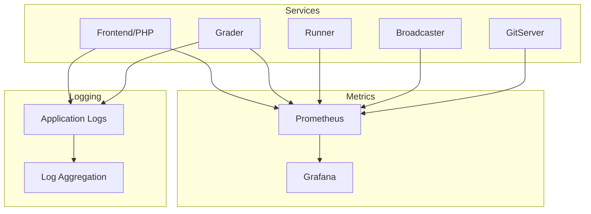

# Monitoring

omegaUp uses various monitoring tools to track system health, performance, and reliability across all services.

## Overview



## Metrics Collection

### Grader Metrics

The Grader exposes metrics on port `6060`:

```bash
curl http://grader:6060/metrics
```

**Key Metrics**:

| Metric | Type | Description |
|--------|------|-------------|
| `grader_queue_length` | Gauge | Number of submissions in queue |
| `grader_queue_total_wait_time_seconds` | Histogram | Time submissions spend in queue |
| `grader_runs_total` | Counter | Total runs processed |
| `grader_run_duration_seconds` | Histogram | Time to process each run |
| `grader_runners_available` | Gauge | Number of available runners |
| `grader_runners_total` | Gauge | Total registered runners |

### Runner Metrics

Each Runner reports its status to the Grader:

| Metric | Description |
|--------|-------------|
| `runner_cpu_usage` | Current CPU utilization |
| `runner_memory_usage` | Memory consumption |
| `runner_executions_total` | Total executions performed |
| `runner_compilation_errors` | Compilation failures |

### Application Metrics (PHP)

PHP application metrics tracked:

| Metric | Description |
|--------|-------------|
| `http_requests_total` | Total HTTP requests by endpoint |
| `http_request_duration_seconds` | Request latency histogram |
| `api_errors_total` | API error count by type |
| `db_query_duration_seconds` | Database query times |
| `cache_hits_total` | Redis cache hit rate |

## Prometheus Configuration

Example Prometheus scrape configuration:

```yaml
# prometheus.yml
global:
  scrape_interval: 15s
  evaluation_interval: 15s

scrape_configs:
  - job_name: 'grader'
    static_configs:
      - targets: ['grader:6060']
    
  - job_name: 'broadcaster'
    static_configs:
      - targets: ['broadcaster:6061']
    
  - job_name: 'gitserver'
    static_configs:
      - targets: ['gitserver:6062']
    
  - job_name: 'frontend'
    static_configs:
      - targets: ['frontend:9090']
```

## Key Dashboards

### Grader Dashboard

Monitor submission processing:

- **Queue Depth**: Current submissions waiting
- **Processing Rate**: Runs per minute
- **Runner Utilization**: Active vs idle runners
- **Verdict Distribution**: AC/WA/TLE breakdown
- **Average Wait Time**: Time in queue

### Contest Dashboard

During live contests:

- **Active Participants**: Users currently submitting
- **Submission Rate**: Submissions per minute
- **Scoreboard Updates**: Update frequency
- **Clarification Queue**: Pending clarifications

### Infrastructure Dashboard

System health overview:

- **CPU/Memory Usage**: Per service
- **Disk I/O**: Database and problem storage
- **Network Traffic**: Inter-service communication
- **Error Rates**: 5xx responses, timeouts

## Alerting Rules

### Critical Alerts

```yaml
# alerts.yml
groups:
  - name: critical
    rules:
      - alert: GraderQueueBacklog
        expr: grader_queue_length > 100
        for: 5m
        labels:
          severity: critical
        annotations:
          summary: "Grader queue backlog detected"
          description: "Queue has {{ $value }} pending submissions"
      
      - alert: NoRunnersAvailable
        expr: grader_runners_available == 0
        for: 1m
        labels:
          severity: critical
        annotations:
          summary: "No runners available"
          
      - alert: HighErrorRate
        expr: rate(api_errors_total[5m]) > 10
        for: 2m
        labels:
          severity: warning
        annotations:
          summary: "High API error rate"
```

### Warning Alerts

```yaml
      - alert: HighQueueLatency
        expr: histogram_quantile(0.95, grader_queue_total_wait_time_seconds) > 60
        for: 10m
        labels:
          severity: warning
        annotations:
          summary: "High queue wait time"
      
      - alert: DatabaseSlowQueries
        expr: histogram_quantile(0.99, db_query_duration_seconds) > 1
        for: 5m
        labels:
          severity: warning
```

## Logging

### Log Locations

| Service | Log Location |
|---------|--------------|
| Frontend (PHP) | `/var/log/omegaup/frontend.log` |
| Grader | `/var/log/omegaup/grader.log` |
| Runner | `/var/log/omegaup/runner.log` |
| Nginx | `/var/log/nginx/access.log`, `/var/log/nginx/error.log` |
| MySQL | `/var/log/mysql/error.log` |

### Log Format

Structured JSON logging:

```json
{
  "timestamp": "2025-01-23T10:30:00Z",
  "level": "INFO",
  "service": "grader",
  "message": "Run completed",
  "run_id": 12345,
  "verdict": "AC",
  "duration_ms": 450,
  "runner": "runner-1"
}
```

### Log Aggregation

Centralized logging with ELK stack:

```yaml
# filebeat.yml
filebeat.inputs:
  - type: log
    enabled: true
    paths:
      - /var/log/omegaup/*.log
    json.keys_under_root: true
    
output.elasticsearch:
  hosts: ["elasticsearch:9200"]
  index: "omegaup-%{+yyyy.MM.dd}"
```

## Health Checks

### Service Health Endpoints

| Service | Endpoint | Expected Response |
|---------|----------|-------------------|
| Frontend | `GET /health/` | `200 OK` |
| Grader | `GET /grader/status/` | JSON with queue info |
| MySQL | TCP check on 3306 | Connection success |
| Redis | `PING` | `PONG` |

### Docker Health Checks

```yaml
services:
  frontend:
    healthcheck:
      test: ["CMD", "curl", "-f", "http://localhost/health/"]
      interval: 30s
      timeout: 10s
      retries: 3
      start_period: 40s
  
  mysql:
    healthcheck:
      test: ["CMD", "mysqladmin", "ping", "-h", "localhost"]
      interval: 10s
      timeout: 5s
      retries: 5
```

## Performance Baselines

### Expected Metrics (Normal Operation)

| Metric | Normal Range | Warning | Critical |
|--------|--------------|---------|----------|
| Queue Length | 0-10 | >50 | >100 |
| Queue Wait Time | <10s | >30s | >60s |
| API Latency (p95) | <200ms | >500ms | >1s |
| Error Rate | <0.1% | >1% | >5% |
| Runner Utilization | 20-80% | >90% | 100% |

## Troubleshooting with Metrics

### Slow Submissions

1. Check `grader_queue_length` - queue backlog?
2. Check `grader_runners_available` - enough runners?
3. Check `grader_run_duration_seconds` - slow problems?

### High Error Rates

1. Check `api_errors_total` by error type
2. Check `db_query_duration_seconds` - database issues?
3. Check service logs for stack traces

### Memory Issues

1. Check container memory limits
2. Review `cache_size_bytes` metrics
3. Check for memory leaks in long-running processes

## Related Documentation

- **[Troubleshooting](troubleshooting.md)** - Common issues and solutions
- **[Infrastructure](../architecture/infrastructure.md)** - Service architecture
- **[Deployment](deployment.md)** - Deployment process
