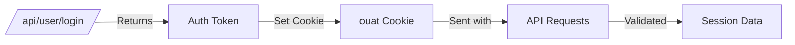
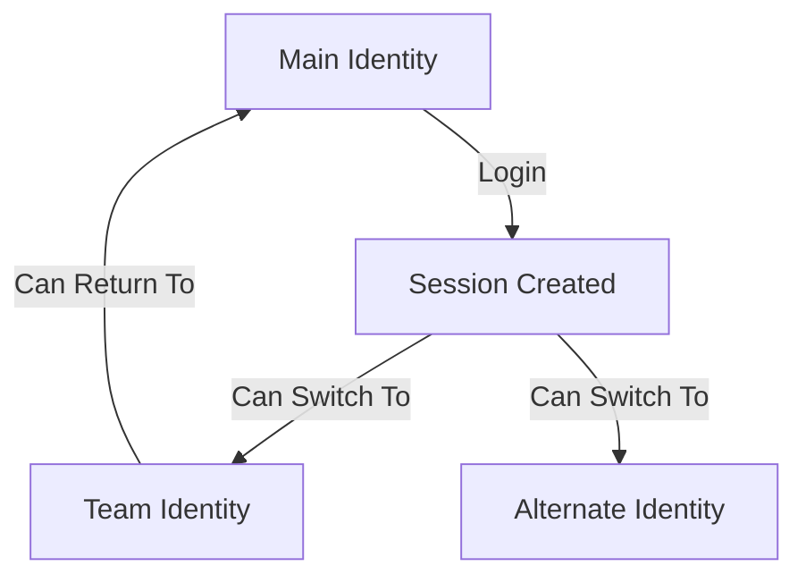

# API de administrador y sistema

Esta página documenta los puntos finales administrativos y las API de utilidades del sistema, incluida la gestión de sesiones, la sincronización horaria y las estadísticas de la plataforma.

## API de sesión

### Obtener sesión actual

Devuelve información sobre la sesión actual y la hora del servidor. Útil para sincronizar la hora del cliente con el servidor.

**`GET /api/session/currentSession/`**

**Parámetros:**

| Parámetro | Tipo | Requerido | Descripción |
|-----------|------|----------|-------------|
| `auth_token` | cadena | No | Token de autenticación (generalmente de cookie) |

**Respuesta:**

```json
{
  "session": {
    "valid": true,
    "email": "user@example.com",
    "user": { ... },
    "identity": { ... },
    "classname": "user-rank-expert",
    "auth_token": "abc123...",
    "is_admin": false,
    "associated_identities": [
      { "username": "main-user", "default": true },
      { "username": "team:group:team1", "default": false }
    ],
    "api_tokens": [
      {
        "name": "CI Token",
        "timestamp": { "time": 1609459200 },
        "last_used": { "time": 1704067200 },
        "rate_limit": {
          "limit": 1000,
          "remaining": 950,
          "reset": { "time": 1704070800 }
        }
      }
    ]
  },
  "time": 1704067200
}
```
**Campos de sesión:**

| Campo | Descripción |
|-------|-------------|
| `valid` | Si la sesión está autenticada |
| `email` | Dirección de correo electrónico del usuario |
| `user` | Objeto de usuario completo |
| `identity` | Identidad activa actual |
| `loginIdentity` | Identidad de inicio de sesión original |
| `classname` | Clase CSS para visualización de clasificación de usuarios |
| `is_admin` | Estado de administrador del sistema |
| `associated_identities` | Identidades vinculadas (equipos, etc.) |
| `api_tokens` | Tokens API activos |

**Privilegios:** Público (devuelve datos limitados si no está autenticado)

---

## API de tiempo

### Obtener hora del servidor

Devuelve la marca de tiempo actual del servidor. Esencial para la sincronización del tiempo en la arena.

**`GET /api/time/get/`**

**Respuesta:**

```json
{
  "time": 1704067200
}
```
**Casos de uso:**

- Sincronizar los cronómetros del concurso con el servidor.
- Calcular la deriva de tiempo entre el cliente y el servidor.
- Muestra el tiempo restante exacto en los concursos.

**Privilegios:** Público (no se requiere autenticación)

---

## API de administración

### Estadísticas del informe de la plataforma

Devuelve estadísticas agregadas de la plataforma para informes administrativos.

**`GET /api/admin/platformReportStats/`**

**Parámetros:**

| Parámetro | Tipo | Requerido | Descripción |
|-----------|------|----------|-------------|
| `start_time` | entero | No | Marca de tiempo de inicio (predeterminado: 1 de enero del año en curso) |
| `end_time` | entero | No | Marca de tiempo de finalización (predeterminado: hora actual) |

**Respuesta:**

```json
{
  "report": {
    "activeUsers": {
      "male": 5000,
      "female": 2500,
      "other": 500,
      "decline": 1000
    },
    "acceptedSubmissions": 150000,
    "activeSchools": 500,
    "courses": 50,
    "omiCourse": {
      "attemptedUsers": 1000,
      "passedUsers": 700,
      "completedUsers": 500
    }
  }
}
```
**Métricas:**

| Métrica | Descripción |
|--------|-------------|
| `activeUsers` | Usuarios con actividad, por sexo |
| `acceptedSubmissions` | Total de presentaciones del AC |
| `activeSchools` | Escuelas con usuarios activos |
| `courses` | Número de cursos |
| `omiCourse` | Estadísticas del curso OMI |

**Privilegios:** Solo administrador del sistema

---

## Flujo de autenticación

### Autenticación basada en cookies

omegaUp utiliza la cookie `ouat` (omegaUp Auth Token) para la gestión de sesiones.


### Autenticación de token API

Para acceso programático, utilice tokens API a través del encabezado `Authorization`:

```bash
# Simple token
curl -H "Authorization: token abc123..." https://omegaup.com/api/...

# Token with identity selection
curl -H "Authorization: token Credential=abc123,Username=team:group:team1" \
  https://omegaup.com/api/...
```
---

## Limitación de velocidad

Los tokens API tienen límites de tasa devueltos en los encabezados de respuesta:

| Encabezado | Descripción |
|--------|-------------|
| `X-RateLimit-Limit` | Solicitudes máximas por período |
| `X-RateLimit-Remaining` | Solicitudes restantes |
| `X-RateLimit-Reset` | Marca de tiempo de Unix cuando se restablece el límite |
| `Retry-After` | Segundos de espera (cuando se excede el límite) |

**Respuesta de error (429):**

```json
{
  "status": "error",
  "error": "Rate limit exceeded",
  "errorcode": 429
}
```
---

## Cambio de identidad

Los usuarios con identidades asociadas (equipos, identidades alternativas) pueden alternar entre ellas:


Esto se maneja internamente al seleccionar una identidad en la interfaz de usuario o mediante credenciales de token API.

---

## Casos de uso

### Sincronización horaria

```javascript
// Sync client time with server
async function syncTime() {
  const response = await fetch('/api/time/get/');
  const { time } = await response.json();
  const serverTime = time * 1000; // Convert to milliseconds
  const clientTime = Date.now();
  const drift = serverTime - clientTime;
  return drift;
}
```
### Verificar el estado de la sesión

```javascript
async function checkSession() {
  const response = await fetch('/api/session/currentSession/');
  const { session } = await response.json();
  
  if (!session.valid) {
    // Redirect to login
    window.location.href = '/login/';
    return;
  }
  
  console.log(`Logged in as: ${session.identity.username}`);
  console.log(`Admin: ${session.is_admin}`);
}
```
---

## Documentación relacionada

- **[Autenticación](authentication.md)** - Guía de autenticación detallada
- **[API de usuarios](users.md)** - Gestión de usuarios e inicio de sesión

## Referencia completa

Para obtener detalles completos de la implementación, consulte:

- [Controlador de sesión](https://github.com/omegaup/omegaup/blob/main/frontend/server/src/Controllers/Session.php)
- [Controlador de tiempo](https://github.com/omegaup/omegaup/blob/main/frontend/server/src/Controllers/Time.php)
- [Controlador de administración](https://github.com/omegaup/omegaup/blob/main/frontend/server/src/Controllers/Admin.php)
