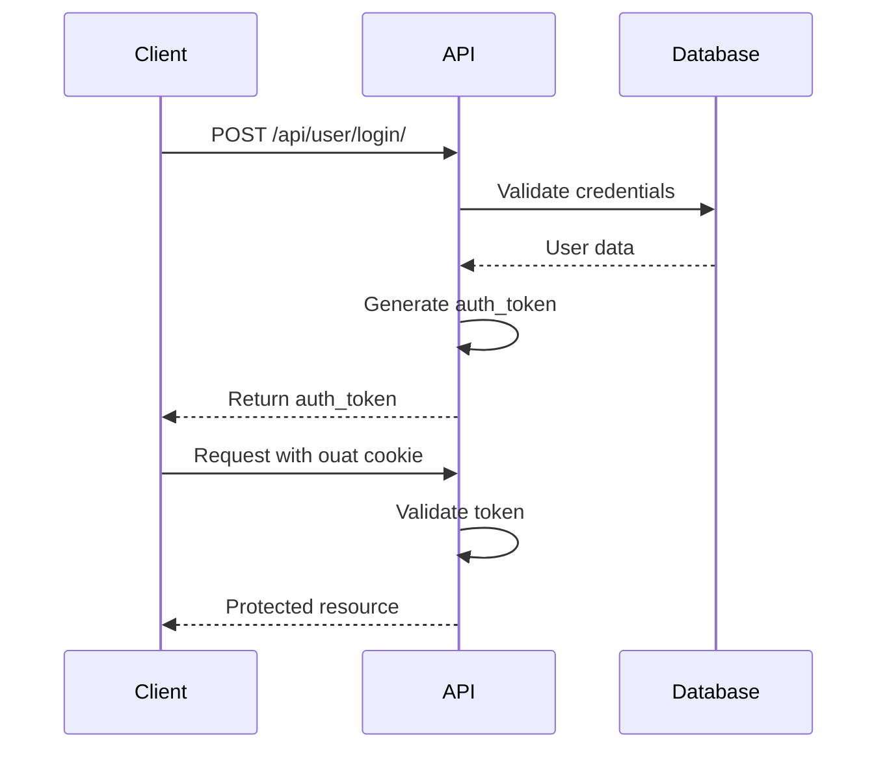

# Autenticación API

La API de omegaUp utiliza autenticación basada en tokens para un acceso seguro a puntos finales protegidos.

## Flujo de autenticación


## Obtener un token de autenticación

### Iniciar sesión en el punto final

**Solicitud:**
```bash
POST https://omegaup.com/api/user/login/
Content-Type: application/json

{
  "usernameOrEmail": "user@example.com",
  "password": "password"
}
```
**Respuesta:**
```json
{
  "status": "ok",
  "auth_token": "abc123def456..."
}
```
## Usando el token

Incluya el token en una cookie denominada `ouat` (token de autenticación omegaUp):

```bash
curl -X POST https://omegaup.com/api/problem/create/ \
  -H "Cookie: ouat=abc123def456..." \
  -H "Content-Type: application/json" \
  -d '{"title": "My Problem", ...}'
```
Alternativamente, incluya como parámetro POST:

```bash
curl -X POST https://omegaup.com/api/problem/create/ \
  -d "ouat=abc123def456..." \
  -d "title=My Problem" \
  ...
```
## Gestión de sesiones

!!! importante "Sesión activa única"
    omegaUp solo admite una sesión activa a la vez. Iniciar sesión mediante programación invalidará la sesión de su navegador y viceversa.

## Consideraciones de seguridad

- **Solo HTTPS**: toda la comunicación API debe utilizar HTTPS
- **Almacenamiento de tokens**: almacene tokens de forma segura, nunca se comprometa con el control de versiones
- **Caducidad del token**: los tokens pueden caducar; manejar los errores de autenticación con gracia

## Documentación relacionada

- **[API de usuarios](users.md)** - Puntos finales de administración de usuarios
- **[API REST](rest-api.md)** - Información general de la API
