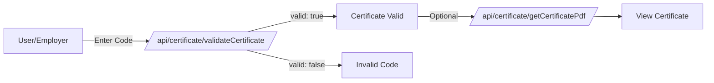

# API de certificados

Los certificados son documentos PDF que reconocen los logros de los usuarios en concursos y cursos. Esta API proporciona puntos finales para generar, recuperar y validar certificados.

## Descripción general

omegaUp emite certificados para:

- **Participación en el concurso**: reconocer la colocación o participación en el concurso
- **Finalización del curso**: completar cursos educativos
- **Codificador del mes**: premios de reconocimiento mensuales

Cada certificado tiene un código de verificación único que se puede validar.

## Puntos finales

### Generar Certificados de Concurso

Genera certificados para todos los participantes calificados en un concurso.

**`POST /api/certificate/generateContestCertificates/`**

**Parámetros:**

| Parámetro | Tipo | Requerido | Descripción |
|-----------|------|----------|-------------|
| `contest_alias` | cadena | Sí | Alias ​​del concurso |
| `certificates_cutoff` | entero | No | Límite de clasificación para certificados |

**Respuesta:**

```json
{
  "status": "ok"
}
```
**Privilegios:** Generador de certificados + Administrador del concurso

**Requisitos:**

- El concurso debe haber terminado
- Los certificados no deben estar ya generados (estado `uninitiated` o `retryable_error`)

**Proceso:**

1. La solicitud se pone en cola a través de RabbitMQ
2. Los certificados se generan de forma asincrónica.
3. Cambios de estado a `queued` → `generated`

---

### Obtener certificado PDF

Recupera el PDF de un certificado por código de verificación.

**`GET /api/certificate/getCertificatePdf/`**

**Parámetros:**

| Parámetro | Tipo | Requerido | Descripción |
|-----------|------|----------|-------------|
| `verification_code` | cadena | Sí | Código de verificación del certificado |

**Respuesta:**

```json
{
  "certificate": "base64-encoded-pdf-content"
}
```
Devuelve `null` para `certificate` si el código de verificación no es válido.

**Privilegios:** Público

---

### Obtener certificados de usuario

Devuelve todos los certificados que pertenecen a un usuario.

**`GET /api/certificate/getUserCertificates/`**

**Parámetros:**

| Parámetro | Tipo | Requerido | Descripción |
|-----------|------|----------|-------------|
| `user_id` | entero | Sí | ID de usuario |

**Respuesta:**

```json
{
  "certificates": [
    {
      "certificate_type": "contest",
      "name": "Annual Programming Contest 2024",
      "date": { "time": 1704067200 },
      "verification_code": "ABC123XYZ"
    },
    {
      "certificate_type": "course",
      "name": "Introduction to Algorithms",
      "date": { "time": 1701388800 },
      "verification_code": "DEF456UVW"
    }
  ]
}
```
**Privilegios:** Certificados propios o Administrador del sistema

---

### Validar certificado

Verifica si un certificado es válido.

**`GET /api/certificate/validateCertificate/`**

**Parámetros:**

| Parámetro | Tipo | Requerido | Descripción |
|-----------|------|----------|-------------|
| `verification_code` | cadena | Sí | Código de verificación del certificado |

**Respuesta:**

```json
{
  "valid": true
}
```
**Privilegios:** Público

---

## Tipos de certificados

### Certificados del concurso

Emitido para:
- **Colocación**: 1.º, 2.º, 3.º lugar (con sufijo de lugar)
- **Participación**: Reconocimiento general de participación

El certificado incluye:
- Nombre del participante
- Nombre del concurso
- Colocación (si corresponde)
- Fecha
- Código de verificación

### Certificados del curso

Emitido al finalizar el curso.

El certificado incluye:
- Nombre del estudiante
- Nombre del curso
- Fecha de finalización
- Código de verificación

### Codificador del mes

Emitido a los ganadores mensuales.

El certificado incluye:
- Nombre del ganador
- Mes/Año
- Código de verificación

---

## Estructura del PDF del certificado

Los certificados se generan utilizando una plantilla estándar con:

- encabezado y logotipo de omegaUp
- Texto de reconocimiento
- Nombre del destinatario (destacado)
- Descripción del logro
- Fecha y lugar
- Firma del director
- Código de verificación y URL

---

## Flujo de verificación


---

## Estados de certificado

Para certificados de concurso:

| Estado | Descripción |
|--------|-------------|
| `uninitiated` | Aún no generado |
| `queued` | Generación en curso |
| `generated` | Creado con éxito |
| `retryable_error` | Error, puedo volver a intentarlo |

---

## Casos de uso

### Verificar un certificado

```bash
# Check if certificate is valid
curl "https://omegaup.com/api/certificate/validateCertificate/?verification_code=ABC123XYZ"

# Download PDF if valid
curl "https://omegaup.com/api/certificate/getCertificatePdf/?verification_code=ABC123XYZ" \
  | jq -r '.certificate' | base64 -d > certificate.pdf
```
### Administrador del concurso: generar certificados

```bash
# Generate certificates for top 10 finishers
curl -X POST https://omegaup.com/api/certificate/generateContestCertificates/ \
  -d "contest_alias=annual-contest-2024&certificates_cutoff=10"
```
---

## Documentación relacionada

- **[API de concursos](contests.md)** - Gestión de concursos
- **[API de usuarios](users.md)** - Información del usuario

## Referencia completa

Para obtener detalles completos de la implementación, consulte el código fuente del [Controlador de certificados](https://github.com/omegaup/omegaup/blob/main/frontend/server/src/Controllers/Certificate.php).
