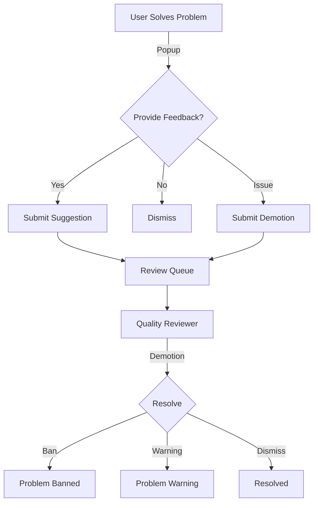

# API de nominaciones de calidad

La API Quality Nominations permite a los usuarios proporcionar comentarios sobre la calidad de los problemas, sugerir mejoras e informar problemas. Luego, los revisores de calidad pueden procesar estas nominaciones.

## Descripción general

El sistema de nominación de calidad permite:

- **Sugerencias**: Califique la dificultad, la calidad y las etiquetas del problema.
- **Promociones**: Nombra problemas para el estado de calidad.
- **Degradaciones**: informar contenido problemático
- **Despidos**: descartar ventanas emergentes de calidad sin comentarios

## Tipos de nominaciones

| Tipo | Propósito | ¿Quién puede enviar?
|------|---------|----------------|
| `suggestion` | Calificar dificultad, calidad, etiquetas | Usuarios que solucionaron el problema |
| `promotion` | Nominar para estatus de problema de calidad | Usuarios que solucionaron el problema |
| `demotion` | Informar problemas (spam, ofensivos, etc.) | Cualquier usuario autenticado |
| `dismissal` | Descartar solicitud de comentarios | Usuarios que intentaron/resolvieron |
| `quality_tag` | Asignar sellos y etiquetas de calidad | Sólo revisores de calidad |

## Puntos finales

### Crear nominación

Crea una nueva nominación de calidad.

**`POST /api/qualityNomination/create/`**

**Parámetros:**

| Parámetro | Tipo | Requerido | Descripción |
|-----------|------|----------|-------------|
| `problem_alias` | cadena | Sí | Alias ​​del problema |
| `nomination` | cadena | Sí | Tipo: `suggestion`, `promotion`, `demotion`, `dismissal`, `quality_tag` |
| `contents` | JSON | Sí | Contenido específico de la nominación |

#### Contenido de la sugerencia

```json
{
  "difficulty": 2,
  "quality": 3,
  "tags": ["problemTopicDynamicProgramming", "problemTopicGraphTheory"],
  "before_ac": false
}
```
- `difficulty`: escala 0-4 (0=trivial, 4=muy difícil)
- `quality`: escala 0-4 (0=malo, 4=excelente)
- `tags`: conjunto de etiquetas de temas permitidas
- `before_ac`: Verdadero si se envía antes de resolver

#### Contenido de la promoción

```json
{
  "statements": {
    "es": { "markdown": "# Problema\n\nDescripción..." },
    "en": { "markdown": "# Problem\n\nDescription..." }
  },
  "source": "Original problem by John Doe",
  "tags": ["problemTopicArrays", "problemTopicSorting"]
}
```
#### Contenido de degradación

```json
{
  "reason": "duplicate",
  "original": "original-problem-alias",
  "rationale": "This is a duplicate of the original problem."
}
```
Motivos válidos: `duplicate`, `no-problem-statement`, `offensive`, `other`, `spam`, `wrong-test-cases`, `poorly-described`

**Respuesta:**

```json
{
  "qualitynomination_id": 12345
}
```
**Privilegios:** Varía según el tipo de nominación (ver arriba)

---

### Lista de nominaciones

Devuelve una lista paginada de nominaciones (solo revisores).

**`GET /api/qualityNomination/list/`**

**Parámetros:**

| Parámetro | Tipo | Requerido | Descripción |
|-----------|------|----------|-------------|
| `offset` | entero | No | Número de página (predeterminado: 1) |
| `rowcount` | entero | No | Artículos por página (predeterminado: 100) |
| `status` | cadena | No | Filtro: `all`, `open`, `resolved`, `banned`, `warning` |
| `types` | matriz | No | Filtrar por tipo: `promotion`, `demotion` |
| `query` | cadena | No | Término de búsqueda |
| `column` | cadena | No | Columna de búsqueda: `problem_alias`, `nominator_username`, `author_username` |

**Respuesta:**

```json
{
  "nominations": [
    {
      "qualitynomination_id": 123,
      "problem": { "alias": "sum-two", "title": "Sum Two Numbers" },
      "nominator": { "username": "user1", "name": "User One" },
      "author": { "username": "author", "name": "Problem Author" },
      "nomination": "demotion",
      "status": "open",
      "time": { "time": 1609459200 },
      "contents": { "reason": "spam" },
      "votes": []
    }
  ],
  "pager_items": [...]
}
```
**Privilegios:** Revisor de calidad

---

### Mis nominaciones

Devuelve nominaciones creadas por el usuario actual.

**`GET /api/qualityNomination/myList/`**

**Parámetros:**

| Parámetro | Tipo | Requerido | Descripción |
|-----------|------|----------|-------------|
| `offset` | entero | No | Número de página |
| `rowcount` | entero | No | Artículos por página |
| `types` | matriz | No | Filtrar por tipo |

**Privilegios:** Usuario autenticado

---

### Nominaciones asignadas

Devuelve las nominaciones asignadas al revisor actual.

**`GET /api/qualityNomination/myAssignedList/`**

**Parámetros:**

| Parámetro | Tipo | Requerido | Descripción |
|-----------|------|----------|-------------|
| `page` | entero | No | Número de página |
| `page_size` | entero | No | Artículos por página |

**Privilegios:** Revisor de calidad

---

### Obtener detalles de nominación

Devuelve información detallada sobre una nominación.

**`GET /api/qualityNomination/details/`**

**Parámetros:**

| Parámetro | Tipo | Requerido | Descripción |
|-----------|------|----------|-------------|
| `qualitynomination_id` | entero | Sí | ID de nominación |

**Respuesta:**

```json
{
  "qualitynomination_id": 123,
  "nomination": "promotion",
  "nomination_status": "open",
  "time": { "time": 1609459200 },
  "problem": { "alias": "my-problem", "title": "My Problem" },
  "nominator": { "username": "user1", "name": "User One" },
  "author": { "username": "author", "name": "Author" },
  "contents": {
    "statements": {...},
    "source": "Original",
    "tags": [...]
  },
  "original_contents": {
    "statements": {...},
    "source": "Current source",
    "tags": [...]
  },
  "reviewer": true,
  "votes": []
}
```
**Privilegios:** Nominador o revisor de calidad

---

### Resolver nominación

Resuelve una nominación de degradación (solo revisores).

**`POST /api/qualityNomination/resolve/`**

**Parámetros:**

| Parámetro | Tipo | Requerido | Descripción |
|-----------|------|----------|-------------|
| `qualitynomination_id` | entero | Sí | ID de nominación |
| `problem_alias` | cadena | Sí | Alias ​​del problema |
| `status` | cadena | Sí | `open`, `resolved`, `banned`, `warning` |
| `rationale` | cadena | Sí | Explicación de la decisión |
| `all` | booleano | No | Resolver todas las degradaciones por este problema |

**Respuesta:**

```json
{
  "status": "ok"
}
```
**Efectos de estado:**

| Estado | Visibilidad del problema |
|--------|-------------------|
| `banned` | Oculto del público |
| `warning` | Visible con advertencia |
| `resolved` | Visibilidad normal |
| `open` | Sin cambios |

**Privilegios:** Revisor de calidad

---

## Etiquetas permitidas

### Etiquetas de tema (para sugerencias/promociones)

-`problemTopic2Sat`
-`problemTopicArrays`
-`problemTopicBinarySearch`
-`problemTopicDynamicProgramming`
-`problemTopicGraphTheory`
-`problemTopicGreedy`
- ... (ver lista completa en la fuente)

### Etiquetas de nivel (para etiqueta_calidad)

-`problemLevelBasicKarel`
-`problemLevelBasicIntroductionToProgramming`
-`problemLevelIntermediateDataStructuresAndAlgorithms`
-`problemLevelAdvancedCompetitiveProgramming`
- ... (ver lista completa en la fuente)

---

## Flujo de trabajo


---

## Casos de uso

### Enviar comentarios de calidad

```bash
curl -X POST https://omegaup.com/api/qualityNomination/create/ \
  -d 'problem_alias=sum-two' \
  -d 'nomination=suggestion' \
  -d 'contents={"difficulty":1,"quality":3,"tags":["problemTopicArrays"]}'
```
### Informar problema duplicado

```bash
curl -X POST https://omegaup.com/api/qualityNomination/create/ \
  -d 'problem_alias=duplicate-problem' \
  -d 'nomination=demotion' \
  -d 'contents={"reason":"duplicate","original":"original-problem"}'
```
---

## Documentación relacionada

- **[API de problemas](problems.md)** - Gestión de problemas
- **[API de usuarios](users.md)** - Roles y permisos de usuario

## Referencia completa

Para obtener listas completas de implementación y etiquetas, consulte el código fuente de [QualityNomination Controller](https://github.com/omegaup/omegaup/blob/main/frontend/server/src/Controllers/QualityNomination.php).
