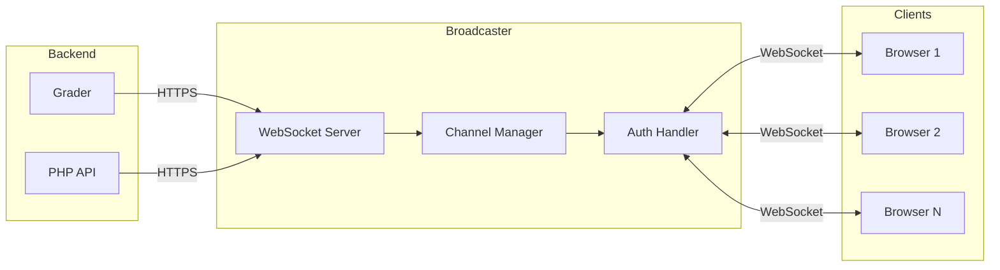
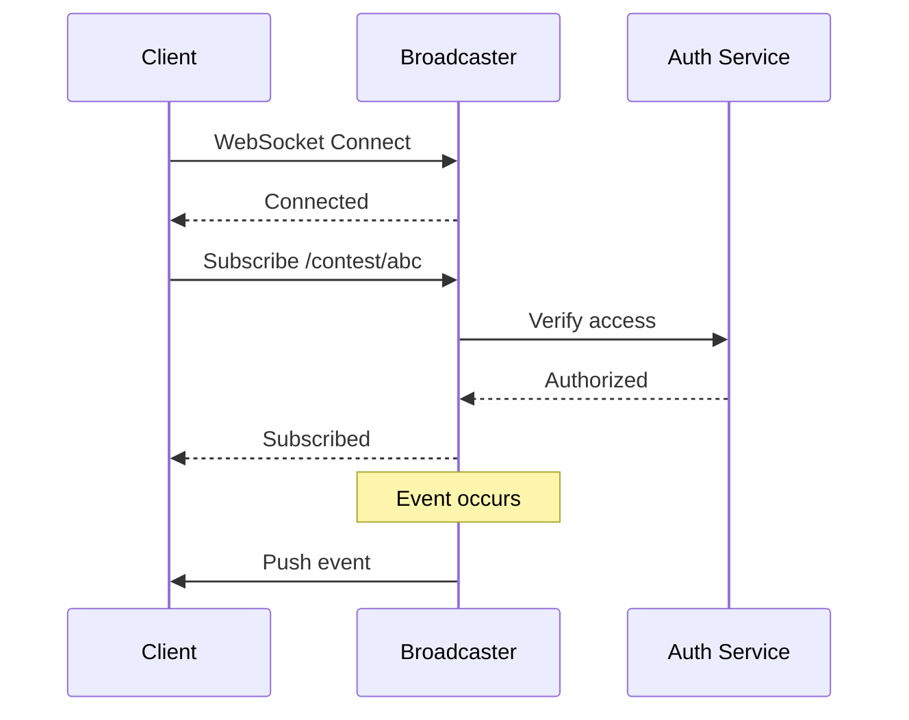
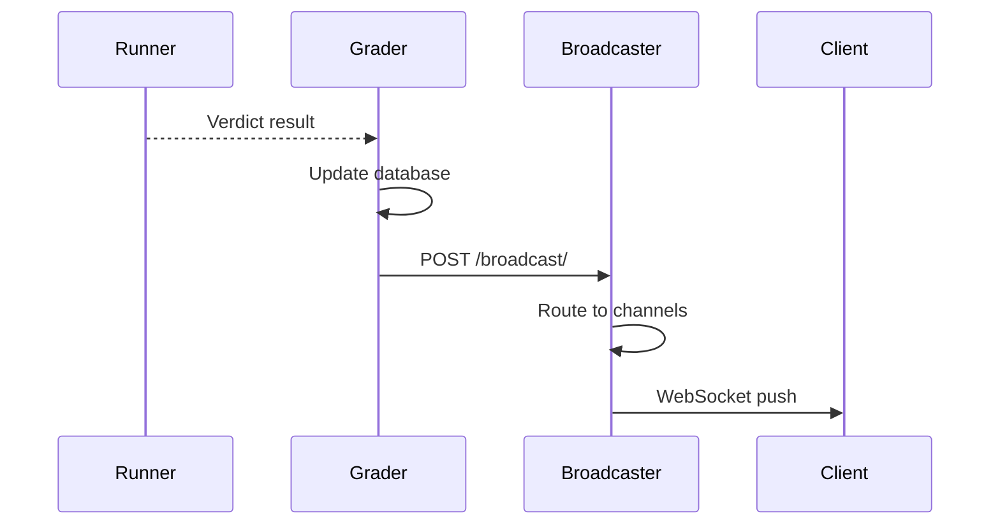
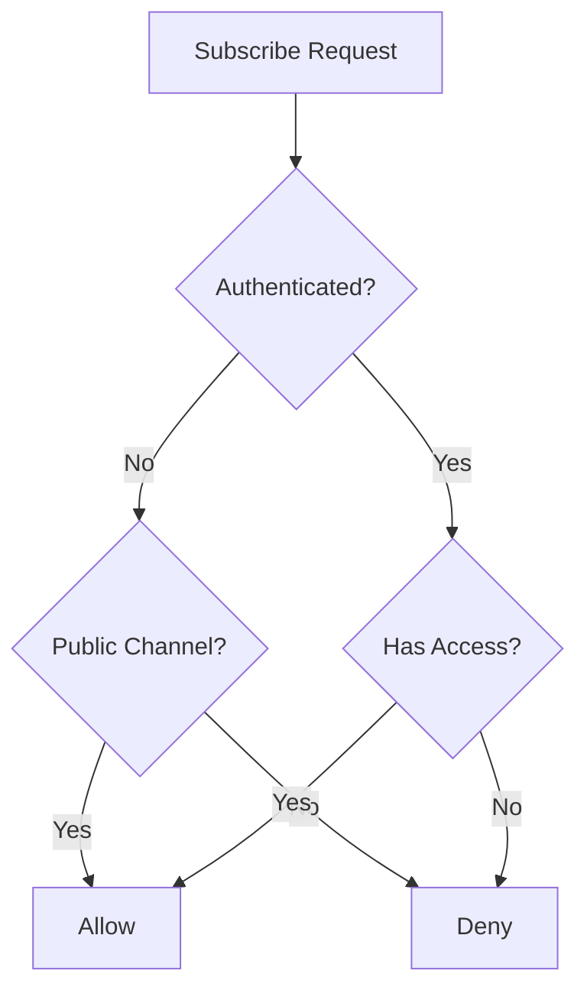
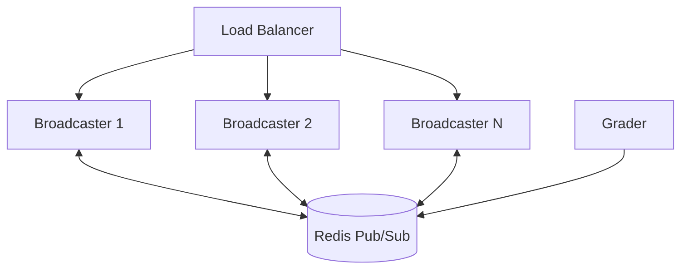

# Arquitectura de emisora

Broadcaster es un servidor WebSocket que permite la comunicación en tiempo real entre el backend y los clientes web. Impulsa marcadores en vivo, actualizaciones de envíos y notificaciones de aclaraciones.

## Descripción general


## Eventos en tiempo real

### Tipos de eventos

| Evento | Descripción | Canal |
|-------|-------------|---------|
| `run_update` | Veredicto de presentación cambiado | Usuario, Concurso |
| `scoreboard_update` | Marcador cambiado | Concurso |
| `clarification` | Nueva aclaración | Concurso, Problema |
| `contest_update` | La configuración del concurso cambió | Concurso |

### Estructura de carga útil del evento

```json
{
  "type": "run_update",
  "timestamp": 1704067200,
  "data": {
    "run_id": 12345,
    "verdict": "AC",
    "score": 1.0,
    "contest_alias": "contest-2024",
    "problem_alias": "sum-two"
  }
}
```
## Sistema de canales

### Tipos de canales

| Patrón de canal | Descripción | Se requiere autenticación |
|-----------------|-------------|---------------|
| `/user/{username}` | Eventos específicos del usuario | Sí (propietario) |
| `/contest/{alias}` | Eventos del concurso | Acceso al concurso |
| `/contest/{alias}/admin` | Eventos de administración | Administrador del concurso |
| `/problem/{alias}` | Eventos problemáticos | Acceso problemático |
| `/scoreboard/{token}` | Marcador público | Token válido |

### Flujo de suscripción al canal


## Protocolo WebSocket

### Conexión

```javascript
const ws = new WebSocket('wss://omegaup.com/events/');

ws.onopen = () => {
  // Authenticate
  ws.send(JSON.stringify({
    type: 'auth',
    token: authToken
  }));
};
```
### Suscríbete al canal

```javascript
ws.send(JSON.stringify({
  type: 'subscribe',
  channel: '/contest/annual-2024'
}));
```
### Darse de baja

```javascript
ws.send(JSON.stringify({
  type: 'unsubscribe',
  channel: '/contest/annual-2024'
}));
```
### Recibir eventos

```javascript
ws.onmessage = (event) => {
  const data = JSON.parse(event.data);
  
  switch (data.type) {
    case 'run_update':
      updateSubmissionStatus(data.data);
      break;
    case 'scoreboard_update':
      refreshScoreboard();
      break;
    case 'clarification':
      showClarificationNotification(data.data);
      break;
  }
};
```
## Integración de back-end

### Calificador a emisor

Cuando se califica una presentación:


### PHP a emisora

Para aclaraciones y actualizaciones del concurso:

```php
// In Clarification Controller
\OmegaUp\Grader::getInstance()->broadcast(
    contestAlias: $contest->alias,
    problemAlias: $problem->alias,
    message: json_encode([
        'type' => 'clarification',
        'data' => $clarification
    ]),
    public: false,
    username: $identity->username
);
```
## Autenticación

### Autenticación basada en tokens

Las conexiones WebSocket se autentican usando:

1. **Token de autenticación**: el mismo token que la API REST (de la cookie `ouat`)
2. **Token del marcador**: para URL públicas del marcador

### Verificación de permiso

Para cada suscripción:


## Escalabilidad

### Manejo de conexión

- Cada instancia de Broadcaster maneja miles de conexiones.
- Las conexiones no tienen estado (suscripciones almacenadas en la memoria)
- Latido cada 30 segundos para detectar conexiones muertas

### Escala horizontal


Con múltiples instancias:
- El equilibrador de carga distribuye conexiones WebSocket
- Redis Pub/Sub distribuye eventos entre instancias
- Cualquier instancia puede publicar en cualquier canal.

## Configuración

### Configuración de emisora

```json
{
  "Broadcaster": {
    "Port": 32672,
    "TLS": {
      "CertFile": "/etc/omegaup/ssl/broadcaster.crt",
      "KeyFile": "/etc/omegaup/ssl/broadcaster.key"
    },
    "EventsPort": 39613,
    "PingInterval": 30,
    "WriteTimeout": 10
  },
  "Redis": {
    "URL": "redis://redis:6379",
    "Channel": "omegaup:events"
  }
}
```
### Componente acoplable

```yaml
broadcaster:
  image: omegaup/broadcaster
  ports:
    - "32672:32672"  # Internal API
    - "39613:39613"  # WebSocket
  depends_on:
    - redis
  environment:
    - REDIS_URL=redis://redis:6379
```
## Implementación del cliente

### Servicio de interfaz

La interfaz de Vue.js utiliza un servicio WebSocket:

```typescript
class EventService {
  private ws: WebSocket | null = null;
  private subscriptions: Map<string, Set<Function>> = new Map();
  
  connect(authToken: string): void {
    this.ws = new WebSocket(EVENTS_URL);
    this.ws.onopen = () => this.authenticate(authToken);
    this.ws.onmessage = (e) => this.handleMessage(e);
  }
  
  subscribe(channel: string, callback: Function): void {
    if (!this.subscriptions.has(channel)) {
      this.subscriptions.set(channel, new Set());
      this.ws?.send(JSON.stringify({
        type: 'subscribe',
        channel
      }));
    }
    this.subscriptions.get(channel)!.add(callback);
  }
  
  private handleMessage(event: MessageEvent): void {
    const data = JSON.parse(event.data);
    const callbacks = this.subscriptions.get(data.channel);
    callbacks?.forEach(cb => cb(data));
  }
}
```
## Monitoreo

### Control de salud

```bash
curl https://broadcaster:32672/health
```
### Métricas

Disponible en `/metrics`:

| Métrica | Descripción |
|--------|-------------|
| `connections_active` | Conexiones WebSocket actuales |
| `subscriptions_total` | Total de suscripciones activas |
| `messages_sent_total` | Mensajes enviados a clientes |
| `messages_received_total` | Mensajes de backends |

## Solución de problemas

### Problemas de conexión

| Problema | Causa | Solución |
|-------|-------|----------|
| Conexión rechazada | Locutor caído | Consultar estado del servicio |
| Error de autenticación | Token no válido | Volver a autenticar |
| Sin eventos | No suscrito | Verificar suscripción |
| Eventos retrasados ​​| Latencia de red | Comprobar conexión |

### Modo de depuración

Habilite el registro detallado:

```json
{
  "Logging": {
    "Level": "debug",
    "IncludeMessages": true
  }
}
```
## Código fuente

El Broadcaster es parte del repositorio [`quark`](https://github.com/omegaup/quark):

- `cmd/omegaup-broadcaster/` - Punto de entrada principal
- `broadcaster/` - Lógica principal de WebSocket

## Documentación relacionada

- **[Funciones en tiempo real](../features/realtime.md)** - Descripción general de las funciones
- **[Grader Internals](grader-internals.md)** - Origen del evento
- **[Infraestructura](infrastructure.md)** - Integración de Redis
