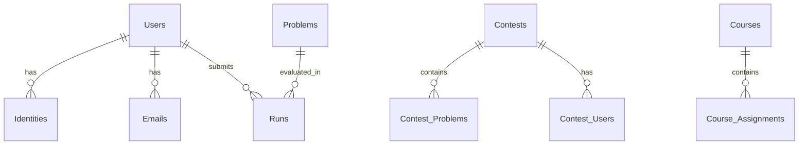

# Esquema de base de datos

omegaUp utiliza MySQL 8.0.39 como sistema de base de datos. El esquema consta de más de 77 tablas organizadas en torno a entidades principales.

## Entidades principales

### Usuarios e identidades
- **Usuarios**: Cuentas de usuarios principales
- **Identidades**: Identidades de usuario (admite múltiples identidades por usuario)
- **Correos electrónicos**: direcciones de correo electrónico vinculadas a usuarios
- **Escuelas**: Instituciones educativas

### Problemas
- **Problemas**: Definiciones de problemas
- **Problem_Tags**: categorización de problemas
- **Problem_Of_The_Week**: Problemas destacados

### Concursos
- **Concursos**: definiciones del concurso
- **Contest_Problems**: Problemas en los concursos
- **Contest_Users**: participantes del concurso
- **Aclaraciones_del_concurso**: Preguntas y respuestas del concurso

### Envíos
- **Ejecuciones**: registros de envío
- **Runs_Groups**: resultados de casos de prueba agrupados
- **Envíos**: metadatos del envío

### Cursos
- **Cursos**: definiciones de cursos
- **Course_Assignments**: Tareas del curso
- **Course_Problems**: Problemas en los cursos

## Relaciones clave

## Migraciones de bases de datos

Los cambios en el esquema de la base de datos se administran a través de archivos de migración en `frontend/database/`:

- Archivos de migración: `00001_initial_schema.sql`, `00002_*.sql`, etc.
- Esquema principal: `schema.sql` (generado a partir de migraciones)
- Aplicar migraciones: `./stuff/db-migrate.py migrate`

## Documentación relacionada

- **[Patrones de base de datos](../development/database-patterns.md)** - Uso de DAO/VO
- **[Arquitectura de backend](backend.md)** - Estructura de backend
- **[Comandos útiles](../development/useful-commands.md)** - Comandos de base de datos
