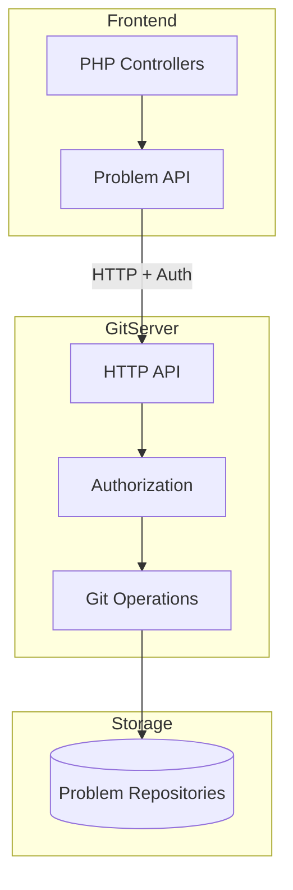
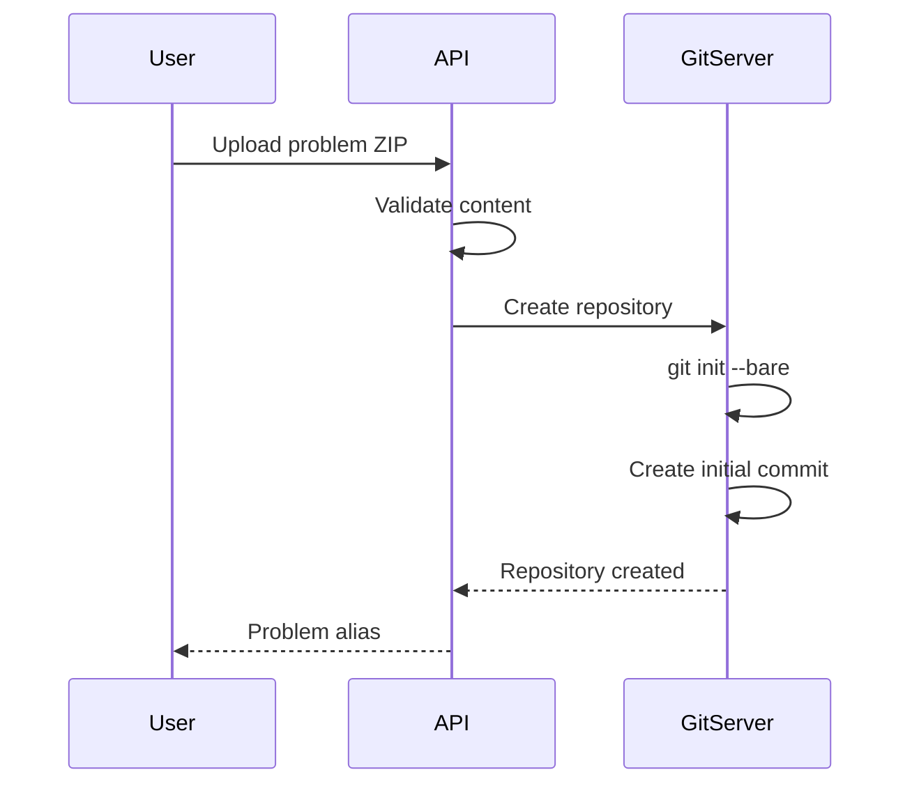
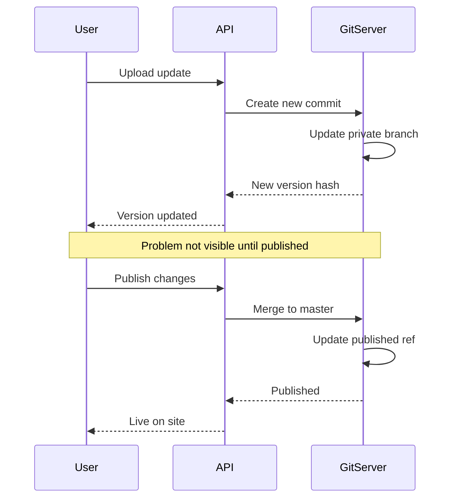
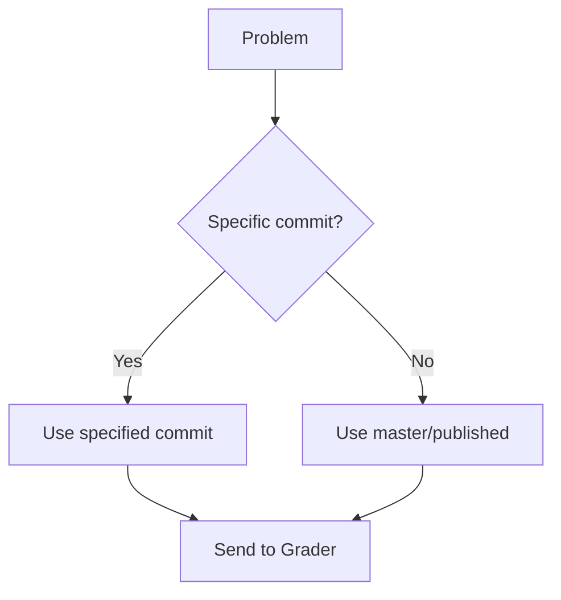

# Arquitectura de GitServer

GitServer gestiona repositorios de problemas y proporciona control de versiones para declaraciones de problemas, casos de prueba y validadores. Permite controlar versiones de problemas, revertir y editar simultáneamente.

## Descripción general

Cada problema en omegaUp se almacena como un repositorio Git, lo que permite:

- **Historial de versiones**: realiza un seguimiento de todos los cambios en los problemas
- **Actualizaciones atómicas**: actualizaciones de problemas de todo o nada
- **Revertir**: volver a cualquier versión anterior
- **Bramificación**: Mantener múltiples versiones del problema

## Arquitectura


## Estructura del repositorio

Cada problema se almacena en un repositorio Git básico:

```
/var/lib/omegaup/problems/{problem_alias}.git/
├── HEAD
├── config
├── objects/
│   ├── pack/
│   └── info/
└── refs/
    ├── heads/
    │   ├── master        # Current published version
    │   ├── private       # Private (draft) version
    │   └── published     # Alias for master
    └── tags/
        ├── v1
        └── v2
```
## Estructura del contenido del problema

Dentro de cada repositorio, el contenido del problema sigue esta estructura:

```
problem/
├── statements/
│   ├── es.markdown      # Spanish statement
│   ├── en.markdown      # English statement
│   └── images/
│       └── diagram.png
├── cases/
│   ├── 1.in             # Test input
│   ├── 1.out            # Expected output
│   ├── 2.in
│   ├── 2.out
│   └── ...
├── solutions/
│   └── solution.cpp     # Official solution
├── validators/
│   └── validator.cpp    # Custom validator (optional)
├── interactive/
│   └── Main.cpp         # Interactive problem (optional)
├── settings.json        # Problem configuration
└── testplan            # Test case weights (optional)
```
## Configuración de problemas

El archivo `settings.json` define la configuración del problema:

```json
{
  "Limits": {
    "TimeLimit": "1s",
    "MemoryLimit": "64MiB",
    "OverallWallTimeLimit": "30s",
    "OutputLimit": "10240KiB"
  },
  "Validator": {
    "Name": "token-caseless"
  },
  "Interactive": {
    "IdlName": "Main",
    "ModuleName": "Main"
  },
  "Cases": [
    {
      "Name": "group1",
      "Cases": ["1", "2", "3"],
      "Weight": 50
    },
    {
      "Name": "group2", 
      "Cases": ["4", "5"],
      "Weight": 50
    }
  ]
}
```
## Puntos finales API

### Operaciones problemáticas

| Punto final | Método | Descripción |
|----------|--------|-------------|
| `/problem/{alias}/` | OBTENER | Obtener información del problema |
| `/problem/{alias}/tree/{ref}/` | OBTENER | Obtener listado de directorio |
| `/problem/{alias}/blob/{ref}/{path}` | OBTENER | Obtener contenido del archivo |
| `/problem/{alias}/archive/{ref}.zip` | OBTENER | Descargar como ZIP |

### Operaciones de versión

| Punto final | Método | Descripción |
|----------|--------|-------------|
| `/problem/{alias}/versions/` | OBTENER | Listar todas las versiones |
| `/problem/{alias}/log/` | OBTENER | Historial de confirmaciones de Git |
| `/problem/{alias}/refs/` | OBTENER | Listar sucursales/etiquetas |

### Operaciones de actualización

| Punto final | Método | Descripción |
|----------|--------|-------------|
| `/problem/{alias}/update/` | PUBLICAR | Actualizar el contenido del problema |
| `/problem/{alias}/publish/` | PUBLICAR | Publicar versión borrador |
| `/problem/{alias}/git-upload-pack` | PUBLICAR | Protocolo de inserción de Git |

## Flujo de control de versiones

### Creando un nuevo problema


### Actualizando un problema


### Selección de versión para concursos


## Autenticación

### Encabezado de autorización

Las solicitudes a GitServer incluyen:

```
Authorization: OmegaUpSharedSecret secret {service}:{identity}
```
Componentes:
- `secret`: Secreto compartido configurado en ambos servicios
- `service`: Servicio de llamada (p. ej., `grader`, `frontend`)
- `identity`: Identidad de usuario o servicio

### Niveles de permiso

| Nivel | Capacidades |
|-------|-------------|
| **Administrador** | Acceso completo, puede publicar |
| **Colaborador** | Puede actualizar la sucursal privada |
| **Visor** | Leer versión publicada |
| **Público** | Leer problemas públicos |

## Almacenamiento en caché

### Caché del calificador

Grader mantiene un caché local de archivos problemáticos:

```
/var/lib/omegaup/problems/cache/
└── {problem_alias}/
    └── {commit_hash}/
        ├── cases/
        ├── validator
        └── settings.json
```
Invalidación de caché:
- Notificación de actualización de problemas
- Caducidad basada en TTL
- Actualización manual al volver a juzgar

### Caché frontal

Las declaraciones de problemas se almacenan en caché en Redis:

- Clave: `problem:{alias}:statement:{lang}:{commit}`
-TTL: 1 hora
- Invalidado al publicar

## Problema con el formato ZIP

Al cargar problemas, utilice esta estructura ZIP:

```
problem.zip
├── statements/
│   └── es.markdown
├── cases/
│   ├── easy.1.in
│   ├── easy.1.out
│   ├── hard.1.in
│   └── hard.1.out
└── testplan           # Optional
```
### Formato del plan de prueba

```
# Weights for test groups
easy 30
hard 70

# Test case listing
easy.1
easy.2
hard.1
hard.2
```
## Configuración

### Configuración de GitServer

```json
{
  "GitServer": {
    "RootPath": "/var/lib/omegaup/problems",
    "SecretToken": "shared-secret-token",
    "AllowDirectPushToMaster": false,
    "LibinteractivePath": "/usr/lib/libinteractive",
    "MaxCommitSize": 104857600
  },
  "HTTP": {
    "Port": 33861,
    "TLS": {
      "CertFile": "/etc/omegaup/ssl/gitserver.crt",
      "KeyFile": "/etc/omegaup/ssl/gitserver.key"
    }
  }
}
```
### Componente acoplable

```yaml
gitserver:
  image: omegaup/gitserver
  ports:
    - "33861:33861"  # HTTP API
    - "33862:33862"  # Git protocol
  volumes:
    - problems:/var/lib/omegaup/problems
  environment:
    - OMEGAUP_SECRET_TOKEN=shared-secret
```
## Monitoreo

### Control de salud

```bash
curl http://gitserver:33861/health
```
Respuesta:
```json
{
  "status": "ok",
  "repositories": 1500,
  "disk_usage": "10GB"
}
```
### Métricas

Disponible en `/metrics`:
- Recuento del repositorio
- Solicitar latencia
- Tiempo de operación de Git
- Tasas de error

## Seguridad

### Control de acceso

- Todas las escrituras requieren autenticación
- Problemas públicos legibles por cualquiera.
- Los problemas privados requieren acceso explícito
- Acciones de administrador registradas

### Validación de entrada

- Tamaño máximo de ZIP: 100 MB
- Número máximo de archivos: 1000
- Desinfección de nombres de archivos
- Validación de tipo de contenido

## Código fuente

GitServer es parte del repositorio [`gitserver`](https://github.com/omegaup/gitserver):

- `cmd/omegaup-gitserver/` - Punto de entrada principal
- `githttp/` - Controladores de API HTTP
- `gitserver/` - Operaciones principales de Git

## Documentación relacionada

- **[Versionamiento de problemas](../features/problem-versioning.md)** - Guía de administración de versiones
- **[API de problemas](../api/problems.md)** - Referencia de API de problemas
- **[Grader Internals](grader-internals.md)** - Cómo Grader usa GitServer
