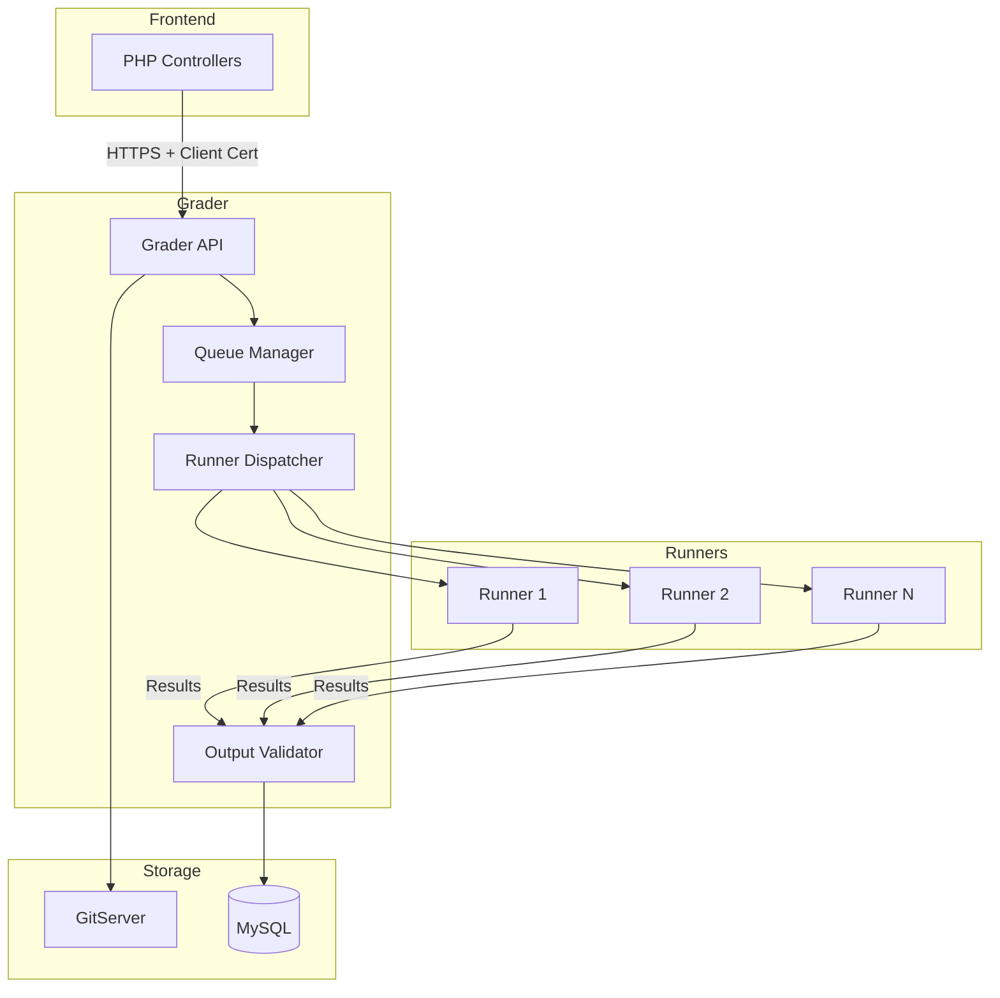
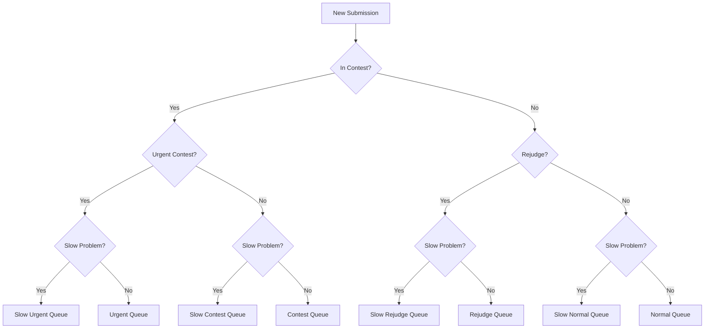
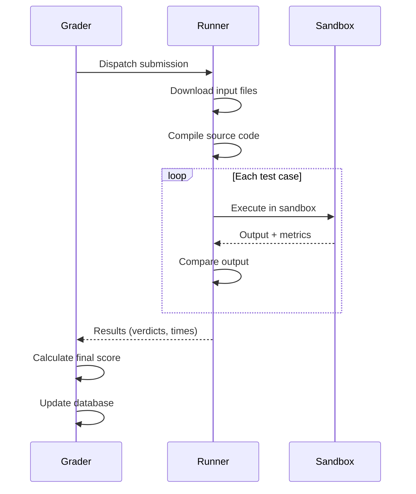

# Componentes internos del clasificador

Grader es el componente de orquestación central del sistema de evaluación de omegaUp. Escrito en Go, gestiona las colas de envío, coordina a los corredores y determina los veredictos finales.

## Descripción general de la arquitectura


## Sistema de cola

Grader mantiene ocho colas de prioridad para manejar diferentes tipos de envíos:

### Tipos de cola

| Cola | Prioridad | Propósito |
|-------|----------|---------|
| **Urgente** | 1 (más alto) | Concursos de alta prioridad marcados como urgentes |
| **Lento Urgente** | 2 | Envíos urgentes para problemas lentos |
| **Concurso** | 3 | Envíos regulares al concurso |
| **Concurso Lento** | 4 | Envíos a concursos para problemas lentos |
| **Normal** | 5 | Envíos en modo práctica |
| **Lento Normal** | 6 | Envíos de práctica para problemas lentos |
| **Rejuzgar** | 7 | Rejuzgar solicitudes |
| **Rejuicio lento** | 8 (más bajo) | Rejuzgar por problemas lentos |

### Lógica de enrutamiento de colas


### Definición lenta del problema

Un problema se considera "lento" si:
- El límite de tiempo supera los 30 segundos.
- O el problema está marcado explícitamente como lento

**Restricción de cola lenta**: solo el 50% de los corredores pueden procesar simultáneamente envíos de cola lentos para evitar la escasez de recursos.

## Coordinación de corredores

### Registro de corredores

1. Los corredores se conectan a Grader al iniciar
2. Regístrese con sus capacidades (memoria, CPU)
3. Vuelva a registrar cada 60 segundos como latido del corazón.
4. Grader elimina los corredores que pierden los latidos del corazón

### Algoritmo de envío

El método `RunnerDispatcher.dispatchLocked()`:

1. Selecciona el envío de mayor prioridad de las colas.
2. Encuentra un corredor disponible (todos contra todos, sin afinidad)
3. Crea un `GradeTask` con un plazo de 10 minutos.
4. Envíos a Runner vía HTTPS

```
Priority Order:
Urgent → Slow Urgent → Contest → Slow Contest → 
Normal → Slow Normal → Rejudge → Slow Rejudge
```
### Flujo de ejecución


## Determinación del veredicto

### Tipos de veredicto

| Veredicto | Código | Descripción |
|---------|------|-------------|
| Aceptado | `AC` | Respuesta correcta |
| Aceptado parcialmente | `PA` | Algunos casos de prueba pasaron |
| Error de presentación | `PE` | Problemas con el formato de salida |
| Respuesta incorrecta | `WA` | Salida incorrecta |
| Límite de tiempo excedido | `TLE` | Límite de tiempo excedido |
| Límite de salida excedido | `OLE` | Demasiada producción |
| Límite de memoria excedido | `MLE` | Límite de memoria excedido |
| Error de tiempo de ejecución | `RTE` | El programa falló |
| Error de función restringida | `RFE` | Llamada al sistema prohibida usada |
| Error de compilación | `CE` | No se pudo compilar |
| Error del juez | `JE` | Error de calificación interno |
| Error del validador | `VE` | El validador falló |

### Lógica de puntuación

1. **Veredicto por caso de prueba**: cada caso de prueba obtiene un veredicto
2. **Asignación de peso**:
   - Si existe `/testplan`: analizar pesos explícitos
   - En caso contrario: pesos iguales (1/N para N casos)
3. **Puntuación de grupo**: Casos agrupados por prefijo de nombre de archivo (antes del primer `.`)
4. **Puntuación final**: Suma ponderada de las puntuaciones del grupo

### Formato del plan de prueba

```
# Group weights (optional)
[group1]
weight = 30

[group2]  
weight = 70

# Test case to group mapping
group1.case1.in
group1.case2.in
group2.case1.in
group2.case2.in
```
## Puntos finales API

Grader expone estas API internas (a las que se accede a través de HTTPS con certificados de cliente):

### Gestión de envíos

| Punto final | Método | Descripción |
|----------|--------|-------------|
| `/run/new/{run_id}/` | PUBLICAR | Enviar nueva ejecución para calificar |
| `/run/grade/` | PUBLICAR | Ejecuciones de calificación/rejuicio |
| `/submission/source/{guid}/` | OBTENER | Recuperar fuente de envío |
| `/run/resource/` | OBTENER | Obtener recursos de ejecución |

### Estado y control

| Punto final | Método | Descripción |
|----------|--------|-------------|
| `/grader/status/` | OBTENER | Obtenga el estado del calificador y la duración de la cola |
| `/broadcast/` | PUBLICAR | Difundir mensajes a clientes |

## Configuración

El Grader se configura vía JSON:

```json
{
  "Grader": {
    "BroadcasterURL": "https://broadcaster:32672/broadcast/",
    "GitserverURL": "http://gitserver:33861",
    "GitserverAuthorization": "OmegaUpSharedSecret secret omegaup:grader",
    "V1": {
      "Enabled": true
    }
  },
  "Runner": {
    "PreserveFiles": false
  },
  "Logging": {
    "Level": "info"
  }
}
```
### Configuración clave

| Configuración | Descripción |
|---------|-------------|
| `BroadcasterURL` | Servidor WebSocket para actualizaciones en tiempo real |
| `GitserverURL` | Servidor de repositorio de problemas |
| `GitserverAuthorization` | Encabezado de autenticación para GitServer |
| `PreserveFiles` | Conservar archivos después de calificar (depurar) |

## Monitoreo

### Estado de respuesta del punto final

```json
{
  "status": "ok",
  "grader": {
    "running": true,
    "queue_length": {
      "urgent": 0,
      "contest": 5,
      "normal": 12,
      "rejudge": 3
    },
    "runners": {
      "total": 4,
      "available": 2
    }
  }
}
```
### Puerto de métricas

Grader expone las métricas de Prometheus en el puerto 6060:

- Longitudes de cola por tipo
- Disponibilidad de corredores
- Latencias de calificación
- Tasas de error

## Seguridad

### Autenticación

- PHP Frontend utiliza certificados de cliente para autenticar
- Secreto compartido para la comunicación del servicio interno.
- Todo el tráfico cifrado a través de HTTPS

### Zona de pruebas

Toda la ejecución del código se realiza en corredores de espacio aislado (consulte [Runner Internals](runner-internals.md)).

## Código fuente

El Grader se implementa en el repositorio [`quark`](https://github.com/omegaup/quark):

- `cmd/omegaup-grader/` - Punto de entrada principal
- `grader/` - Lógica de calificación central
- `runner/` - Coordinación de corredores

## Documentación relacionada

- **[Runner Internals](runner-internals.md)** - Detalles de ejecución del código
- **[Partes internas del sistema](internals.md)** - Flujo de solicitud completo
- **[Características: Grader](../features/grader.md)** - Descripción general de alto nivel
