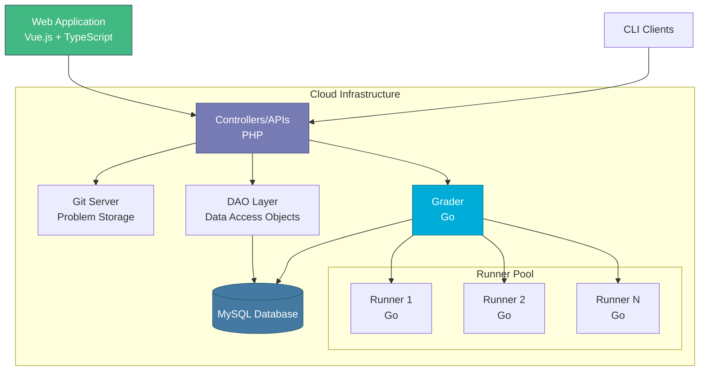

# Descripción general de la arquitectura

omegaUp se construye utilizando el patrón arquitectónico **Modelo-Vista-Controlador (MVC)**, lo que proporciona una clara separación de preocupaciones entre datos, lógica de negocios y presentación.

## Navegación rápida

- :material-sitemap:{ .lg .middle } __[Patrón MVC](mvc-pattern.md)__

    ---

    Descubra cómo omegaUp implementa el patrón MVC y separa las preocupaciones.

    [:octicons-arrow-right-24: Más información](mvc-pattern.md)

- :material-code-tags:{ .lg .middle } __[Arquitectura frontal](frontend.md)__

    ---

    Estructura y organización del frontend de Vue.js, TypeScript y Bootstrap 4.

    [:octicons-arrow-right-24: Explorar](frontend.md)

- :material-server:{ .lg .middle } __[Arquitectura de backend](backend.md)__

    ---

    Controladores PHP, patrones DAO/VO y estructura API.

    [:octicons-arrow-right-24: Explorar](backend.md)

- :material-database:{ .lg .middle } __[Esquema de base de datos](database-schema.md)__

    ---

    Estructura de bases de datos, relaciones y patrones de acceso a datos.

    [:octicons-arrow-right-24: Explorar](database-schema.md)

## Componentes del sistema

omegaUp consta de varios componentes clave:

### Interfaz (PHP + MySQL)
La capa de aplicación web que maneja las interacciones de los usuarios, la administración de problemas y concursos, la gestión de usuarios, las clasificaciones y los marcadores. Escrito en PHP con base de datos MySQL.

### Backend (Ir)
El subsistema de evaluación responsable de compilar y ejecutar los envíos de los usuarios.

- **Calificador**: mantiene la cola de envío, envía a los corredores y determina los veredictos.
- **Runner**: compila y ejecuta programas en un entorno seguro de pruebas.
- **Minijail**: entorno limitado de Linux (bifurcado de Chrome OS) para la ejecución segura de código

## Arquitectura de alto nivel

## Pila de tecnología

| Tecnología | Propósito | Versión |
|------------|---------|---------|
| MySQL | Base de datos | 8.0.39 |
| PHP | Controladores/API | 8.1.2 |
| Pitón | Trabajos cron | 3.10.12 |
| Mecanografiado | Interfaz | 4.4.4 |
| Vue.js | Marco de interfaz de usuario | 2.5.22 |
| Arranque | Marco de interfaz de usuario | 4.6.0 |
| Ir | Clasificador y corredor | 20.0.1 |

!!! información "Actualizaciones de versión"
    Las versiones de la tecnología se actualizan periódicamente para mantener la plataforma respaldada y segura.

## Flujo de solicitudes

Cuando un usuario envía código, esto es lo que sucede:

1. **Frontend** envía HTTP POST a `/api/run/create/`
2. **Nginx** reenvía la solicitud a PHP (HHVM)
3. **Bootstrap** carga la configuración e inicializa la base de datos.
4. **El controlador** (`RunController::apiCreate`) procesa la solicitud
5. **Autenticación** valida el token del usuario
6. **Validación** verifica permisos, estado del concurso, límites de tarifas
7. **Base de datos** almacena el envío con GUID
8. **Calificador** recibe el envío para evaluación
9. **Runner** compila y ejecuta código
10. **Resultado** devuelto al frontend a través de WebSocket

Para obtener información detallada, consulte [Partes internas del sistema](internals.md).

## Principios de diseño

### La seguridad es lo primero
- Toda la comunicación cifrada (HTTPS)
- Ejecución segura de código a través de Minijail sandbox
- Tokens de autenticación para acceso API
- Limitación de tarifas para evitar abusos.

### Escalabilidad
- Arquitectura de corredor distribuido
- Procesamiento de envíos basado en colas
- Almacenamiento en caché para rendimiento
- Optimización de la base de datos

### Mantenibilidad
- Patrón MVC para separación de preocupaciones.
- Patrón DAO/VO para acceso a datos
- Cobertura completa de pruebas.
- Organización de código claro

## Documentación relacionada

- **[Patrón MVC](mvc-pattern.md)** - Implementación detallada de MVC
- **[Arquitectura Frontend](frontend.md)** - Estructura y componentes del frontend
- **[Arquitectura backend](backend.md)** - Diseño de controladores y API
- **[Esquema de base de datos](database-schema.md)** - Estructura y relaciones de la base de datos
- **[Partes internas del sistema](internals.md)** - Profundización en el funcionamiento del sistema

## Referencias Académicas

omegaUp ha sido documentado en artículos académicos:

- Luis Héctor CHÁVEZ, Alan GONZÁLEZ, Joemmanuel PONCE.  
  [omegaUp: Sistema de gestión de concursos y plataforma de capacitación basado en la nube en la Olimpiada Mexicana de Informática](http://ioinformatics.org/oi/pdf/v8_2014_169_178.pdf)
-Luis Héctor CHÁVEZ.  
  [libinteractive: una mejor manera de escribir tareas interactivas](https://ioinformatics.org/journal/v9_2015_3_14.pdf)

---

**Próximos pasos:** Explore el [Patrón MVC](mvc-pattern.md) para comprender cómo omegaUp organiza su código.
