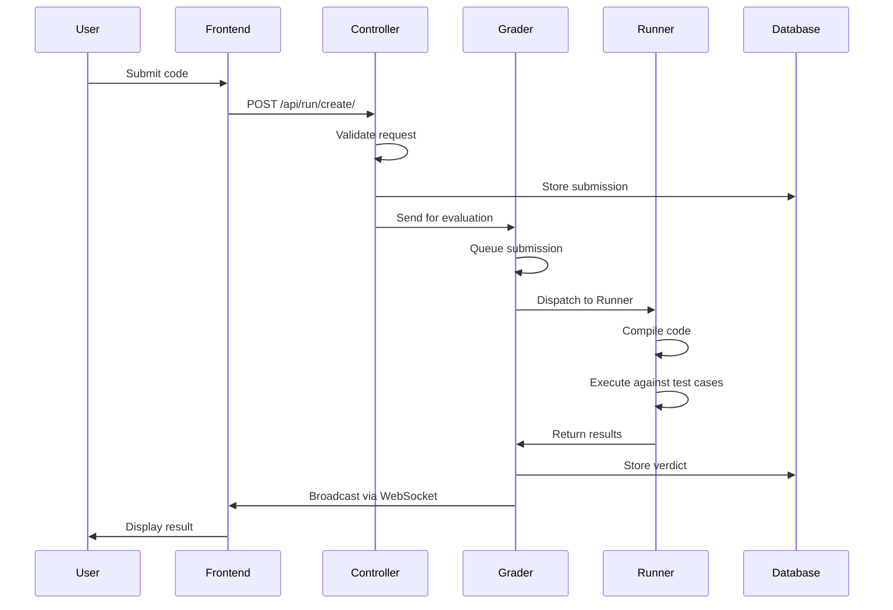

# Componentes internos del sistema

Este documento explica cómo omegaUp procesa los envíos de principio a fin.

## Flujo de envío

## Procesamiento frontal

Cuando se realiza una presentación:

1. Código, alias del concurso, problema e idioma enviados mediante HTTP POST a `/api/run/create/`
2. Nginx reenvía a PHP (HHVM)
3. `bootstrap.php` carga la configuración e inicializa la base de datos.
4. Objeto `Request` creado con parámetros
5. URL tokenizada: `/api/run/create/` → `['run', 'create']`
6. Se invoca `RunController::apiCreate()`

## Autenticación y validación

El controlador:

1. Valida el token de autenticación (cookie o parámetro POST)
2. Recupera la identificación del usuario
3. Valida permisos:
   - Elementos requeridos presentes
   - El problema pertenece al concurso.
   - El tiempo límite del concurso no ha expirado.
   - Límite de tasa de envío (60 segundos por problema)
   - Visibilidad del concurso (público o usuario listado)
4. Calcula la penalización según la política del concurso.
5. Genera GUID aleatorio
6. Almacena el envío en la base de datos.
7. Guarda el código en el sistema de archivos.
8. Envía una solicitud HTTP a Grader

## Procesamiento del calificador

### Sistema de cola

The Grader mantiene ocho colas:

1. **Urgente** - Concursos de alta prioridad
2. **Lento Urgente** - Problemas urgentes pero lentos
3. **Concurso** - Envíos al concurso
4. **Concurso lento**: presentaciones de concursos para problemas lentos
5. **Normal** - Envíos en modo práctica
6. **Lento Normal** - Problemas lentos en el modo de práctica
7. **Rejuzgar** - Rejuzgar solicitudes
8. **Rejuicio lento** - Rejuicio para problemas lentos

### Enrutamiento de cola

- Envíos al concurso → Cola del concurso
- Envíos de práctica → Cola normal
- Solicitudes de rechazo → Cola de rechazo
- Problemas lentos (>30s TLE) → Colas lentas

Solo el 50% de los corredores pueden procesar colas lentas simultáneamente para evitar la monopolización.

### Proceso de envío

1. Envío agregado a la cola correspondiente
2. `RunnerDispatcher.dispatchLocked()` selecciona el envío de mayor prioridad
3. Free Runner seleccionado (todos contra todos)
4. Hora de envío registrada
5. `GradeTask.gradeTask()` invocado en el grupo de subprocesos
6. Se aplica un plazo de 10 minutos

## Procesamiento del corredor

### Registro

- Los corredores se registran con Grader al inicio.
- Vuelva a registrarse cada minuto para indicar que está vivo.
- Implementado en máquinas virtuales en la nube

### Compilación

1. `Runner.compile()` invocado a través de HTTPS
2. Utiliza `Minijail` para una compilación segura
3. Compila el archivo principal (y el validador si está presente)
4. Devuelve el token (ruta del sistema de archivos) en caso de éxito.
5. Elimina archivos temporales en caso de falla.

### Ejecución

1. Grader envía token de compilación + hash SHA-1 de entrada
2. Runner comprueba el caché en busca de archivos de entrada.
3. Si falta, solicita el archivo `.zip` de Grader
4. Ejecuta el programa compilado en cada archivo `.in`.
5. Almacena archivos y metadatos `.out`
6. Comprime con bzip2
7. Envía los resultados inmediatamente a Grader
8. Ejecución del validador si está presente
9. Archivos temporales eliminados

## Validación y puntuación

### Tipos de validador

Todos los validadores tokenizan usando espacios:

- **token**: compara tokens uno por uno
- **token-caseless**: comparación que no distingue entre mayúsculas y minúsculas
- **token-numeric**: Compara números con tolerancia
- **personalizado**: validador definido por el usuario

### Puntuación

1. Veredicto determinado para cada caso de prueba.
2. Si existe `/testplan`, analice y normalice los pesos.
3. En caso contrario, pesos iguales (1/número de casos)
4. Casos agrupados por prefijo de nombre de archivo (antes del primer `.`)
5. El grupo otorga puntos solo si todos los casos son AC o PA.
6. Puntuación total = suma de puntuaciones del grupo × puntos del problema
7. Veredicto final almacenado en la base de datos.

## Radiodifusión

La emisora:

1. Mantiene conexiones WebSocket para los participantes del concurso.
2. Colas `RunContext` después de la evaluación
3. Llama a `/api/scoreboard/refresh` para presentaciones de concursos.
4. Actualiza la caché del marcador
5. Notifica a todos los participantes sobre los cambios en el marcador.
6. Registra datos de sincronización y destruye `RunContext`

## Documentación relacionada

- **[Descripción general de la arquitectura](index.md)** - Arquitectura de alto nivel
- **[Grader](../features/grader.md)** - Detalles del sistema de calificación
- **[Runner](../features/runner.md)** - Detalles del sistema Runner
