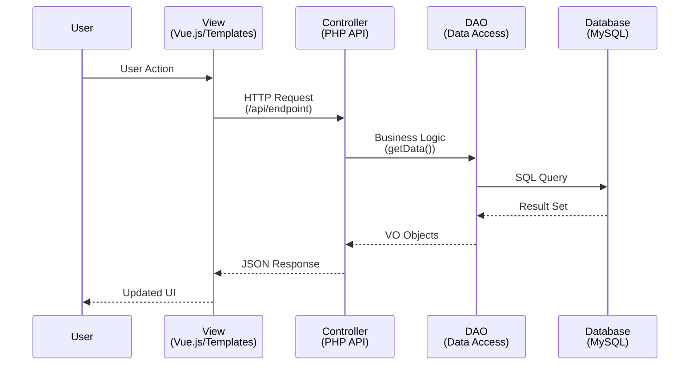
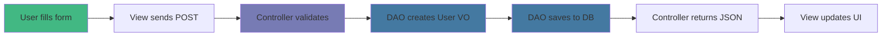

# Patrón MVC en omegaUp

omegaUp sigue el patrón arquitectónico **Modelo-Vista-Controlador (MVC)**, que separa una aplicación en tres componentes lógicos principales.

## Componentes MVC

### Modelo
Representa los datos y la lógica empresarial. En omegaUp:
- **DAOs (Objetos de acceso a datos)**: Clases para interacción con bases de datos
- **VO (Objetos de valor)**: clases que se asignan a tablas de bases de datos
- Ubicado en `frontend/server/src/DAO/`

### Ver
Representa la interfaz de usuario. En omegaUp:
- **Plantillas**: Plantillas Smarty (en proceso de migración a Vue.js)
- **Componentes de Vue**: componentes de interfaz de usuario modernos
- **TypeScript**: Lógica de interfaz
- Ubicado en `frontend/www/` y `frontend/templates/`

### Controlador
Actúa como intermediario entre Modelo y Vista. En omegaUp:
- **Controladores API**: maneja solicitudes HTTP y lógica empresarial
- Ubicado en `frontend/server/src/Controllers/`
- Nunca acceda directamente a la base de datos (usa DAO)
- Nunca renderizar HTML (devuelve JSON)

## Diagrama de flujo MVC


## Ejemplo de flujo de datos

Así es como funciona el registro de un usuario:


## Principios clave

### Separación de preocupaciones
- **Modelo**: solo datos y reglas comerciales
- **Ver**: solo presentación
- **Controlador**: Sólo coordinación

### Sin acceso directo a la base de datos
Los controladores nunca escriben SQL directamente. Usan DAO:

```php
// ✅ Good: Using DAO
$user = new Users();
$user->setEmail('user@example.com');
$results = UsersDAO::search($user);

// ❌ Bad: Direct SQL in Controller
$results = $conn->query("SELECT * FROM Users WHERE email = ...");
```
### Diseño API primero
Los controladores devuelven JSON, haciéndolos reutilizables:
- Interfaz web
-Herramientas CLI
- Aplicaciones móviles
- Integraciones de terceros

## Beneficios

1. **Mantenibilidad**: la separación clara hace que el código sea más fácil de entender
2. **Probabilidad**: Cada componente se puede probar de forma independiente
3. **Reutilizabilidad**: los controladores sirven como puntos finales de API
4. **Escalabilidad**: Fácil de agregar nuevas vistas o modificar las existentes

## Documentación relacionada

- **[Arquitectura backend](backend.md)** - Controlador detallado y estructura DAO
- **[Arquitectura frontend](frontend.md)** - Ver implementación de capa
- **[Esquema de base de datos](database-schema.md)** - Estructura de capas del modelo
