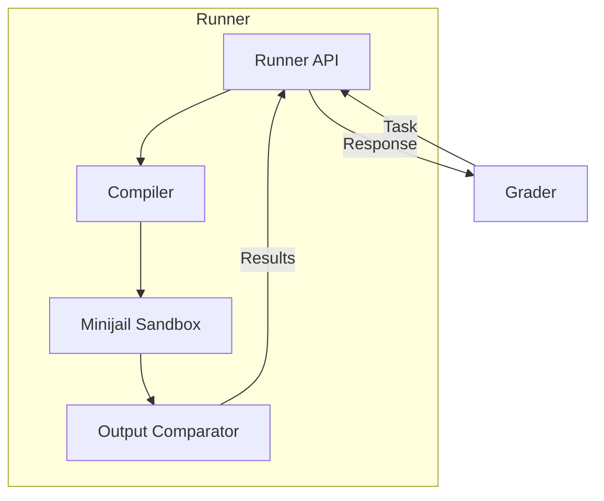
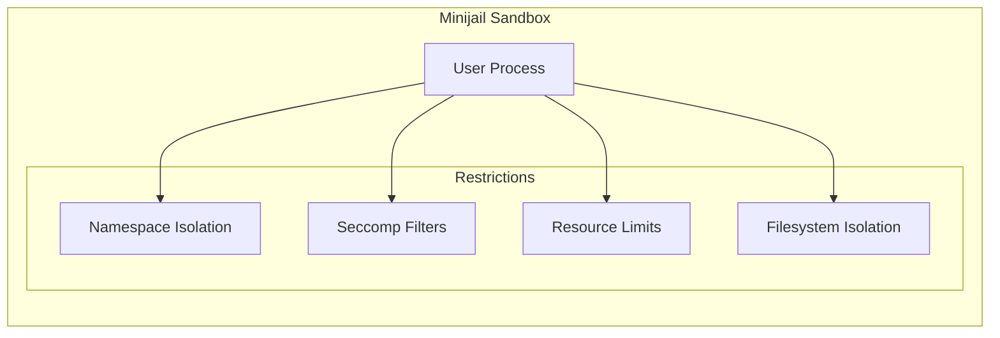
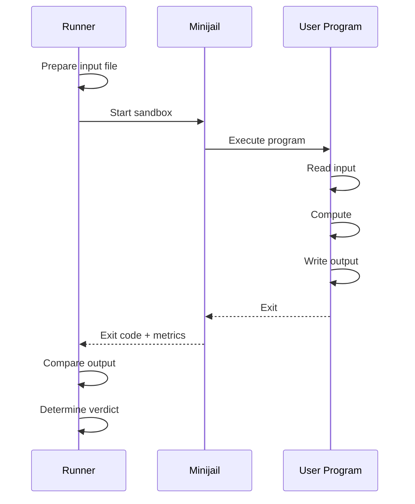
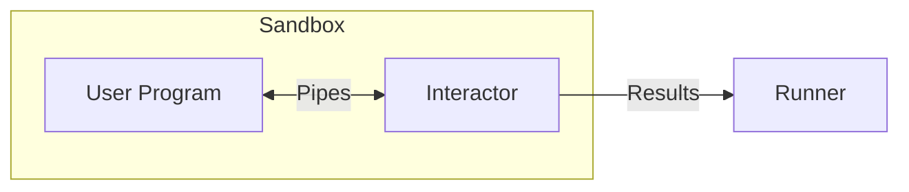

# Componentes internos del corredor

Los corredores son responsables de compilar y ejecutar los envíos de los usuarios en un entorno seguro y aislado. Reciben tareas del Grader y devuelven resultados de ejecución.

## Arquitectura


## Compilación

### Idiomas admitidos

| Idioma | Compilador/Intérprete | Versión |
|----------|---------------------|---------|
| C | CCG | 10+ |
| C++ (14/11/17/20) | G++ | 10+ |
| Java | AbiertoJDK | 17+ |
| Pitón 3 | CPython | 3.10+ |
| Python 2 (heredado) | CPython | 2.7 |
| Karel (pascal/java) | Personalizado | - |
| Rubí | Rubí | 3.0+ |
| Pascal | Pascal libre | 3.2+ |
| Haskel | GHC | 8.10+ |
| C# | Mono | 6.12+ |
| Lúa | Lúa | 5.4+ |

### Banderas de compilación

#### C/C++

```bash
# C
gcc -std=c11 -O2 -lm -o program program.c

# C++17 (default)
g++ -std=c++17 -O2 -lm -o program program.cpp

# C++20
g++ -std=c++20 -O2 -lm -o program program.cpp
```
####Java

```bash
# Compile
javac -encoding UTF-8 Main.java

# Run
java -Xmx{memory}m Main
```
#### Pitón

```bash
# Python 3 (no compilation)
python3 program.py

# Byte-compile check
python3 -m py_compile program.py
```
### Límites de compilación

| Recurso | Límite |
|----------|-------|
| Hora | 30 segundos |
| Memoria | 512MB |
| Salida | 64MB |
| Procesos | 32 |

## Caja de arena (minicárcel)

Runner utiliza [Minijail](https://android.googlesource.com/platform/external/minijail/), bifurcado de Chrome OS, para la ejecución segura de código.

### Funciones de seguridad


### Mecanismos de aislamiento

| Mecanismo | Descripción |
|-----------|-------------|
| **Espacio de nombres PID** | El proceso sólo se ve a sí mismo |
| **Espacio de nombres de red** | Sin acceso a la red |
| **Montar espacio de nombres** | Vista limitada del sistema de archivos |
| **Segundo** | Lista blanca de llamadas al sistema |
| **cgrupos** | Límites de recursos |

### Llamadas al sistema permitidas

El filtro seccomp permite solo llamadas al sistema esenciales:

- Operaciones de archivos: `read`, `write`, `open`, `close`
- Memoria: `mmap`, `munmap`, `brk`
- Proceso: `exit`, `exit_group`
- Hora: `clock_gettime` (limitada)

Operaciones prohibidas:
- Llamadas al sistema de red (`socket`, `connect`, etc.)
- Creación de procesos (`fork`, `clone`, `execve`)
-IPC (`shmget`, `msgget`, etc.)

### Límites de recursos

Aplicado a través de cgroups y rlimits:

| Recurso | Mecanismo | Descripción |
|----------|-----------|-------------|
| Tiempo de CPU | grupo c | Límite estricto por prueba |
| Tiempo de pared | Temporizador | Límite de CPU 2x |
| Memoria | grupo c | Problema específico |
| Tamaño de archivo | límite | Límite de salida |
| Procesos | grupo c | 1 (sin bifurcación) |

## Flujo de ejecución

### Ejecución por caso de prueba


### Medición de recursos

El Runner mide:

- **Tiempo de CPU**: ciclos de CPU reales utilizados
- **Tiempo de pared**: tiempo real transcurrido
- **Memoria**: uso máximo de memoria (a través de cgroup)
- **Tamaño de salida**: Bytes escritos en la salida estándar

## Validación de salida

### Modos de comparación

| Modo | Descripción |
|------|-------------|
| **Exacto** | Coincidencia byte por byte |
| **Ficha** | Tokens normalizados con espacios en blanco |
| **Numérico** | Tolerancia de punto flotante |
| **Personalizado** | Validador de problemas específicos |

### Comparación de tokens

Modo de comparación predeterminado:
1. Dividir la salida en tokens (separados por espacios en blanco)
2. Comparar secuencias de tokens
3. Ignorar los espacios en blanco finales
4. Ignorar las nuevas líneas finales

### Validadores personalizados

Los problemas pueden incluir validadores personalizados:

```
problem/
├── cases/
│   ├── 1.in
│   └── 1.out
└── validator
    └── validator.cpp
```
El validador recibe:
- Ruta del archivo de entrada
- Ruta de salida esperada
- Ruta de salida del usuario
- Límite de puntuación

Devoluciones:
- Puntuación (0,0 a 1,0)
- Mensaje de veredicto

## Problemas interactivos

Para problemas interactivos, Runner usa `libinteractive`:


El interactor:
1. Se ejecuta junto con el programa de usuario.
2. Se comunica a través de tuberías stdin/stdout
3. Valida las respuestas en tiempo real.
4. Informa veredicto final

## Manejo de errores

### Determinación del veredicto

| Condición | Veredicto |
|-----------|------------------|
| Salida correcta | Aire acondicionado |
| Salida incorrecta | WA |
| Se superó el tiempo de CPU | TLE |
| Se superó el tiempo del muro | TLE |
| Memoria excedida | MLE |
| Salida demasiado grande | OLE |
| Salida distinta de cero | RTE |
| Señal recibida | RTE |
| Llamada al sistema prohibida | RFE |
| La compilación falló | CE |

### Detalles del error de tiempo de ejecución

El corredor captura:
- Código de salida
- Número de señal (si muere)
- Última llamada al sistema (si es RFE)
- Memoria en caso de accidente

## Configuración

### Configuración del corredor

```json
{
  "Runner": {
    "RuntimePath": "/var/lib/omegaup/runner",
    "GraderURL": "https://grader:21680/",
    "CompileTimeLimit": 30,
    "CompileMemoryLimit": 536870912,
    "PreserveFiles": false
  },
  "Sandbox": {
    "Path": "/usr/bin/minijail0",
    "TimeLimit": 60,
    "OutputLimit": 67108864
  }
}
```
### Estructura del directorio

```
/var/lib/omegaup/runner/
├── cache/           # Compiled binaries cache
├── input/           # Test input files
├── runs/            # Active execution directories
│   └── {guid}/
│       ├── source   # User source code
│       ├── program  # Compiled binary
│       ├── input    # Current test input
│       ├── output   # User output
│       └── error    # Stderr capture
└── problems/        # Problem files cache
```
## Rendimiento

### Almacenamiento en caché

- **Caché de compilación**: reutiliza archivos binarios para fuentes idénticas
- **Caché de entrada**: Archivos de prueba de problemas almacenados en caché localmente
- **Caché de problemas**: metadatos y validadores de problemas

### Ejecución paralela

- Cada corredor maneja una presentación a la vez.
- Los casos de prueba dentro de un envío pueden ejecutarse en paralelo
- Múltiples corredores proporcionan escala horizontal

## Consideraciones de seguridad

### Defensa en profundidad

1. **Validación de código**: comprobaciones básicas del código fuente
2. **Sandbox de compilación**: entorno de compilación limitado
3. **Sandbox de ejecución**: aislamiento completo de Minijail
4. **Límites de recursos**: límites estrictos para todos los recursos
5. **Aislamiento de red**: sin comunicación externa

### Limitaciones conocidas

- Posibles ataques de sincronización (tiempo de CPU visible)
- Los canales laterales de memoria no están completamente mitigados.
- Los problemas interactivos tienen una mayor superficie de ataque.

## Código fuente

El Runner es parte del repositorio [`quark`](https://github.com/omegaup/quark):

- `runner/` - Lógica del corredor principal
- `sandbox/` - Integración de minicárcel
- `compiler/` - Compilación específica del idioma

## Documentación relacionada

- **[Grader Internals](grader-internals.md)** - Cola y envío
- **[Función Sandbox](../features/sandbox.md)** - Descripción general del Sandbox
- **[Veredictos](../features/verdicts.md)** - Tipos de veredicto
