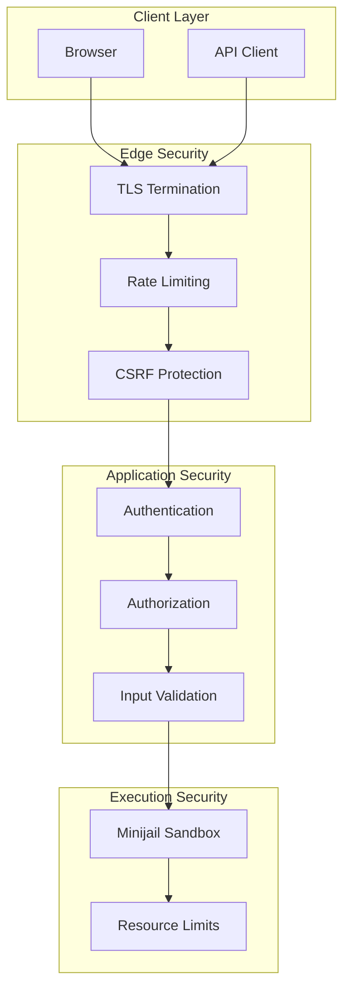
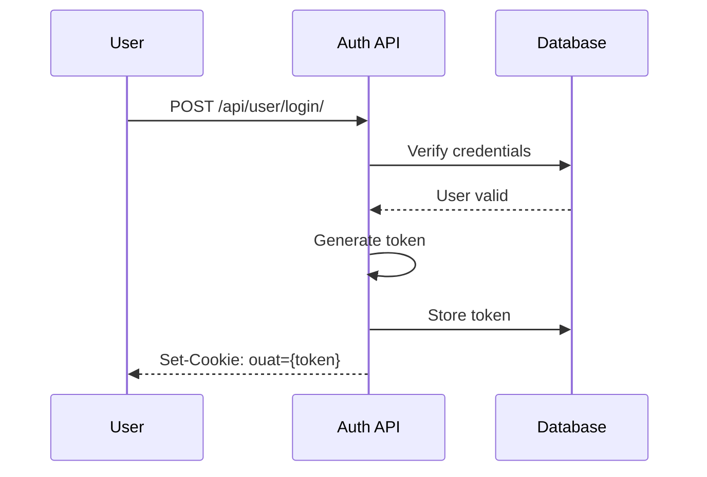
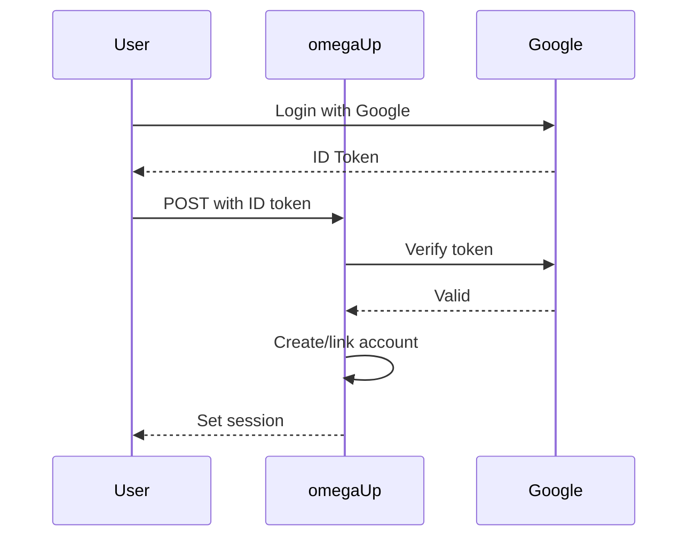
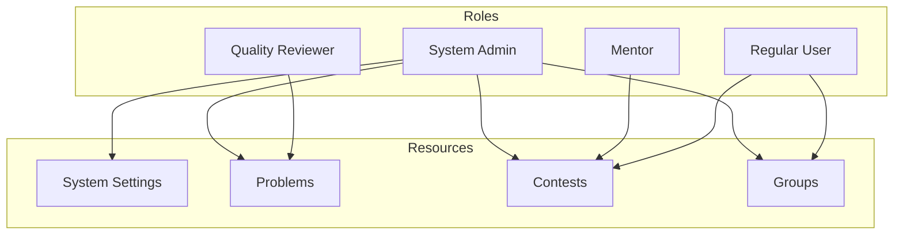
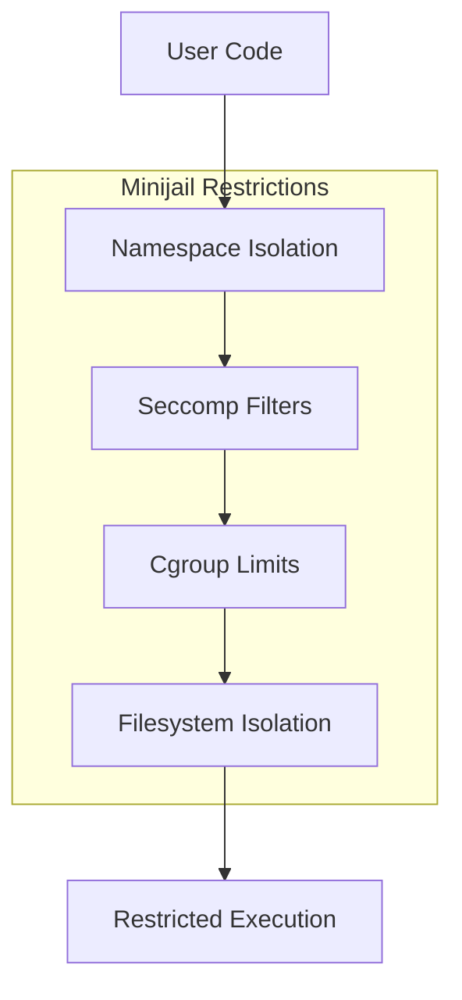

# Arquitectura de seguridad

Esta página documenta la arquitectura de seguridad de omegaUp, incluidos los mecanismos de autenticación, el modelo de autorización, la limitación de velocidad y el sistema de espacio aislado para la ejecución de código.

## Descripción general de seguridad


## Autenticación

### Autenticación basada en tokens

omegaUp utiliza autenticación basada en token a través de la cookie `ouat` (omegaUp Auth Token).

#### Generación de tokens


#### Estructura del token

```
{entropy}-{identity_id}-{hash}
```
- `entropy`: 15 bytes de datos aleatorios (codificados en hexadecimal)
- `identity_id`: ID de identidad del usuario
- `hash`: SHA-256(sal + identidad_id + entropía)

#### Validación de token

```php
// Token validated on each request
$identityExt = \OmegaUp\DAO\AuthTokens::getIdentityByToken($authToken);
if (is_null($identityExt)) {
    throw new UnauthorizedException('loginRequired');
}
```
### Autenticación de token API

Para acceso programático, los usuarios pueden crear tokens API:

```bash
# Authorization header format
Authorization: token {api_token}

# With identity selection
Authorization: token Credential={api_token},Username={identity}
```
#### Límites de tarifas

Los tokens API tienen límites de tasa configurables:

| Tipo de límite | Predeterminado | Encabezados |
|------------|---------|---------|
| Solicitudes/hora | 1000 | `X-RateLimit-Limit` |
| Restante | - | `X-RateLimit-Remaining` |
| Tiempo de reinicio | - | `X-RateLimit-Reset` |

### Integración de OAuth

Autenticación de terceros a través de:

- **Google**: OAuth 2.0 con verificación de token de identificación
- **Facebook**: OAuth 2.0 con token de acceso


## Autorización

### Control de acceso basado en roles


### Niveles de permiso

| Nivel | Descripción | Ejemplo |
|-------|-------------|---------|
| Administrador del sistema | Acceso completo a la plataforma | Configuración del sitio |
| Revisor de calidad | Revisar la calidad del problema | Nominaciones de calidad |
| Mentor | Guía codificadores del mes | Seleccionar ganadores |
| Administrador del concurso | Gestionar concurso específico | Añadir problemas, usuarios |
| Administrador de problemas | Gestionar problema específico | Declaraciones de actualización |
| Administrador de grupo | Administrar grupo | Agregar miembros |

### Comprobaciones de autorización

```php
// Check system admin
if (!\OmegaUp\Authorization::isSystemAdmin($identity)) {
    throw new ForbiddenAccessException();
}

// Check contest admin
if (!\OmegaUp\Authorization::isContestAdmin($identity, $contest)) {
    throw new ForbiddenAccessException();
}

// Check group membership
if (!\OmegaUp\Authorization::isGroupAdmin($identity, $group)) {
    throw new ForbiddenAccessException();
}
```
### Sistema ACL

Los recursos utilizan listas de control de acceso:

```sql
-- ACL table
CREATE TABLE `ACLs` (
    `acl_id` int NOT NULL AUTO_INCREMENT,
    `owner_id` int NOT NULL,
    PRIMARY KEY (`acl_id`)
);

-- User permissions
CREATE TABLE `User_Roles` (
    `user_id` int NOT NULL,
    `role_id` int NOT NULL,
    `acl_id` int NOT NULL,
    PRIMARY KEY (`user_id`, `role_id`, `acl_id`)
);

-- Group permissions
CREATE TABLE `Group_Roles` (
    `group_id` int NOT NULL,
    `role_id` int NOT NULL,
    `acl_id` int NOT NULL,
    PRIMARY KEY (`group_id`, `role_id`, `acl_id`)
);
```
## Validación de entrada

### Validación de parámetros

Todas las entradas de API están validadas:

```php
// Required string
$alias = $r->ensureString('alias', 
    fn ($alias) => \OmegaUp\Validators::alias($alias)
);

// Optional int with bounds
$page = $r->ensureOptionalInt('page', 
    lowerBound: 1, 
    upperBound: 1000
);

// Enum validation
$status = $r->ensureEnum('status', 
    ['open', 'resolved', 'banned']
);
```
### Prevención de inyección SQL

Todas las consultas de bases de datos utilizan declaraciones preparadas:

```php
// Safe query with parameters
$result = \OmegaUp\MySQLConnection::getInstance()->GetAll(
    'SELECT * FROM Problems WHERE alias = ?',
    [$problemAlias]
);
```
### Prevención XSS

La salida tiene escape de forma predeterminada en las plantillas:

```twig
{# Auto-escaped #}
{{ problem.title }}

{# Raw HTML (explicit) #}
{{ problem.description | raw }}
```
## Limitación de velocidad

### Límites de velocidad de terminales

| Punto final | Límite | Ventana |
|----------|-------|--------|
| `/api/user/login/` | 10 | 1 minuto |
| `/api/run/create/` | 1 por problema | 60 segundos |
| `/api/*` (predeterminado) | 100 | 1 minuto |

### Implementación

```php
// Check rate limit
$key = "ratelimit:{$ip}:{$endpoint}";
$count = $redis->incr($key);

if ($count === 1) {
    $redis->expire($key, 60);
}

if ($count > $limit) {
    throw new RateLimitExceededException();
}
```
### Omitir concursos

Durante los concursos, los límites de la tasa de envío se relajan:

- Normal: 1 envío cada 60 segundos por problema
- Concurso: Configurable `submissions_gap`

## Protección CSRF

### Validación de token

Los formularios incluyen tokens CSRF:

```html
<input type="hidden" name="csrf_token" value="{{ csrf_token }}">
```

```php
// Validate on POST
if ($request->method === 'POST') {
    if ($request['csrf_token'] !== $session['csrf_token']) {
        throw new CSRFException();
    }
}
```
### Cookies del mismo sitio

Las cookies de sesión utilizan el atributo SameSite:

```php
setcookie(
    OMEGAUP_AUTH_TOKEN_COOKIE_NAME,
    $token,
    [
        'path' => '/',
        'secure' => true,
        'httponly' => true,
        'samesite' => 'Lax'
    ]
);
```
## Zona de pruebas de ejecución de código

### Minicárcel Sandbox

El código de usuario se ejecuta en un entorno muy restringido:


### Aislamiento de espacio de nombres

| Espacio de nombres | Restricción |
|-----------|-------------|
| PID | No puedo ver otros procesos |
| Red | Sin acceso a la red |
| Monte | Raíz de sólo lectura, escrituras limitadas |
| Usuario | Usuario no root |
| CIP | Sin memoria compartida |

### Lista blanca de Seccomp

Sólo se permiten llamadas al sistema esenciales:

```c
// Allowed syscalls
read, write, open, close, fstat, mmap, mprotect,
munmap, brk, rt_sigaction, rt_sigprocmask, 
ioctl, access, exit_group, arch_prctl

// Blocked (examples)
socket, connect, fork, execve, ptrace, 
shmget, msgget, semget
```
### Límites de recursos

| Recurso | Límite | Aplicación |
|----------|-------|-------------|
| Tiempo de CPU | Problema específico | grupo c |
| Tiempo de pared | Límite de CPU 2x | Temporizador |
| Memoria | Problema específico | grupo c |
| Tamaño de archivo | 10 MB | límite |
| Procesos | 1 | grupo c |
| Abrir archivos | 10 | límite |

## Configuración TLS

### Requisitos del certificado

- TLS 1.2 mínimo
- Sólo conjuntos de cifrado fuertes
- HSTS habilitado

### Configuración de Nginx

```nginx
ssl_protocols TLSv1.2 TLSv1.3;
ssl_ciphers ECDHE-ECDSA-AES128-GCM-SHA256:ECDHE-RSA-AES128-GCM-SHA256;
ssl_prefer_server_ciphers on;

add_header Strict-Transport-Security "max-age=31536000" always;
```
### Servicio interno TLS

Los servicios utilizan TLS mutuo:

```yaml
grader:
  volumes:
    - ./ssl/grader.crt:/etc/omegaup/ssl/grader.crt
    - ./ssl/grader.key:/etc/omegaup/ssl/grader.key
    - ./ssl/ca.crt:/etc/omegaup/ssl/ca.crt
```
## Encabezados de seguridad

```nginx
# Security headers
add_header X-Content-Type-Options "nosniff" always;
add_header X-Frame-Options "SAMEORIGIN" always;
add_header X-XSS-Protection "1; mode=block" always;
add_header Content-Security-Policy "default-src 'self'" always;
add_header Referrer-Policy "strict-origin-when-cross-origin" always;
```
## Registro de auditoría

### Eventos de inicio de sesión

```sql
CREATE TABLE `Identity_Login_Log` (
    `identity_id` int NOT NULL,
    `ip` int UNSIGNED NOT NULL,
    `time` timestamp NOT NULL DEFAULT CURRENT_TIMESTAMP
);
```
### Acciones administrativas

Se registran acciones críticas:

- Cambios de rol de usuario.
- Cambios en la visibilidad del problema.
- Modificaciones del concurso
- Resoluciones de nominación de calidad

## Respuesta a incidentes

### Modo de bloqueo

El bloqueo de emergencia desactiva operaciones sensibles:

```php
if (OMEGAUP_LOCKDOWN) {
    throw new ForbiddenAccessException('forbiddenInLockdown');
}
```
### Invalidación de sesión

Forzar el cierre de sesión de todas las sesiones:

```php
// Delete all auth tokens for user
\OmegaUp\DAO\AuthTokens::deleteAllByUser($userId);
```
## Documentación relacionada

- **[API de autenticación](../api/authentication.md)** - Puntos finales de autenticación
- **[Runner Internals](runner-internals.md)** - Detalles de Sandbox
- **[Códigos de error](../api/error-codes.md)** - Códigos de error de seguridad
