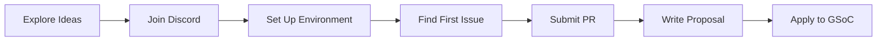

# Google Verano del Código

omegaUp ha estado participando en Google Summer of Code (GSoC), brindando oportunidades para que estudiantes de todo el mundo contribuyan a la tecnología educativa de código abierto mientras obtienen una valiosa experiencia en el desarrollo de software.

## Acerca de GSoC en omegaUp

Google Summer of Code es un programa global que acerca a los estudiantes desarrolladores al desarrollo de software de código abierto. Desde que se unió a GSoC, omegaUp ha sido mentor de numerosos estudiantes que han hecho contribuciones significativas a nuestra plataforma.

### ¿Por qué trabajar con omegaUp?

- **Impacto**: su código ayuda a millones de estudiantes a aprender programación
- **Aprendizaje**: trabaje con mentores experimentados en problemas del mundo real.
- **Comunidad**: únete a un equipo internacional acogedor
- **Tecnología**: Pila moderna (Vue.js, TypeScript, PHP, Go, Python)
- **Flexibilidad**: Trabajo remoto con horarios flexibles

## Años del programa

### Programa actual

- :material-rocket-launch: **[GSoC 2025](2025.md)**

    ---

    Programa del año actual con 6 ideas de proyectos que incluyen asistente docente de IA, generación editorial de problemas y más.

    [:octicons-arrow-right-24: Ver ideas](2025.md)

### Años anteriores

| Año | Proyectos | Aspectos destacados |
|------|----------|------------|
| **[2024](2024.md)** | 2 | Migración de Problem Creator a Vue.js, cursos públicos en GitHub |
| **[2023](2023.md)** | 2 | Cuentas infantiles que cumplen con COPPA, migración de prueba de Cypress |

## Involucrarse

### Guía paso a paso

### 1. Explora ideas de proyectos

Revise las [ideas de proyectos](2025.md) del año actual para encontrar algo que le interese. ¡También puedes proponer tus propias ideas!

### 2. Únase a nuestra comunidad

Conéctese con nosotros en [Discord](https://discord.gg/gMEMX7Mrwe), nuestro principal canal de comunicación. ¡No dudes en hacer preguntas!

### 3. Configure su entorno

Siga la [guía de configuración de desarrollo](../../getting-started/development-setup.md) para que omegaUp se ejecute localmente.

### 4. Haz tu primera contribución

Busque un problema etiquetado ["Buen primer problema"](https://github.com/omegaup/omegaup/labels/Good%20first%20issue) y envíe una solicitud de extracción. La fusión de un PR demuestra su capacidad para trabajar con nuestro código base.

### 5. Escribe tu propuesta

Utilice nuestra [plantilla de propuesta](https://docs.google.com/document/d/1_FKfpc2M3VLDVYqvT8ZgsgwIJ3zaZnyUVmSm-H3h6UQ/edit) para elaborar un documento de diseño detallado para el proyecto elegido.

### 6. Aplicar a Google

Envíe su propuesta final a través del [sitio web oficial de GSoC](https://summerofcode.withgoogle.com/).

## Línea de tiempo (típica)

| Fase | Periodo | Actividades |
|-------|--------|------------|
| Solicitud de organización | enero-febrero | omegaUp se aplica a GSoC |
| Exploración estudiantil | febrero-marzo | Los estudiantes exploran proyectos, se unen a Discord |
| Período de contribución | Mar-abril | Los estudiantes contribuyen y se fusionan los RP |
| Envío de propuestas | Finales de marzo a abril | Estudiantes presentan propuestas |
| Revisión y selección | Abril-mayo | Revisión de mentores, entrevistas realizadas |
| Vinculación comunitaria | mayo | Estudiantes seleccionados conocen a sus mentores |
| Período de codificación 1 | junio-julio | Primera mitad de la codificación |
| Evaluación de mitad de período | julio | Verificación de progreso |
| Período de codificación 2 | julio-agosto | Segunda mitad de la codificación |
| Evaluación final | Agosto-septiembre | Presentación y evaluación final |

## Historias de éxito

### Creador de problemas (GSoC 2024)

Aritra Chakraborty migró Problem Creator a Vue.js + TypeScript, lo que permite la creación de problemas visuales directamente en omegaUp.com.

**Impacto**: Flujo de trabajo de creación de problemas simplificado para miles de creadores de problemas.

### Migración de cipreses (GSoC 2023)

Se migraron más de 100 pruebas de Selenium a Cypress, lo que mejoró la confiabilidad de las pruebas de ~80 % a ~98 %.

**Impacto**: Canalizaciones de CI/CD más rápidas e implementaciones más seguras.

## Preguntas frecuentes

**¿Necesito hablar español?**
: ¡No! Damos la bienvenida a colaboradores que hablen cualquier idioma. Todas las discusiones técnicas pueden ser en inglés.

**¿Cuántos contribuyentes aceptas?**
: normalmente 2 o 3 por año, dependiendo de la asignación de Google.

**¿Puedo proponer mi propio proyecto?**
: ¡Sí! Fomentamos las ideas originales. Discútelos primero con mentores en Discord.

**¿Qué pasa si no soy seleccionado?**
: ¡Damos la bienvenida a los voluntarios continuos! Muchos contribuyentes que no pertenecen a GSoC se han convertido en valiosos miembros del equipo.

## Documentación relacionada

- **[Guía de contribución](../../getting-started/contributing.md)** - Cómo contribuir
- **[Obteniendo ayuda](../../getting-started/getting-help.md)** - Soporte de la comunidad
- **[Configuración de desarrollo](../../getting-started/development-setup.md)** - Configuración del entorno
- **[Descripción general de la arquitectura](../../architecture/index.md)** - Arquitectura del sistema
