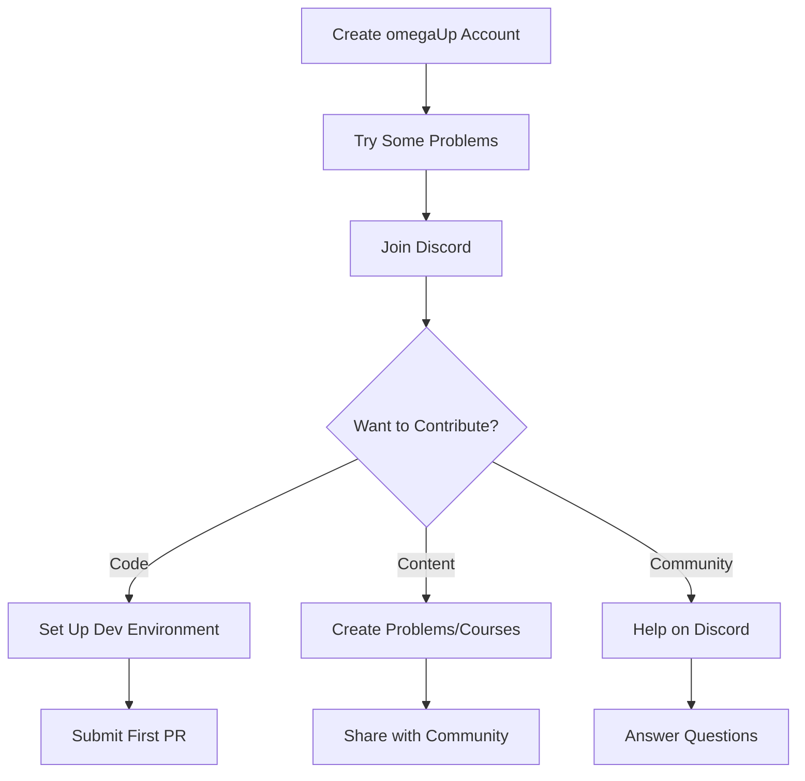

# Comunidad

¡Bienvenido a la comunidad omegaUp! Somos un grupo diverso de desarrolladores, educadores y entusiastas que trabajamos juntos para hacer que la educación en programación sea accesible para todos.

## Acerca de nuestra comunidad

omegaUp es un proyecto de código abierto impulsado por voluntarios que creen en el poder de la educación en programación. Nuestra comunidad abarca varios países e incluye:

- **Desarrolladores**: contribuyendo con código, revisiones y experiencia técnica.
- **Creadores de problemas**: creación de desafíos de programación educativa
- **Traductores**: hacer que el contenido sea accesible en varios idiomas
- **Educadores**: uso de omegaUp en aulas y competiciones

## Formas de contribuir

### Verano de código de Google

Nuestro programa estrella para estudiantes contribuyentes:

| Año | Estado | Descripción |
|------|--------|-------------|
| **[GSoC 2025](gsoc/2025.md)** | Activo | 6 ideas de proyectos, mentores disponibles |
| **[GSoC 2024](gsoc/2024.md)** | Completado | Creador de problemas, cursos públicos |
| **[GSoC 2023](gsoc/2023.md)** | Completado | Cuentas infantiles, migración de cipreses |

[:octicons-arrow-right-24: Más información sobre GSoC](gsoc/index.md)

### Desarrollo voluntario

Contribuya con código en cualquier momento, no solo durante GSoC:

1. **Configure** su [entorno de desarrollo](../getting-started/development-setup.md)
2. **Encuentre** un [primer número bueno](https://github.com/omegaup/omegaup/labels/Good%20first%20issue)
3. **Enviar** una solicitud de extracción
4. **Conviértete** en colaborador habitual

### Otras contribuciones

- **Documentación**: Mejore nuestros documentos y tutoriales
- **Traducción**: ayuda a traducir el contenido a más idiomas
- **Pruebas**: informa errores y prueba nuevas funciones
- **Configuración de problemas**: crea problemas de programación
- **Tutoría**: ayuda a los nuevos colaboradores a comenzar

## Canales de comunicación

### Discordia (Primaria)

Únase a nuestro [servidor de Discord](https://discord.gg/gMEMX7Mrwe) para:

- Discusiones en tiempo real
- Ayuda al desarrollo
- Coordinación GSoC
- Anuncios de la comunidad

### GitHub

- **[Problemas](https://github.com/omegaup/omegaup/issues)**: informes de errores y solicitudes de funciones
- **[Discusiones](https://github.com/omegaup/omegaup/discussions)**: Conversaciones generales
- **[Solicitudes de extracción](https://github.com/omegaup/omegaup/pulls)**: contribuciones de código

###Blog

Visite nuestro [blog](https://blog.omegaup.com/) para:

- Actualizaciones de la plataforma
- Inmersiones técnicas profundas
- Aspectos destacados de la comunidad
- Anuncios de competición.

## Únete al equipo

¿Interesado en convertirse en miembro oficial del equipo omegaUp?

- **[Reclutamiento](recruitment.md)** - Cómo unirse a nuestro equipo principal

## Código de conducta

Estamos comprometidos a brindar un ambiente acogedor para todos:

- Ser respetuoso e inclusivo.
- Ayudar a otros a aprender y crecer.
- Centrarse en comentarios constructivos.
- Celebre diversas perspectivas

## Empezando

¿Nuevo en omegaUp? Aquí está su hoja de ruta:

## Estadísticas de la comunidad

| Métrica | Contar |
|--------|-------|
| Estrellas de GitHub | 300+ |
| Bifurcaciones de GitHub | 430+ |
| Colaboradores | 100+ |
| Participantes del GSoC | 10+ |

## Documentación relacionada

- **[Comenzando](../getting-started/index.md)** - Comience a contribuir
- **[Guía de contribución](../getting-started/contributing.md)** - Cómo enviar relaciones públicas
- **[Obtener ayuda](../getting-started/getting-help.md)** - Dónde hacer preguntas
- **[Descripción general del desarrollo](../development/index.md)** - Recursos técnicos
