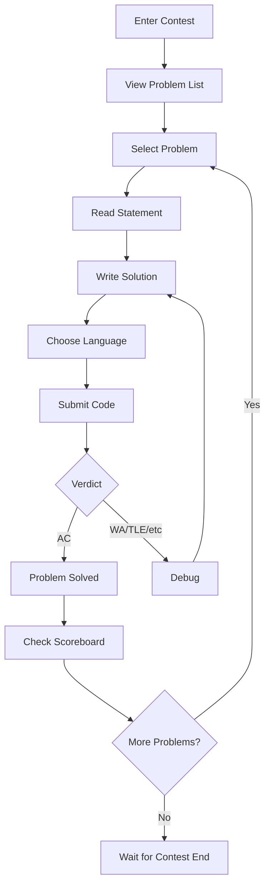

# Arena

Arena es la interfaz del concurso donde los participantes resuelven problemas durante las competiciones. Proporciona un entorno de resolución de problemas en tiempo real con actualizaciones de marcadores en vivo, envío de códigos y comentarios instantáneos.

## Descripción general

La Arena es el corazón de la experiencia del concurso omegaUp y ofrece:

- **Visualización de problemas**: vea enunciados de problemas con representación matemática
- **Editor de código**: editor basado en Mónaco con resaltado de sintaxis
- **Sistema de envío**: envíe soluciones y vea resultados detallados
- **Marcador en vivo**: clasificaciones de concursos en tiempo real
- **Aclaraciones**: Sistema de preguntas y respuestas para las preguntas del concurso
- **Temporizador**: cuenta regresiva del concurso y seguimiento del tiempo

## Diseño de la arena

```
┌─────────────────────────────────────────────────────────────┐
│  Contest Title                              Timer: 01:30:00 │
├─────────┬───────────────────────────────────────────────────┤
│         │                                                   │
│ Problem │              Problem Statement                    │
│  List   │                                                   │
│         │  - Description                                    │
│  [A]    │  - Input/Output format                           │
│  [B]    │  - Constraints                                   │
│  [C]    │  - Examples                                      │
│         │                                                   │
│─────────┼───────────────────────────────────────────────────│
│         │                                                   │
│ Submit  │              Code Editor                          │
│ History │                                                   │
│         │  [Language: C++17 ▼]  [Submit]                   │
│         │                                                   │
├─────────┴───────────────────────────────────────────────────┤
│                    Scoreboard / Clarifications              │
└─────────────────────────────────────────────────────────────┘
```
## Flujo de usuarios


## Componentes clave

### Panel de problemas

El panel de problemas muestra:

| Elemento | Descripción |
|---------|-------------|
| **Declaración** | Descripción del problema con soporte matemático LaTeX |
| **Formato de entrada** | Especificación de entrada esperada |
| **Formato de salida** | Formato de salida requerido |
| **Restricciones** | Límite de tiempo, límite de memoria, límites de entrada |
| **Ejemplos** | Ejemplos de pares de entrada/salida |
| **Notas** | Consejos o aclaraciones adicionales |

**Representación matemática**:
```latex
$$ \sum_{i=1}^{n} a_i \leq 10^9 $$
```
### Editor de código

Características del editor de Mónaco:

- **Resaltado de sintaxis**: coloración específica del idioma
- **Autocompletado**: finalización de código básico
- **Números de línea**: referencia fácil
- **Atajos de teclado**: atajos de editor estándar
- **Tema**: compatibilidad con el modo claro/oscuro

**Idiomas admitidos**:

| Idioma | Ampliación | Versión |
|----------|-----------|---------|
| C++ 17 | `.cpp` | CCG 10+ |
| C++ 11 | `.cpp` | CCG 10+ |
| Java | `.java` | AbiertoJDK 17 |
| Pitón 3 | `.py` | 3.10+ |
| Pitón 2 | `.py` | 2.7 |
| C | `.c` | CCG 10+ |
| Karel | `.kp`, `.kj` | Personalizado |
| Pascal | `.pas` | FPC 3.2 |

### Sistema de envío

#### Enviar flujo

1. Seleccione el idioma del menú desplegable
2. Pega o escribe el código en el editor.
3. Haga clic en el botón "Enviar"
4. Espere el veredicto (actualizaciones en tiempo real)

#### Visualización de veredicto

| Veredicto | Color | Significado |
|---------|-------|---------|
| Aire acondicionado | Verde | Aceptado: todas las pruebas pasaron |
| Autoridad Palestina | Amarillo | Parcial: se aprobaron algunas pruebas |
| WA | Rojo | Respuesta incorrecta |
| TLE | Naranja | Límite de tiempo excedido |
| MLE | Naranja | Límite de memoria excedido |
| RTE | Rojo | Error de tiempo de ejecución |
| CE | Gris | Error de compilación |

#### Detalles de envío

Al hacer clic en un envío se muestra:

- **Veredicto por caso de prueba** (si está permitido)
- **Tiempo de ejecución y uso de memoria**
- **Salida de compilación** (si es CE)
- **Desglose de puntuación** (puntuación parcial)

### Marcador

Marcador en tiempo real que muestra:

| Columna | Descripción |
|--------|-------------|
| Clasificación | Posición actual |
| Usuario | Nombre del participante |
| Puntuación | Puntos totales |
| Penalización | Penalización de tiempo (ICPC) |
| Por problema | Estado por problema |

**Iconos de estado del problema**:

- ✓ (verde): Aceptado
- ✗ (rojo): Intentos de respuesta incorrectos
- ? (amarillo): Pendiente de sentencia
- - (gris): No intentado

### Aclaraciones

Sistema de preguntas y respuestas para concursos:

1. **Preguntar**: enviar una pregunta sobre un problema
2. **Ver**: Ver aclaraciones públicas
3. **Notificaciones**: alertas en tiempo real para respuestas

**Tipos de aclaración**:

- **Público**: Visible para todos los participantes
- **Privado**: Sólo para el participante que lo solicite

## Modos de concurso

### Modo de práctica

Horarios fuera del concurso:

- Sin presión de tiempo
- Detalles completos del veredicto visibles
- Sin impacto en el marcador
- Envíos ilimitados

### Modo concurso

Durante el concurso:

- Temporizador de cuenta regresiva
- Información de veredicto limitada (configurable)
- Marcador en vivo
- Pueden aplicarse límites de envío

### Concurso virtual

Simular concursos pasados:

- Plazos originales
- Problemas originales
- Temporizador personal
- Comparar con resultados originales

## Funciones en tiempo real

### Actualizaciones de WebSocket

Arena utiliza WebSocket para actualizaciones en tiempo real:

```javascript
// Events received
- 'run_update': Submission verdict changed
- 'scoreboard_update': Scoreboard refreshed
- 'clarification': New clarification posted
```
### Notificaciones

Notificaciones de escritorio para:

- Presentación juzgada
- Nueva aclaración
- El concurso finalizará pronto (15 min, 5 min)

## Atajos de teclado

| Atajo | Acción |
|----------|--------|
| `Ctrl+Enter` | Enviar código |
| `Ctrl+S` | Guardar borrador (local) |
| `Esc` | Cerrar modal |
| `1-9` | Cambie al problema 1-9 |

## Vista de administrador del concurso

Los administradores del concurso ven características adicionales:

- **Todos los envíos**: ver todos los envíos de los participantes
- **Rejuzgar**: Rejuzgar envíos específicos
- **Transmisión**: Enviar anuncios
- **Aclaraciones de respuestas**: Responde a las preguntas
- **Extender tiempo**: agregar tiempo de concurso

## Soporte móvil

Arena responde y admite:

- Visualización de tableta (problema de lectura)
- Envío móvil (limitado)
- Visualización del marcador

## Rendimiento

Optimizaciones de arena:

- **Lazy Loading**: Problemas cargados bajo demanda
- **Almacenamiento en caché**: marcador almacenado en caché y actualizado con diferencias
- **Compresión**: respuestas comprimidas
- **CDN**: Activos estáticos en CDN

## Documentación relacionada

- **[Concursos](contests/index.md)** - Gestión de concursos
- **[Problemas](problems/index.md)** - Creación de problemas
- **[Actualizaciones en tiempo real](realtime.md)** - Sistema WebSocket
- **[Veredictos](verdicts.md)** - Explicaciones del veredicto
- **[API de concursos](../api/contests.md)** - Puntos finales de API
