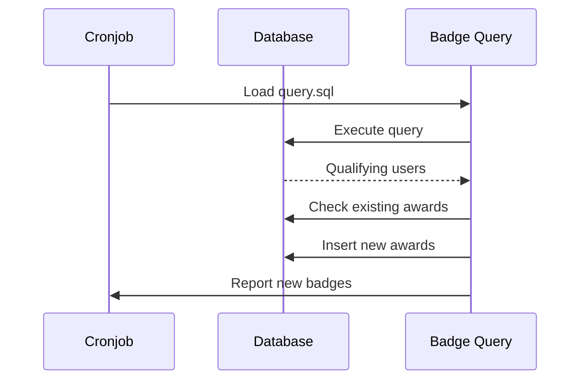

# Insignias

omegaUp incluye un sistema integral de insignias para reconocer los logros, hitos y contribuciones de los usuarios a la plataforma.

## Descripción general

Las insignias se otorgan automáticamente en función de consultas SQL que se ejecutan periódicamente mediante cronjobs. Cada insignia tiene su propio directorio que contiene la lógica de consulta, descripciones localizadas y casos de prueba.

## Categorías de insignias

### Hitos en la resolución de problemas

| Insignia | Requisito | Descripción |
|-------|-------------|-------------|
| **100 problemas resueltos** | Resuelve más de 100 problemas | Reconoce a los solucionadores de problemas dedicados |
| **Puntuación 500** | Consigue una puntuación total de más de 500 | Hito de puntuación general |

### Insignias de racha

| Insignia | Requisito | Descripción |
|-------|-------------|-------------|
| **Racha de 7 días** | Resuelve problemas 7 días consecutivos | Consistencia de una semana |
| **Racha de 15 días** | Resuelve problemas 15 días consecutivos | Dedicación de dos semanas |
| **Racha de 30 días** | Resuelve problemas 30 días consecutivos | Compromiso de un mes |

### Insignias de experto en idiomas

| Insignia | Requisito | Descripción |
|-------|-------------|-------------|
| **Experto en C++** | Resuelve más de 10 problemas en C++ | Competencia en C++ |
| **Experto en Java** | Resuelve más de 10 problemas en Java | Dominio de Java |
| **Experto en Python** | Resuelve más de 10 problemas en Python | Dominio de Python |
| **Experto en Pascal** | Resuelve más de 10 problemas en Pascal | Competencia en Pascal |
| **Karel Experto** | Resuelve más de 10 problemas en Karel | Competencia Karel |

### Finalización del curso

| Insignia | Requisito | Descripción |
|-------|-------------|-------------|
| **Graduado del curso C++** | Curso completo de C++ | Finalización del curso |
| **Graduado del curso de Python** | Curso completo de Python | Finalización del curso |
| **Graduado en Introducción a los Algoritmos** | Curso completo de algoritmos | Finalización del curso |
| **Introducción a Algoritmos 2 Graduado** | Curso avanzado completo | Finalización del curso |

### Comunidad y contribución

| Insignia | Requisito | Descripción |
|-------|-------------|-------------|
| **Creador de problemas** | Crear un problema público | Creador de contenido |
| **Gerente del concurso** | Organizar un concurso | Organizador del concurso |
| **Gerente del concurso virtual** | Crear concursos virtuales | Facilitador de prácticas |
| **Proveedor de comentarios** | Presentar nominaciones de calidad | Colaborador de la comunidad |
| **Codificador del mes** | Ser seleccionado como codificador del mes | Reconocimiento mensual |

### Insignias especiales

| Insignia | Requisito | Descripción |
|-------|-------------|-------------|
| **Usuario heredado** | Cuenta creada antes de 2020 | Adoptador pionero |
| **Usuario actualizado** | Información completa del perfil | Finalización del perfil |
| **Problema de la semana** | Resolver problema destacado | Desafío semanal |
| **Problema de Navidad 2021** | Resolver el problema de las vacaciones | Participación en eventos |

## Implementación de insignias

### Estructura del directorio

Cada insignia está definida en `frontend/badges/[badge-name]/`:

```
frontend/badges/
├── 100solvedProblems/
│   ├── icon.svg          # Badge icon
│   ├── localizations.json # Translations
│   ├── query.sql         # Award criteria
│   └── test.json         # Test cases
├── cppExpert/
│   └── ...
└── default_icon.svg      # Fallback icon
```
### Estructura de consulta

Las consultas de insignias devuelven ID de usuarios que califican:

```sql
-- Example: 100solvedProblems/query.sql
SELECT DISTINCT
    i.user_id
FROM
    Identities i
INNER JOIN
    (
        SELECT
            s.identity_id,
            COUNT(DISTINCT s.problem_id) AS solved_count
        FROM
            Submissions s
        INNER JOIN
            Runs r ON s.current_run_id = r.run_id
        WHERE
            r.verdict = 'AC'
        GROUP BY
            s.identity_id
        HAVING
            solved_count >= 100
    ) AS solved ON i.identity_id = solved.identity_id
WHERE
    i.user_id IS NOT NULL;
```
### Formato de localización

Soporte multilingüe en `localizations.json`:

```json
{
  "es": {
    "name": "100 Problemas resueltos",
    "description": "Otorgado a personas que han resuelto 100 problemas o más."
  },
  "en": {
    "name": "100 Solved Problems",
    "description": "User has solved 100 or more problems."
  },
  "pt": {
    "name": "100 Problemas Resolvidos",
    "description": "Concedido a pessoas que resolveram 100 ou mais problemas."
  }
}
```
### Casos de prueba

Validación en `test.json`:

```json
{
  "users": ["test_user_1", "test_user_2"],
  "expected": {
    "test_user_1": true,
    "test_user_2": false
  }
}
```
## Procesamiento de insignias

### Ejecución de cronjob

Las insignias se otorgan mediante el cronjob de asignación de insignias:

```bash
# Run badge assignment
python3 stuff/cron/assign_badges.py
```
### Flujo de procesamiento


## Visualización de insignias

### Perfil de usuario

Las insignias aparecen en los perfiles de usuario en `/profile/{username}/`:

- Icono de insignia (SVG)
- Nombre localizado
- Fecha de adjudicación
- Descripción de la insignia al pasar el mouse

### API de insignia

Recuperar insignias mediante programación:

```bash
# Get all badges
GET /api/Badge/list/

# Get user's badges
GET /api/Badge/myList/

# Get specific user's badges
GET /api/Badge/userList/?target_user={username}

# Get badge details
GET /api/Badge/badgeDetails/?badge_alias={alias}
```
## Creando nuevas insignias

### Paso 1: Crear directorio

```bash
mkdir frontend/badges/newBadgeName
```
### Paso 2: escribir consulta

Cree `query.sql` que devuelva valores `user_id` calificados:

```sql
SELECT DISTINCT
    i.user_id
FROM
    Identities i
WHERE
    -- Your criteria here
    i.user_id IS NOT NULL;
```
### Paso 3: Agregar localizaciones

Crear `localizations.json`:

```json
{
  "es": {
    "name": "Nuevo Badge",
    "description": "Descripción del badge."
  },
  "en": {
    "name": "New Badge",
    "description": "Badge description."
  }
}
```
### Paso 4: Agregar ícono (opcional)

Cree `icon.svg` o utilice el icono predeterminado.

### Paso 5: Agregar pruebas

Cree `test.json` con los resultados esperados.

### Paso 6: Pruebe localmente

```bash
# Run badge tests
python3 stuff/cron/assign_badges.py --dry-run --badge=newBadgeName
```
## Documentación relacionada

- **[API de insignias](../api/badges.md)** - Puntos finales de API para insignias
- **[Patrones de base de datos](../development/database-patterns.md)** - Patrones de consulta
- **[Cronjobs](../architecture/infrastructure.md)** - Procesamiento en segundo plano
