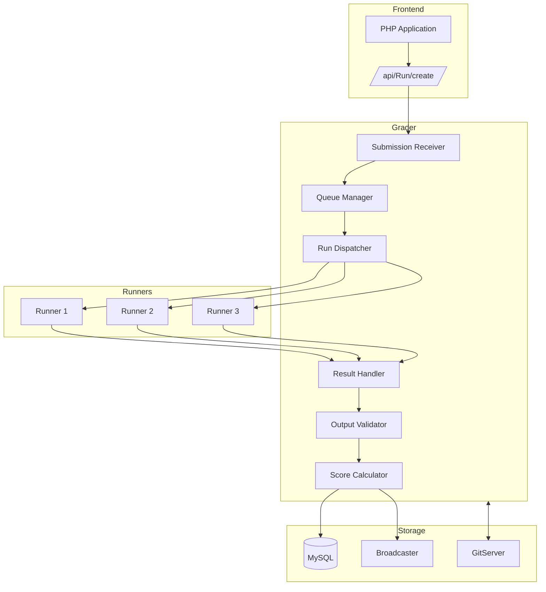
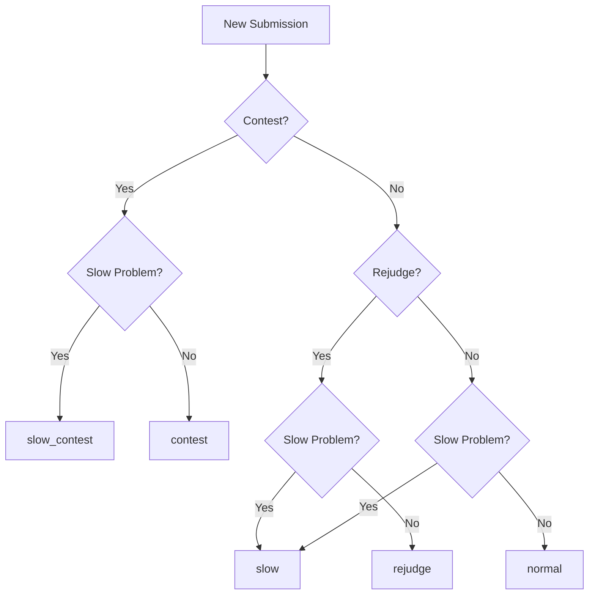
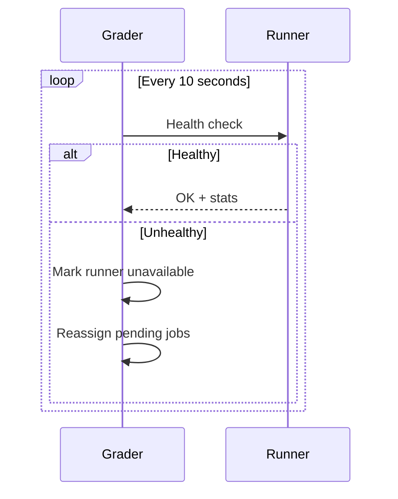
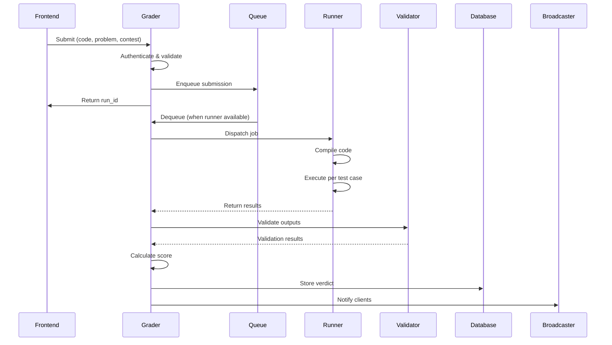

# Calificador

Grader es el microservicio central de Go responsable de gestionar las colas de envío, coordinar la evaluación del código entre múltiples corredores y determinar los veredictos finales. Actúa como despachador entre la interfaz PHP y la infraestructura de ejecución.

## Descripción general

Grader maneja todo el ciclo de vida del envío:

1. Recibe envíos desde el frontend.
2. Los coloca en colas de prioridad adecuadas.
3. Envíos a Corredores disponibles
4. Recopila resultados de ejecución.
5. Ejecuta validadores y calcula puntuaciones.
6. Almacena resultados y notifica a los clientes.

## Arquitectura


## Sistema de cola

### Tipos de cola

El Grader mantiene 8 colas diferentes para priorización:

| Cola | Prioridad | Propósito |
|-------|----------|---------|
| `contest` | 1 (más alto) | Envíos activos al concurso |
| `urgent` | 2 | Concursos de alta prioridad |
| `contest_rejudge` | 3 | Solicitudes de reevaluación de concursos |
| `normal` | 4 | Envíos en modo práctica |
| `rejudge` | 5 | Solicitudes generales de rejuicio |
| `slow_contest` | 6 | Problemas lentos en los concursos |
| `slow_urgent` | 7 | Problemas lentos (alta prioridad) |
| `slow` | 8 (más bajo) | Problemas lentos (generales) |

### Lógica de enrutamiento de colas


### Detección lenta de problemas

Los problemas se marcan como "lentos" si tienen:

- Límite de tiempo > 30 segundos
- Límite de memoria > 512 MB
- Historial de largos tiempos de ejecución.

## Gestión de corredores

### Registro de corredores

Los corredores se registran con el Grader al inicio:

```go
type RunnerInfo struct {
    Name     string
    Hostname string
    Port     int
    MaxJobs  int
    Features []string  // e.g., ["cpp", "java", "python"]
}
```
### Equilibrio de carga

El Dispatcher utiliza round-robin ponderado:

1. Consultar disponibilidad de corredores
2. Considere la carga actual por corredor
3. Haga coincidir las capacidades del corredor con el idioma de envío
4. Envío al corredor adecuado menos cargado

### Monitoreo de salud


## Flujo de evaluación

### Secuencia detallada


### Estructura de resultados

```json
{
  "run_id": 12345,
  "verdict": "PA",
  "score": 0.75,
  "contest_score": 75.0,
  "runtime": 0.234,
  "memory": 16384,
  "compile_error": null,
  "cases": [
    {"name": "1", "verdict": "AC", "score": 1.0, "runtime": 0.05},
    {"name": "2", "verdict": "AC", "score": 1.0, "runtime": 0.08},
    {"name": "3", "verdict": "WA", "score": 0.0, "runtime": 0.06},
    {"name": "4", "verdict": "AC", "score": 1.0, "runtime": 0.05}
  ]
}
```
## Validación

### Tipos de validador

| Tipo | Descripción | Caso de uso |
|------|-------------|----------|
| `token-caseless` | Tokenizar, comparación que no distingue entre mayúsculas y minúsculas | La mayoría de los problemas |
| `token-numeric` | Compara números con tolerancia | Punto flotante |
| `literal` | Coincidencia exacta byte a byte | Salida precisa |
| `custom` | Programa validador proporcionado por el usuario | Múltiples respuestas |

### Interfaz de validador personalizada

```cpp
// validator.cpp
#include <iostream>
#include <fstream>

int main(int argc, char* argv[]) {
    // argv[1] = input file
    // argv[2] = expected output (may be empty)
    // argv[3] = contestant output
    
    std::ifstream input(argv[1]);
    std::ifstream expected(argv[2]);
    std::ifstream contestant(argv[3]);
    
    // Validation logic...
    
    // Output score (0.0 to 1.0)
    std::cout << 1.0 << std::endl;
    return 0;
}
```
## Lógica de puntuación

### Cálculo de puntuación

```python
def calculate_score(test_results, scoring_mode):
    if scoring_mode == "all_or_nothing":
        # All tests must pass
        return 1.0 if all(r.verdict == "AC" for r in test_results) else 0.0
    
    elif scoring_mode == "partial":
        # Sum of individual test scores
        return sum(r.score * r.weight for r in test_results)
    
    elif scoring_mode == "max_per_group":
        # Group tests, take max per group
        groups = group_by(test_results, lambda r: r.group)
        return sum(max(r.score for r in g) * g.weight for g in groups)
```
### Jerarquía de veredictos

Al combinar veredictos de casos de prueba:

```
1. CE (Compilation Error) - if compile failed
2. JE (Judge Error) - if judge had issues
3. TLE - if any test exceeded time
4. MLE - if any test exceeded memory
5. RTE - if any test crashed
6. WA - if any test wrong answer
7. PA - if partial score > 0 but < 1
8. AC - if all tests passed
```
## Puntos finales API

### API interna (ejecutores)

| Punto final | Método | Descripción |
|----------|--------|-------------|
| `/register` | PUBLICAR | Inscripción de corredores |
| `/job` | OBTENER | Consigue el próximo trabajo |
| `/result` | PUBLICAR | Enviar resultados |
| `/health` | OBTENER | Control de salud |

### Interfaz web

Acceso en `http://grader:36663/grader/`:

- Estado y duración de las colas.
- Estado del corredor
- Envíos recientes
- Registros de errores

## Configuración

### Configuración clave

```json
{
  "grader": {
    "port": 21680,
    "web_port": 36663,
    "max_queue_length": 10000,
    "runner_timeout": 300,
    "validation_timeout": 60,
    "db_connection_pool": 20
  },
  "queues": {
    "contest": {"workers": 4},
    "normal": {"workers": 8},
    "slow": {"workers": 2}
  }
}
```
### Variables de entorno

| Variables | Predeterminado | Descripción |
|----------|---------|-------------|
| `GRADER_DB_HOST` | servidor local | Servidor MySQL |
| `GRADER_DB_NAME` | omegaup | Nombre de la base de datos |
| `GRADER_LOG_LEVEL` | información | Verbosidad del registro |
| `GRADER_METRICS_PORT` | 6060 | Métricas de Prometeo |

## Monitoreo

### Métricas clave

| Métrica | Tipo | Descripción |
|--------|------|-------------|
| `grader_queue_length` | Calibre | Artículos por cola |
| `grader_runs_total` | Mostrador | Total procesado |
| `grader_run_duration` | Histograma | Tiempo de procesamiento |
| `grader_runners_active` | Calibre | Corredores activos |
| `grader_validation_errors` | Mostrador | Fallos del validador |

### Alertas

```yaml
- alert: GraderQueueBacklog
  expr: grader_queue_length{queue="contest"} > 50
  for: 5m
  annotations:
    summary: "Contest queue backlog"

- alert: NoRunnersAvailable  
  expr: grader_runners_active == 0
  for: 1m
  annotations:
    summary: "No runners available"
```
## Solución de problemas

### Problemas comunes

**Envíos atascados en la cola**:
```bash
# Check queue status
curl http://grader:36663/grader/status/

# Check runner connectivity
curl http://runner1:port/health
```
**Errores del validador**:
```bash
# Check grader logs
docker-compose logs grader | grep -i validator
```
**Procesamiento lento**:
```bash
# Check metrics
curl http://grader:6060/metrics | grep queue
```
## Documentación relacionada

- **[Grader Internals](../architecture/grader-internals.md)** - Detalles técnicos detallados
- **[Runner](runner.md)** - Sistema de ejecución de código
- **[Veredictos](verdicts.md)** - Explicaciones del veredicto
- **[Arquitectura](../architecture/index.md)** - Descripción general del sistema
