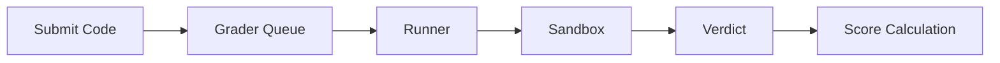

# Características Documentación

Documentación detallada sobre las características y funcionalidades de omegaUp. Esta sección cubre todo, desde la creación de problemas hasta las actualizaciones del concurso en tiempo real.

## Funciones principales

- :material-puzzle:{ .lg .middle } **[Problemas](problems/index.md)**

    ---

    Crear, gestionar y formatear problemas de programación. Obtenga información sobre planteamientos de problemas, casos de prueba, validadores y el ciclo de vida completo del problema.

    [:octicons-arrow-right-24: Más información](problems/index.md)

- :material-trophy:{ .lg .middle } **[Concursos](contests/index.md)**

    ---

    Organización y gestión de concursos de programación. Configure modos de puntuación, administre participantes y realice competiciones exitosas.

    [:octicons-arrow-right-24: Más información](contests/index.md)

- :material-code-braces:{ .lg .middle } **[Arena](arena.md)**

    ---

    La interfaz del concurso donde los participantes resuelven problemas. Incluye editor de código, marcador en tiempo real y sistema de aclaración.

    [:octicons-arrow-right-24: Más información](arena.md)

## Sistema de evaluación

El sistema de evaluación es el corazón de omegaUp y se encarga de la compilación, ejecución y puntuación del código.

| Componente | Descripción | Documentación |
|-----------|-------------|---------------|
| **Calificador** | Gestión de colas y determinación de veredictos | [Calificador](grader.md) |
| **Corredor** | Compilación de código y ejecución en espacio aislado | [Corredor](runner.md) |
| **Caja de arena** | Ejecución segura usando Minijail | [Caja de arena](sandbox.md) |
| **Veredictos** | Tipos de resultados y modelos de puntuación | [Veredictos](verdicts.md) |

### Flujo de evaluación

## Gestión de problemas

| Característica | Descripción | Documentación |
|---------|-------------|---------------|
| **Creando problemas** | Escribir declaraciones, casos de prueba, validadores | [Creando problemas](problems/creating-problems.md) |
| **Formato del problema** | Estructura y configuración de archivos | [Formato del problema](problems/problem-format.md) |
| **Control de versiones** | Versionado de problemas basado en Git | [Versión de problemas](problem-versioning.md) |

## Funciones en tiempo real

| Característica | Descripción | Documentación |
|---------|-------------|---------------|
| **Actualizaciones en vivo** | Notificaciones basadas en WebSocket | [Tiempo real](realtime.md) |
| **Marcadores** | Clasificaciones del concurso en vivo | [Arena](arena.md) |
| **Aclaraciones** | Sistema de preguntas y respuestas del concurso | [Arena](arena.md) |

## Sistema de logros

| Característica | Descripción | Documentación |
|---------|-------------|---------------|
| **Insignias** | Recompensas por logros del usuario | [Insignias](badges.md) |

### Categorías de insignias

- **Resolución de problemas**: 100 problemas resueltos, 500 puntos
- **Rachas**: rachas de resolución de 7 días, 15 días y 30 días
- **Experiencia en idiomas**: especialistas en C++, Java y Python
- **Comunidad**: creador de problemas, administrador de concursos, proveedor de comentarios

## Matriz de funciones

| Característica | Práctica | Concurso | Curso |
|---------|----------|---------|--------|
| Resolución de problemas | ✅ | ✅ | ✅ |
| Marcador en vivo | ❌ | ✅ | ❌ |
| Límites de tiempo | ❌ | ✅ | Configurable |
| Aclaraciones | ❌ | ✅ | ✅ |
| Seguimiento del progreso | ✅ | ❌ | ✅ |
| Certificados | ❌ | ✅ | ✅ |
| Participación virtual | ✅ | ✅ | ❌ |

## Documentación relacionada

- **[Referencia de API](../api/index.md)** - Puntos finales de API para todas las funciones
- **[Arquitectura](../architecture/index.md)** - Detalles de la arquitectura del sistema
- **[Guías de desarrollo](../development/index.md)** - Guías de implementación de funciones
