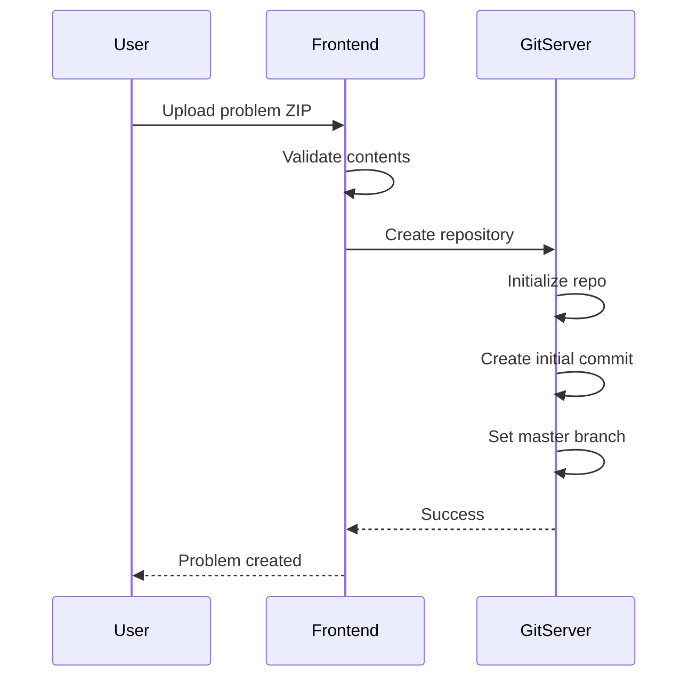
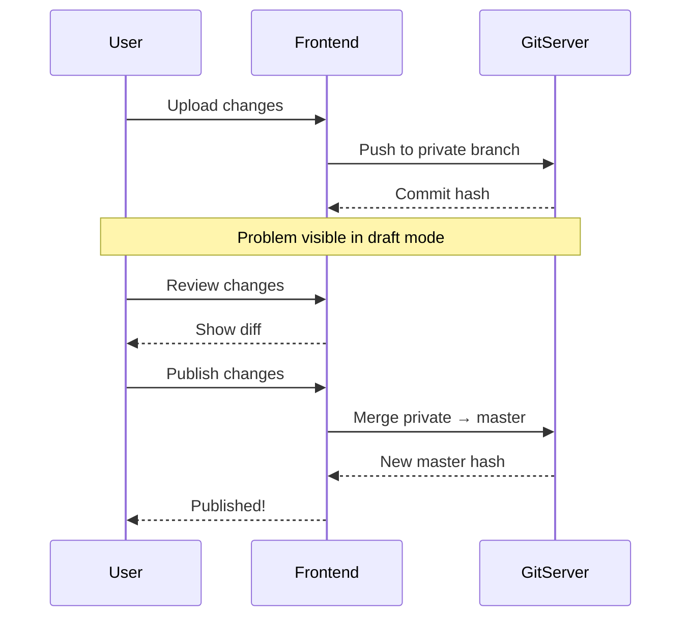
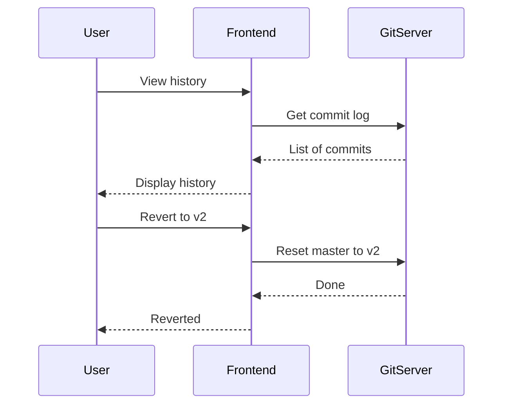
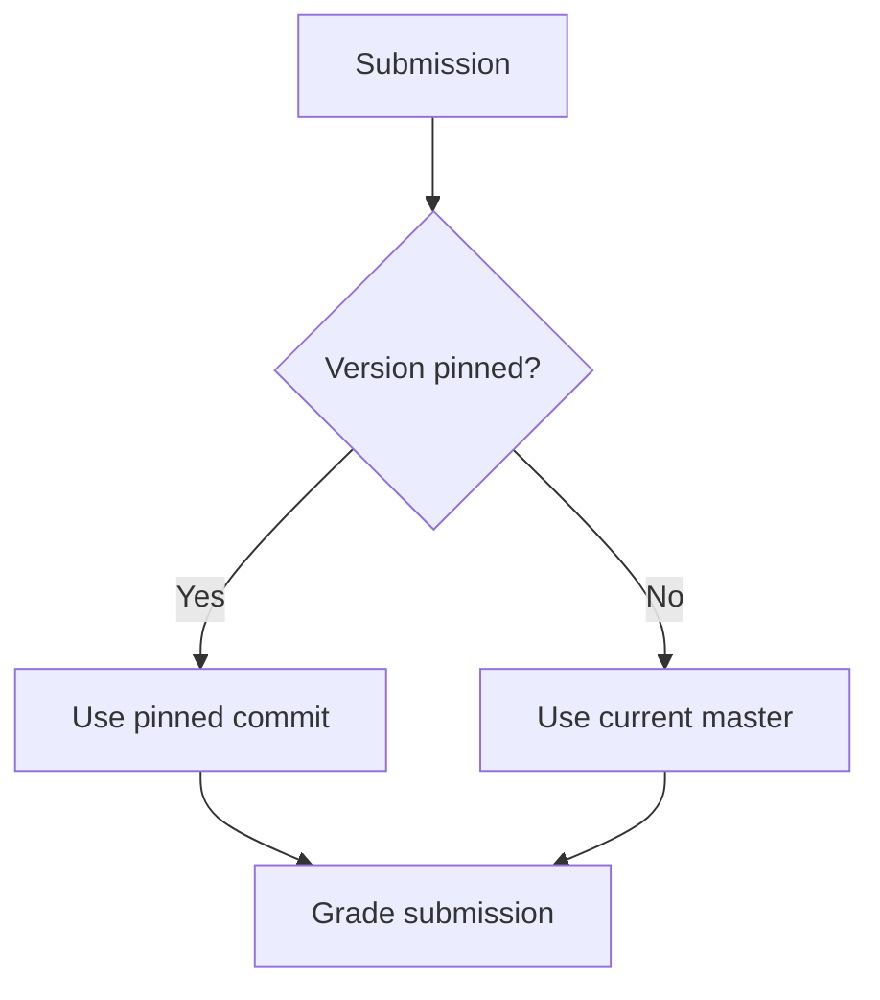

# Problema de control de versiones

omegaUp utiliza Git para el control de versiones de problemas, lo que permite realizar un seguimiento completo del historial, actualizaciones atómicas y fijación de versiones para concursos.

## Descripción general

Cada problema es un repositorio Git que contiene:

- Declaraciones de problemas (varios idiomas)
- Casos de prueba (entradas y salidas esperadas)
- Validadores personalizados (opcional)
- Archivos de problemas interactivos (opcional)
- Ajustes de configuración

## Beneficios del control de versiones

### Para quienes plantean problemas

- **Seguimiento del historial**: vea todos los cambios a lo largo del tiempo
- **Revertir**: volver a cualquier versión anterior
- **Modo borrador**: prueba los cambios antes de publicarlos.
- **Colaboración**: múltiples editores con seguimiento de cambios

### Para organizadores de concursos

- **Fijación de versión**: problema de bloqueo en una versión específica
- **Consistencia**: Misma versión durante todo el concurso
- **Independencia**: las actualizaciones de problemas no afectan la ejecución de concursos

## Sucursales

### Estructura de sucursales

```
refs/
├── heads/
│   ├── master      # Published version
│   ├── private     # Draft version
│   └── published   # Alias for master
└── tags/
    ├── v1
    ├── v2
    └── contest-2024
```
### Propósitos de la sucursal

| Sucursal | Propósito | Visibilidad |
|--------|---------|------------|
| `master` | Versión publicada en vivo | Público (si el problema es público) |
| `private` | Trabajo en progreso | Solo administradores de problemas |
| `published` | Alias ​​para maestro | Igual que maestro |

## Flujo de trabajo

### Creando un problema


### Actualizando un problema


### Revertir cambios


## Fijación de versión

### En concursos

Al agregar un problema a un concurso:

```json
{
  "problem_alias": "sum-two",
  "commit": "abc123def456",  // Optional: pin to specific version
  "points": 100
}
```
Si se omite `commit`, se utiliza el `master` actual al inicio del concurso.

### Durante el concurso


### Después del concurso

El problema se puede actualizar sin afectar:

- Marcadores del concurso
- Presentaciones históricas
- Integridad del concurso

## Historial de confirmaciones

### Historial de visualización

Acceso vía API o UI:

```bash
GET /api/problem/versions/?problem_alias=sum-two
```
Respuesta:

```json
{
  "versions": [
    {
      "commit": "abc123",
      "message": "Fixed test case 5",
      "author": "admin",
      "timestamp": 1704067200
    },
    {
      "commit": "def456",
      "message": "Added edge cases",
      "author": "admin",
      "timestamp": 1703980800
    }
  ]
}
```
### Confirmar mensajes

Mensajes automáticos para operaciones comunes:

| Operación | Formato de mensaje |
|-----------|---------------|
| Crear | "Compromiso inicial" |
| Declaración de actualización | "Declaración actualizada para {lang}" |
| Agregar casos de prueba | "Se agregaron casos de prueba {n}" |
| Cambiar límites | "Límites actualizados: tiempo={t}s, memoria={m}MB" |

## Estructura del directorio

### Contenido del problema

```
problem/
├── statements/
│   ├── es.markdown       # Spanish statement
│   ├── en.markdown       # English statement
│   └── images/
│       └── diagram.png
├── cases/
│   ├── easy.1.in
│   ├── easy.1.out
│   ├── easy.2.in
│   ├── easy.2.out
│   ├── hard.1.in
│   └── hard.1.out
├── solutions/
│   └── solution.cpp
├── validators/
│   └── validator.cpp     # Optional
├── interactive/
│   ├── Main.idl          # Optional
│   └── Main.cpp
├── settings.json
└── testplan              # Optional
```
### configuración.json

```json
{
  "Limits": {
    "TimeLimit": "1s",
    "MemoryLimit": "256MiB",
    "OverallWallTimeLimit": "30s",
    "OutputLimit": "10240KiB"
  },
  "Validator": {
    "Name": "token-numeric",
    "Tolerance": 1e-6
  },
  "Cases": [
    {
      "Name": "easy",
      "Cases": ["easy.1", "easy.2"],
      "Weight": 30
    },
    {
      "Name": "hard",
      "Cases": ["hard.1"],
      "Weight": 70
    }
  ]
}
```
## Detalles del formato de archivo

### Rebaja de declaración

```markdown
# Problem Title

## Description
Problem description here...

## Input
Input format description...

## Output
Output format description...

## Constraints
- $1 \leq n \leq 10^6$

## Examples

### Input
```
5
1 2 3 4 5
```

### Output
```
15
```

## Notes
Additional notes...
```
### Casos de prueba

| Ampliación | Propósito |
|-----------|------------------|
| `.in` | Archivo de entrada |
| `.out` | Producción esperada |

Convención de nomenclatura:

```
{group}.{number}.in
{group}.{number}.out
```
## Operaciones API

### Obtener la versión actual

```bash
GET /api/problem/details/?problem_alias=sum-two
```
Devuelve el campo `current_version`.

### Versiones de lista

```bash
GET /api/problem/versions/?problem_alias=sum-two
```
### Problema de actualización

```bash
POST /api/problem/update/
  problem_alias=sum-two
  message="Fixed edge case"
  contents=<zip file>
  update_published=none|non-problemset|all
```
### Publicar borrador

```bash
POST /api/problem/updateProblemLevel/
  problem_alias=sum-two
  update_published=all
```
## Mejores prácticas

### Gestión de versiones

1. **Utilice mensajes significativos**: describa qué cambió
2. **Prueba antes de publicar**: utiliza una rama privada
3. **Fijar concursos**: fije siempre los concursos críticos
4. **Archivar versiones antiguas**: etiquetar lanzamientos importantes

### Colaboración

1. **Ediciones coordinadas**: un editor a la vez
2. **Revisar cambios**: verifique la diferencia antes de publicar
3. **Decisiones de documentos**: utilice mensajes de confirmación

### Preparación del concurso

1. **Congelar temprano**: Fijar las versiones mucho antes del concurso
2. **Versión fijada de prueba**: Verificar con envíos de prueba
3. **No actualizar durante el concurso**: podría causar problemas

## Documentación relacionada

- **[Arquitectura GitServer](../architecture/gitserver.md)** - Detalles técnicos
- **[API de problemas](../api/problems.md)** - Referencia de API
- **[Creando problemas](problems/creating-problems.md)** - Guía de creación de problemas
