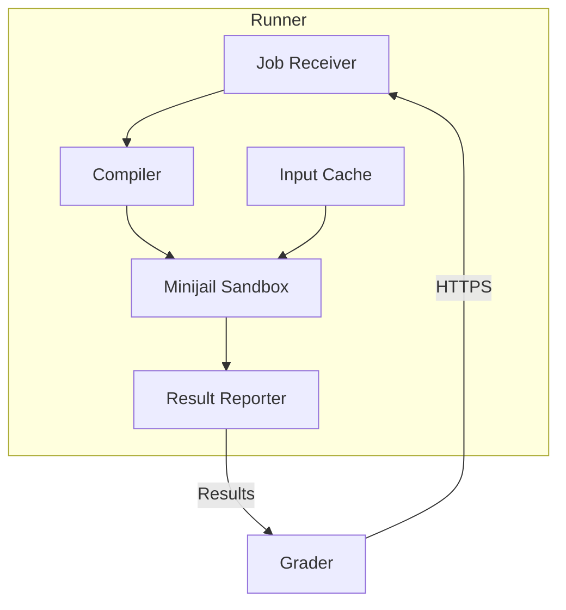
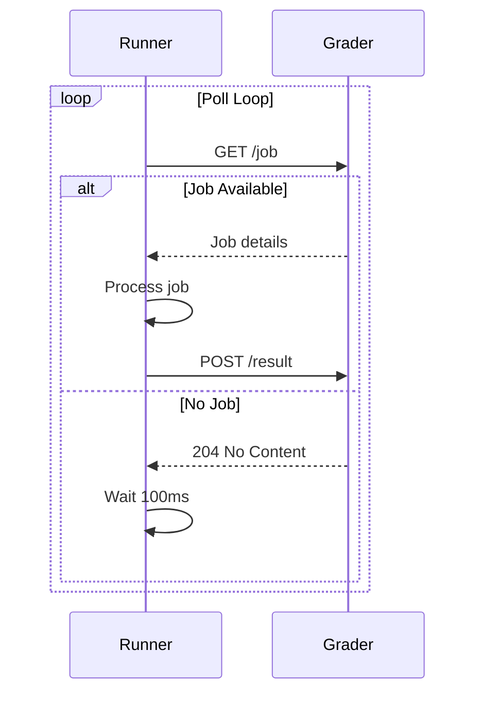
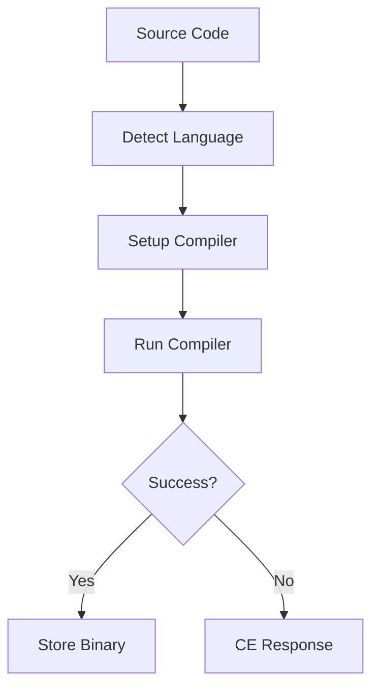
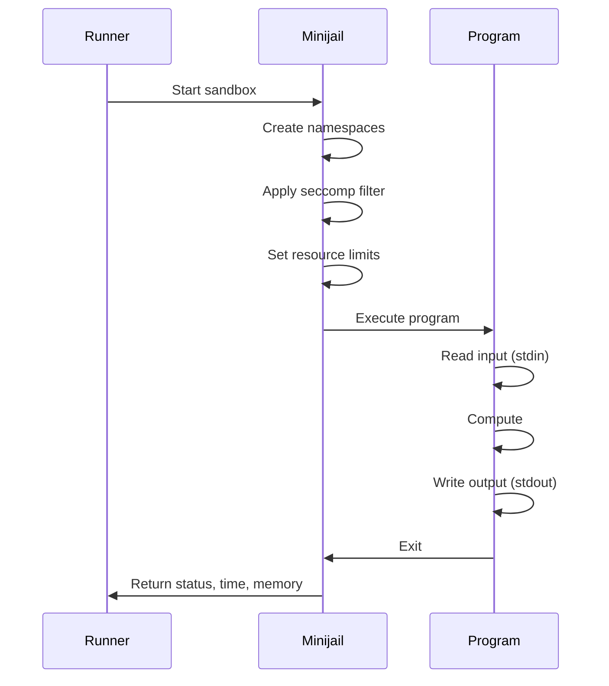

# corredor

Los corredores son servicios Go distribuidos responsables de compilar y ejecutar el código enviado por el usuario en un entorno de pruebas seguro. Varios corredores trabajan en paralelo para manejar la carga de envíos durante las competencias.

## Descripción general

Cada Runner se implementa en una máquina virtual en la nube y se comunica con Grader a través de HTTPS mediante autenticación de certificado mutuo. Los corredores manejan el ciclo de vida de ejecución completo: compilación, ejecución en espacio aislado y recopilación de resultados.

## Arquitectura


## Características clave

- **Ejecución segura**: utiliza el entorno limitado de Minijail para el aislamiento de procesos
- **Distribuido**: múltiples corredores para escalabilidad horizontal
- **Soporte de idiomas**: más de 10 lenguajes de programación
- **Almacenamiento en caché**: entradas de casos de prueba almacenadas en caché para mayor eficiencia
- **Autentificación mutua**: autenticación basada en certificados con Grader

## Idiomas admitidos

| Idioma | Compilador/Intérprete | Versión | Extensiones |
|----------|---------------------|---------|------------|
| C | CCG | 10+ | `.c` |
| C++ 14/11/17/20 | G++ | 10+ | `.cpp` |
| Java | AbiertoJDK | 17+ | `.java` |
| Pitón 3 | CPython | 3.10+ | `.py` |
| Pitón 2 | CPython | 2.7 | `.py` |
| Rubí | resonancia magnética | 3.0+ | `.rb` |
| Pascal | Pascal libre | 3.2+ | `.pas` |
| Karel (Pascal) | Personalizado | - | `.kp` |
| Karel (Java) | Personalizado | - | `.kj` |
| Haskel | GHC | 8.10+ | `.hs` |
| C# | Mono | 6.12+ | `.cs` |
| Lúa | Lúa | 5.4+ | `.lua` |

## Flujo de ejecución

### 1. Recepción de empleo

El corredor sondea al evaluador para conocer los trabajos disponibles:


### 2. Compilación


**Comandos de compilación por idioma**:

```bash
# C++17
g++ -std=c++17 -O2 -lm -o program main.cpp

# Java
javac -encoding UTF-8 Main.java

# Python (no compilation, syntax check)
python3 -m py_compile solution.py

# Pascal
fpc -O2 program.pas
```
### 3. Ejecución en espacio aislado

Para cada caso de prueba:


### 4. Recopilación de resultados

Runner recopila resultados por caso de prueba:

```json
{
  "verdict": "OK",
  "runtime_ms": 45,
  "memory_kb": 16384,
  "output_hash": "d41d8cd98f00b204e9800998ecf8427e",
  "wall_time_ms": 50,
  "signal": 0
}
```
## Puntos finales API

### `/compile/`

Compila un envío de forma sincrónica.

**Pedido**:
```json
{
  "lang": "cpp17",
  "code": {
    "main.cpp": "#include <iostream>\nint main() { ... }"
  }
}
```
**Respuesta (Éxito)**:
```json
{
  "token": "ABJdfoeKFPer9183409dsfDFPOfkaR834JFDJF=",
  "compile_time_ms": 1234
}
```
**Respuesta (Error)**:
```json
{
  "error": "main.cpp:5:1: error: expected ';' before '}'"
}
```
### `/run/`

Ejecuta el programa compilado contra casos de prueba.

**Pedido**:
```json
{
  "token": "ABJdfoeKFPer9183409dsfDFPOfkaR834JFDJF=",
  "input_hash": "d41d8cd98f00b204e9800998ecf8427e",
  "time_limit_ms": 1000,
  "memory_limit_kb": 262144,
  "output_limit_kb": 65536
}
```
**Respuesta**:
```json
{
  "results": [
    {
      "name": "1",
      "status": "OK",
      "time_ms": 45,
      "memory_kb": 16384,
      "output_hash": "abc123..."
    },
    {
      "name": "2",
      "status": "TLE",
      "time_ms": 1000,
      "memory_kb": 16384
    }
  ]
}
```
### `/input/`

Carga entradas de casos de prueba en la caché.

**Pedido**:
```json
{
  "hash": "d41d8cd98f00b204e9800998ecf8427e",
  "cases": [
    {"name": "1", "input": "5\n1 2 3 4 5"},
    {"name": "2", "input": "3\n10 20 30"}
  ]
}
```
### `/health`

Punto final de control de estado.

**Respuesta**:
```json
{
  "status": "healthy",
  "uptime_seconds": 86400,
  "jobs_completed": 12345,
  "current_jobs": 2
}
```
## Límites de recursos

### Límites predeterminados

| Recurso | Predeterminado | Máximo configurable |
|----------|---------|------------------|
| Hora | 1 segundo | 60 segundos |
| Memoria | 256MB | 1 GB |
| Salida | 64MB | 256MB |
| Tamaño de archivo | 64MB | 256MB |
| Procesos | 1 | 1 (sin tenedor) |
| Abrir archivos | 20 | 50 |

### Medición del tiempo

Se rastrean tres métricas de tiempo:

- **Tiempo de CPU**: ciclos de CPU reales utilizados
- **Tiempo de pared**: tiempo real transcurrido
- **Tiempo del sistema**: tiempo del kernel (debe ser mínimo)

```
Total Time = User Time + System Time
Wall Time >= Total Time (due to I/O waits)
```
## Almacenamiento en caché

### Caché de entrada

Los casos de prueba se almacenan en caché para evitar transferencias redundantes:

```
/var/lib/omegaup/runner/cache/
├── d41d8cd98f00b204e9800998ecf8427e/
│   ├── 1.in
│   ├── 2.in
│   └── 3.in
└── abc123.../
    └── ...
```
### Desalojo de caché

- **Política LRU**: los insumos utilizados menos recientemente se desalojan primero
- **Tamaño máximo**: Configurable (predeterminado 10 GB)
- **TTL**: las entradas caducan después de 24 horas

### Caché binario compilado

Binarios compilados almacenados en caché para volver a juzgar:

```
/var/lib/omegaup/runner/compiled/
└── {token}/
    └── program
```
## Seguridad

### Configuración de zona de pruebas

Consulte la [documentación de Sandbox](sandbox.md) para obtener más detalles:

- Aislamiento de procesos a través de espacios de nombres de Linux
- Filtrado de llamadas al sistema a través de seccomp-BPF
- Límites de recursos a través de cgroups/setrlimit
- Aislamiento del sistema de archivos

### Seguridad de la red

- **Solo HTTPS**: todas las comunicaciones cifradas
- **TLS mutuo**: autenticación basada en certificados
- **Sin Internet**: corredores aislados de Internet

### Autenticación

```yaml
# Runner certificate configuration
tls:
  cert_file: /etc/omegaup/runner.crt
  key_file: /etc/omegaup/runner.key
  ca_file: /etc/omegaup/ca.crt
```
## Configuración

### Configuración del corredor

```json
{
  "runner": {
    "port": 6161,
    "grader_url": "https://grader:21680",
    "sandbox_path": "/usr/bin/minijail0",
    "cache_dir": "/var/lib/omegaup/runner/cache",
    "max_cache_size_gb": 10,
    "max_concurrent_jobs": 4
  },
  "languages": {
    "cpp17": {
      "compiler": "/usr/bin/g++",
      "flags": ["-std=c++17", "-O2", "-lm"]
    }
  }
}
```
### Variables de entorno

| Variables | Predeterminado | Descripción |
|----------|---------|-------------|
| `RUNNER_GRADER_URL` | - | URL del calificador (obligatorio) |
| `RUNNER_PORT` | 6161 | Puerto de escucha HTTP |
| `RUNNER_MAX_JOBS` | 4 | Trabajos simultáneos |
| `RUNNER_CACHE_DIR` | `/var/lib/omegaup/runner` | Directorio de caché |

## Monitoreo

### Métricas

| Métrica | Tipo | Descripción |
|--------|------|-------------|
| `runner_jobs_total` | Mostrador | Total de empleos procesados ​​|
| `runner_job_duration_seconds` | Histograma | Tiempo de procesamiento del trabajo |
| `runner_compilation_errors` | Mostrador | Fallos de compilación |
| `runner_execution_errors` | Mostrador | Errores de tiempo de ejecución |
| `runner_cache_hits` | Mostrador | Recuento de visitas de caché |
| `runner_cache_size_bytes` | Calibre | Tamaño de caché actual |

## Solución de problemas

### Problemas comunes

**Tiempo de espera de compilación**:
```bash
# Check compiler is working
docker exec runner /usr/bin/g++ --version
```
**Errores del entorno de pruebas**:
```bash
# Check kernel features
cat /proc/sys/kernel/unprivileged_userns_clone
```
**Problemas de caché**:
```bash
# Check cache disk space
df -h /var/lib/omegaup/runner
```
## Documentación relacionada

- **[Runner Internals](../architecture/runner-internals.md)** - Detalles técnicos detallados
- **[Calificador](grader.md)** - Sistema de gestión de colas
- **[Sandbox](sandbox.md)** - Seguridad y aislamiento
- **[Idiomas](../reference/languages.md)** - Detalles del idioma
