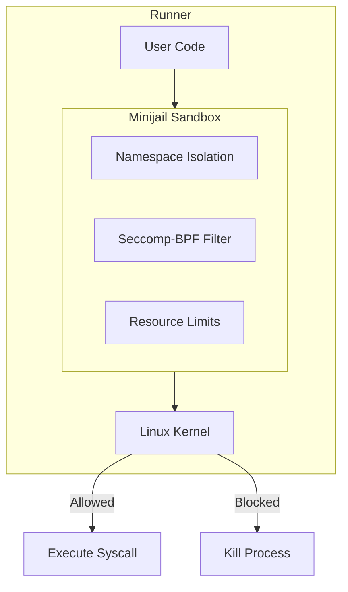
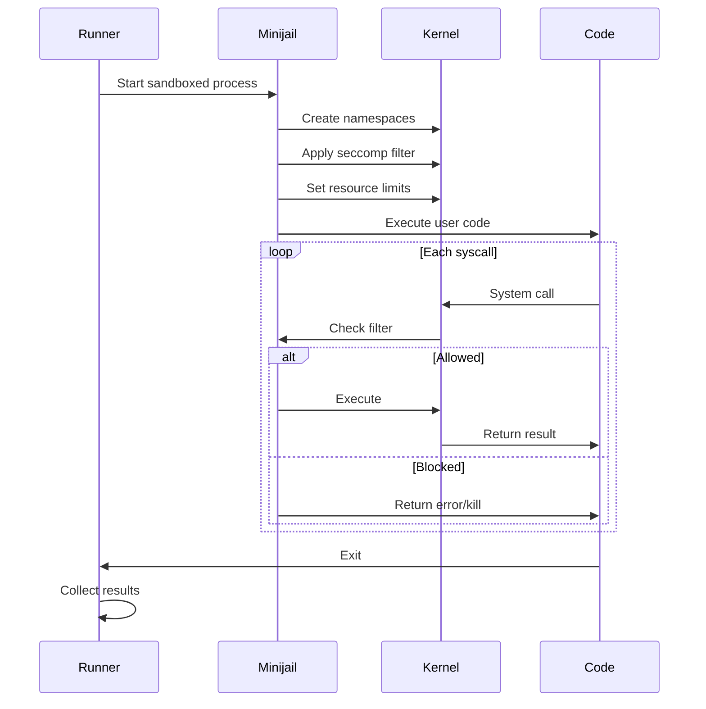

# Caja de arena

omegaUp utiliza **Minijail**, una herramienta de espacio aislado desarrollada originalmente por Google para Chrome OS, para ejecutar de forma segura el código enviado por el usuario. La zona de pruebas proporciona un aislamiento sólido para evitar que el código malicioso afecte al sistema.

## Descripción general

El sandbox intercepta y controla todas las interacciones del sistema desde el código de usuario, asegurando:

- **Aislamiento de procesos**: el código se ejecuta en espacios de nombres aislados
- **Filtrado de llamadas al sistema**: se bloquean las llamadas peligrosas al sistema
- **Límites de recursos**: la memoria, la CPU y el acceso a archivos están restringidos
- **Bloqueo de red**: No hay acceso a la red desde el código enviado

## Arquitectura


## Capas de seguridad

### 1. Espacios de nombres de Linux

Minijail usa espacios de nombres para aislar el proceso:

| Espacio de nombres | Aislamiento proporcionado |
|-----------|-------------------|
| **PID** | Aislamiento de ID de proceso: no puedo ver otros procesos |
| **NETO** | Aislamiento de red: sin acceso a la red |
| **MNT** | Aislamiento de montaje: vista restringida del sistema de archivos |
| **IPC** | Aislamiento de comunicación entre procesos |
| **USUARIO** | Mapeo de ID de usuario: se ejecuta como usuario sin privilegios |
| **UTS** | Aislamiento de nombre de host |

### 2. Filtrado Seccomp-BPF

Las llamadas al sistema se filtran mediante seccomp-BPF:

```c
// Allowed syscalls (essential for execution)
read, write, open, close, fstat, mmap, mprotect, 
munmap, brk, exit_group, arch_prctl, access, 
execve, getpid, getuid, getgid, geteuid, getegid

// Blocked syscalls (dangerous operations)
socket, connect, bind, listen, accept,  // No networking
fork, clone, vfork,                      // No process creation
kill, tkill, tgkill,                     // No signal sending
ptrace,                                  // No debugging
mount, umount, pivot_root,               // No filesystem changes
```
### 3. Límites de recursos

Límites aplicados usando `setrlimit`:

| Recurso | Límite típico | Propósito |
|----------|--------------|---------|
| **Tiempo de CPU** | 1-60 segundos | Evitar bucles infinitos |
| **Memoria** | 256MB | Prevenir el agotamiento de la memoria |
| **Tamaño de archivo** | 64MB | Limitar la producción |
| **Abrir archivos** | 20 | Evitar el agotamiento de los descriptores de archivos |
| **Procesos** | 1 | Sin bifurcación |
| **Tamaño de pila** | 8 megas | Evitar el desbordamiento de la pila |

## Manejo de llamadas al sistema

El sandbox puede manejar llamadas al sistema de tres maneras:

### Permitir

Las llamadas al sistema inofensivas proceden normalmente:

```
read() → Allow (needed for input)
write() → Allow (needed for output)
mmap() → Allow (needed for memory allocation)
```
### Bloquear/Matar

Llamadas al sistema peligrosas finalizan el proceso:

```
socket() → EPERM (no networking)
fork() → EPERM (no process creation)
ptrace() → SIGKILL (no debugging)
```
### Reemplazar/Emular

Algunas llamadas al sistema se reemplazan con alternativas seguras:

```
getpid() → Returns fixed value
gettimeofday() → Returns controlled time
```
## Flujo de ejecución


## Aislamiento del sistema de archivos

### Caminos visibles

El código de usuario solo puede ver:

```
/usr/lib/          # Shared libraries (read-only)
/lib/              # System libraries (read-only)
/tmp/              # Temporary files (read-write, limited)
/dev/null          # Null device
/dev/urandom       # Random numbers (limited)
```
### Caminos ocultos

Protegido del código de usuario:

```
/home/             # User data
/etc/              # System configuration
/proc/             # Process information (mostly)
/sys/              # System information
/var/              # Variable data
```
## Configuraciones específicas del idioma

Diferentes idiomas requieren diferentes perfiles de sandbox:

### C/C++

```
Syscalls: minimal set
Filesystem: standard libraries only
Memory: direct allocation
```
###Java

```
Syscalls: extended for JVM
Filesystem: JRE paths added
Memory: JVM heap management
```
### Pitón

```
Syscalls: interpreter requirements
Filesystem: Python stdlib paths
Memory: interpreter overhead
```
### Idiomas interpretados

Consideraciones adicionales:

- Binarios de intérprete accesibles
- Bibliotecas estándar en la ruta
- Restricciones de importación de módulos.

## Configuración de la minicárcel

### Opciones de línea de comando

```bash
minijail0 \
    -c 0                    # No capabilities
    -n                      # No new privileges
    -v                      # Mount namespace
    -p                      # PID namespace
    -l                      # IPC namespace
    -e                      # Network namespace
    -r                      # Remount /proc read-only
    -t                      # Mount tmpfs at /tmp
    -b /usr/lib,/usr/lib,0  # Bind mount (read-only)
    -S /path/to/policy.bpf  # Seccomp policy
    -T static               # Static seccomp
    -- /path/to/program     # Program to run
```
### Archivo de política Seccomp

```bpf
# policy.bpf - Example seccomp policy
read: 1
write: 1
open: 1
close: 1
fstat: 1
mmap: arg2 in ~0x4  # No PROT_EXEC with PROT_WRITE
munmap: 1
brk: 1
exit_group: 1
```
## Detección de errores

### Señales de error en tiempo de ejecución

| Señal | Significado | Causa común |
|--------|---------|--------------|
| SIGSEGV | Fallo de segmentación | Acceso a memoria no válido |
| SIGFPE | Excepción de coma flotante | División por cero |
| SIGABRT | Abortar | Fallo de afirmación |
| SIGKILL | Asesinado | Violación de llamada al sistema |
| SIGXCPU | Se superó el tiempo de CPU | Bucle infinito |

### Violaciones de la zona de pruebas

Detectado y reportado como RTE con detalles:

```
Syscall violation: socket (blocked)
Memory limit exceeded: 267386880 > 268435456
Time limit exceeded: 1.023s > 1.000s
```
## Comparación con alternativas

| Característica | Minicárcel | acoplador | chroot | ruta |
|---------|----------|--------|--------|--------|
| Arriba | Muy bajo | Bajo | Muy bajo | Alto |
| Aislamiento | Fuerte | Fuerte | Débil | Medio |
| Filtro de llamada al sistema | Sí | Sí | No | Sí |
| Soporte de espacio de nombres | Sí | Sí | No | No |
| Límites de recursos | Sí | Sí | No | No |
| Complejidad de configuración | Medio | Bajo | Bajo | Alto |

## Consideraciones de seguridad

### Defensa en profundidad

El sandbox es una capa de múltiples medidas de seguridad:

1. **Sandbox** (Minijail) - Aislamiento de procesos
2. **Contenedor** (Docker): aislamiento de servicios  
3. **Red** - Reglas de firewall
4. **Autenticación** - Control de acceso

### Limitaciones conocidas

- No se pueden prevenir todos los ataques de sincronización
- Alguna fuga de información a través del uso de recursos.
- Requiere características del kernel de Linux

### Prevención de fugas

Las auditorías de seguridad periódicas comprueban:

- Omisiones del filtro de llamada al sistema
- Técnicas de escape de espacios de nombres.
- Elusión del límite de recursos

## Solución de problemas

### Problemas comunes

**Error al inicializar el entorno de pruebas**:
```bash
# Check kernel capabilities
cat /proc/sys/kernel/unprivileged_userns_clone
# Should be 1
```
**La llamada al sistema se bloqueó inesperadamente**:
```bash
# Run with verbose logging
minijail0 -L -- /path/to/program
```
**Problemas con el límite de memoria**:
```bash
# Check cgroup limits
cat /sys/fs/cgroup/memory/omegaup/memory.limit_in_bytes
```
## Documentación relacionada

- **[Runner Internals](../architecture/runner-internals.md)** - Detalles de ejecución del código
- **[Grader Internals](../architecture/grader-internals.md)** - Procesamiento de envíos
- **[Seguridad](../architecture/security.md)** - Arquitectura de seguridad general
- **[Veredictos](verdicts.md)** - Comprender los resultados de la ejecución
