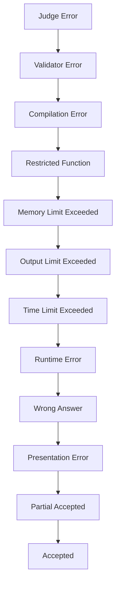

# Veredictos y puntuación

Esta página documenta todos los tipos de veredicto emitidos por el sistema de jueces omegaUp y explica los diferentes modelos de puntuación disponibles para concursos y problemas.

## Tipos de veredicto

### Veredictos de éxito

| Veredicto | Código | Descripción |
|---------|------|-------------|
| **Aceptado** | `AC` | Todos los casos de prueba pasaron |
| **Parcialmente aceptado** | `PA` | Algunos casos de prueba pasaron |

### Veredictos de respuesta incorrecta

| Veredicto | Código | Descripción |
|---------|------|-------------|
| **Respuesta incorrecta** | `WA` | El resultado no coincide con lo esperado |
| **Error de presentación** | `PE` | Problemas con el formato de salida (espacios en blanco adicionales, etc.) |

### Veredictos en tiempo de ejecución

| Veredicto | Código | Descripción |
|---------|------|-------------|
| **Error de tiempo de ejecución** | `RTE` | El programa falló (error de segmento, excepción, etc.) |
| **Límite de tiempo excedido** | `TLE` | Límite de tiempo excedido |
| **Límite de memoria excedido** | `MLE` | Límite de memoria excedido |
| **Límite de salida excedido** | `OLE` | Se genera demasiada producción |
| **Función restringida** | `RFE` | Llamada al sistema prohibida usada |

### Veredictos de compilación

| Veredicto | Código | Descripción |
|---------|------|-------------|
| **Error de compilación** | `CE` | No se pudo compilar |

### Veredictos del sistema

| Veredicto | Código | Descripción |
|---------|------|-------------|
| **Error del juez** | `JE` | Error de calificación interno |
| **Error del validador** | `VE` | El validador personalizado falló |

## Jerarquía de veredictos

Cuando varios casos de prueba tienen veredictos diferentes, el veredicto general sigue esta prioridad:


## Modelos de puntuación

### Todo o nada (`all_or_nothing`)

Puntos otorgados sólo por la solución completa:

```
Score = 100% if ALL cases pass
Score = 0%   otherwise
```
Lo mejor para:
- Problemas simples
- Problemas estilo IOI donde no se desea un crédito parcial

### Crédito parcial (`partial`)

Puntos proporcionales a los casos superados:

```
Score = (passing_cases / total_cases) × max_points
```
Lo mejor para:
- Problemas con casos de prueba independientes.
- Entornos educativos

### Máximo por grupo (`max_per_group`)

Puntos basados en grupos de casos de prueba:

```
Group Score = max_points × (passing_cases_in_group / total_cases_in_group)
Total Score = sum(Group Scores weighted by group weights)
```
Lo mejor para:
- Problemas con subtareas
- Problemas estilo IOI con puntuación parcial

## Grupos de casos de prueba

### Definición de grupo

Los grupos se definen en `settings.json` o se deducen de los nombres de archivos:

```json
{
  "Cases": [
    {
      "Name": "small",
      "Cases": ["1", "2", "3"],
      "Weight": 30
    },
    {
      "Name": "large",
      "Cases": ["4", "5", "6"],
      "Weight": 70
    }
  ]
}
```
### Agrupación automática

Sin grupos explícitos, los casos se agrupan por prefijo de nombre de archivo:

```
small.1.in  → Group "small"
small.2.in  → Group "small"
large.1.in  → Group "large"
large.2.in  → Group "large"
```
### Archivo del plan de prueba

Agrupación alternativa vía `testplan`:

```
# Format: group_name weight
small 30
large 70

# Test cases (order matters for display)
small.1
small.2
small.3
large.1
large.2
large.3
```
## Modelos de penalización

### Sin penalización (`none`)

La puntuación se basa exclusivamente en la corrección:

```
Final Score = Best Score
```
### Penalización de tiempo de ejecución (`runtime`)

Puntuación penalizada por tiempo de ejecución:

```
Final Score = Points × (1 - time_factor)
```
Donde `time_factor` se basa en el tiempo de ejecución relativo.

### Penalización por recuento de envíos (`submission_count`)

Penalización estilo ICPC:

```
Penalty = Σ(wrong_submissions × penalty_minutes + solve_time)
```
## Puntuación del concurso

### Estilo IOI

- Crédito parcial permitido
- El mejor envío cuenta
- No hay penalización por envío incorrecto

```
Total = Σ(max_score_per_problem)
```
### Estilo CIPC

- Todo o nada por problema
- Tiempo + penalización por envío incorrecto
- Problemas que valen la misma puntuación.

```
Solved = count(AC_problems)
Penalty = Σ(solve_time + wrong_attempts × 20)
Rank by: Solved DESC, Penalty ASC
```
### Puntuación personalizada

Configurable por concurso:

| Configuración | Opciones |
|---------|---------|
| `score_mode` | `all_or_nothing`, `partial`, `max_per_group` |
| `penalty` | `none`, `runtime`, `submission_count` |
| `penalty_calc_policy` | `sum`, `max` |

## Visualización del marcador

### Representación de puntuación

| Formato | Ejemplo | Cuando se usa |
|--------|---------|-----------|
| Puntos | `100.00` | Puntuación parcial |
| Fracción | `3/5` | Todo o nada |
| Hora | `45:30` | Penalización del CIPC |
| Combinado | `100 (+2)` | IOI con intentos |

### Codificación de colores

| Color | Significado |
|-------|---------|
| 🟢 Verde | Aceptado / Puntuación completa |
| 🟡 Amarillo | Puntuación parcial |
| 🔴 Rojo | Sin puntuación / Respuesta incorrecta |
| ⚪ Gris | Pendiente de sentencia |

## Detalles del veredicto

### Señales de error en tiempo de ejecución

| Señal | Descripción |
|--------|-------------|
| SIGSEGV (11) | Fallo de segmentación |
| SIGFPE (8) | Excepción de coma flotante |
| SIGABRT (6) | Abortar (aserción fallida) |
| SIGKILL (9) | Asesinado por el sistema |

### Notas sobre el límite de tiempo

- **Tiempo de CPU**: tiempo de cálculo real
- **Wall Time**: tiempo real transcurrido (normalmente 2× límite de CPU)
- TLE puede resultar de:
  - Algoritmo lento
  - Bucle infinito
  - E/S excesiva

### Notas sobre el límite de memoria

- Medido a través de cgroups (RSS máximo)
- Incluye:
  - Asignaciones de montón
  - Uso de la pila
  - Variables estáticas
- NO incluye:
  - Bibliotecas compartidas
  - segmento de código

## Validadores personalizados

### Interfaz del validador

Los validadores personalizados reciben:

```bash
./validator <input_file> <expected_output> <user_output> <score_limit>
```
Y salida:

```
<score>
<message>
```
Donde `score` está entre 0,0 y 1,0.

### Casos de uso

- Tolerancia de punto flotante
- Múltiples salidas válidas
- Verificación interactiva
- Lógica de crédito parcial

## Mejores prácticas

### Para quienes plantean problemas

1. **Utilice grupos significativos**: casos de prueba relacionados con grupos
2. **Equilibrar pesos**: asegúrese de que las subtareas tengan la dificultad adecuada
3. **Incluir casos extremos**: condiciones de contorno de prueba
4. **Establezca límites apropiados**: no establezca límites demasiado estrictos ni demasiado flexibles

### Para concursantes

1. **Verifique todos los veredictos**: lea atentamente los mensajes de veredicto
2. **Comprender la puntuación**: saber si hay crédito parcial disponible
3. **Optimizar incrementalmente**: obtenga primero una puntuación parcial y luego optimice
4. **Esté atento a los casos extremos**: fuente común de WA

## Documentación relacionada

- **[Grader Internals](../architecture/grader-internals.md)** - Cómo se determinan los veredictos
- **[Runner Internals](../architecture/runner-internals.md)** - Detalles de ejecución
- **[API de problemas](../api/problems.md)** - Configuración de problemas
- **[API de concursos](../api/contests.md)** - Configuración de puntuación del concurso
