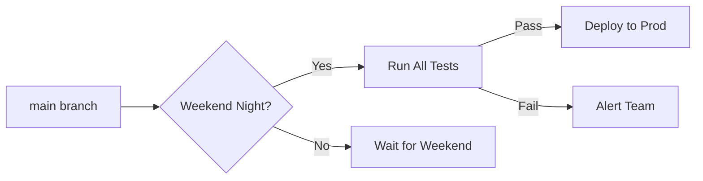
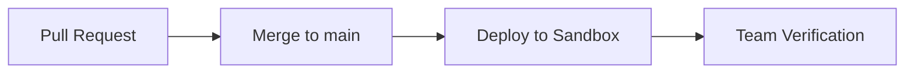
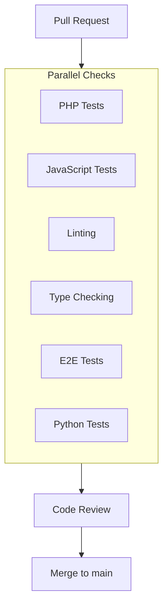
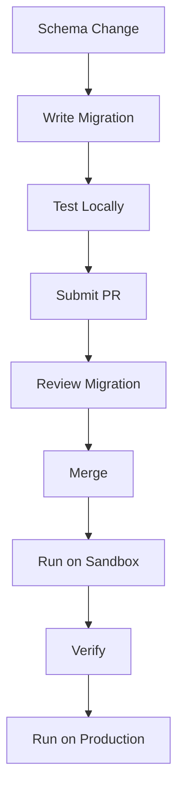

# Lanzamiento e implementación

omegaUp utiliza GitHub Actions para una integración continua e implementaciones automatizadas. Esta guía cubre el proceso de implementación, los entornos y los procedimientos de lanzamiento.

## Entornos de implementación

### Producción

| Atributo | Valor |
|-----------|---------------|
| **URL** | [omegaup.com](https://omegaup.com) |
| **Horario** | Noches automáticas de fin de semana (hora del centro de México) |
| **Disparador** | Acción programada de GitHub |
| **Requisitos** | Todas las pruebas pasan, sin problemas de bloqueo |

Las implementaciones de producción están programadas para minimizar el impacto en los usuarios:


### Sandbox (puesta en escena)

| Atributo | Valor |
|-----------|---------------|
| **URL** | [sandbox.omegaup.com](https://sandbox.omegaup.com) |
| **Disparador** | Cada fusión con la sucursal `main` |
| **Propósito** | Pruebas de preproducción |
| **Datos** | Subconjunto de datos de producción |

Las implementaciones de Sandbox se realizan automáticamente:


### Correcciones

Para problemas críticos de producción:

| Atributo | Valor |
|-----------|---------------|
| **Disparador** | Implementación manual |
| **Proceso** | Se requiere validación interna |
| **Aprobación** | 2 miembros del equipo mínimo |

## Canalización de CI/CD

### Comprobaciones de solicitud de extracción

Cada RP debe pasar estas comprobaciones antes de fusionarse:


### Conjuntos de pruebas

| Suite | Herramienta | Cobertura | Hora |
|-------|------|----------|------|
| Pruebas unitarias de PHP | Unidad PHP | Controladores, bibliotecas | ~5 minutos |
| Pruebas de JavaScript | Broma | Componentes de Vue | ~3 minutos |
| Pruebas de un extremo a otro | Ciprés | Flujos críticos | ~15 minutos |
| Pruebas de Python | pytest | Cronjobs, scripts | ~2 minutos |
| Tipo de cheques | Salmo | Tipos de PHP | ~2 minutos |
| pelusa | ESLint, PHP-CS-Fixer | Estilo | ~1 minuto |

### Reglas de pelusa

Estándares aplicados:

```yaml
# PHP
- PSR-12 coding standard
- Strict types required
- Psalm type annotations

# TypeScript
- ESLint strict mode
- Prettier formatting
- No any types (where possible)

# Python
- PEP 8 style
- Type hints required
```
## Cobertura de código

Usamos **Codecov** para realizar un seguimiento de la cobertura de las pruebas:

| Idioma | Cobertura actual | Objetivo |
|----------|-----------------|--------|
| PHP | ~70% | 80% |
| Mecanografiado | ~60% | 70% |
| Ciprés E2E | No medido | Por determinar |

Requisitos de cobertura:

- Los RP no deberían disminuir la cobertura
- El nuevo código debe tener pruebas.
- Las rutas críticas requieren >80% de cobertura

## Proceso de implementación

### Implementación de producción automatizada

```yaml
# .github/workflows/deploy-production.yml (simplified)
name: Deploy Production

on:
  schedule:
    - cron: '0 6 * * 0'  # Sunday 6 AM UTC (midnight CDT)

jobs:
  deploy:
    runs-on: ubuntu-latest
    steps:
      - name: Run All Tests
        run: ./stuff/run-tests.sh
        
      - name: Build Assets
        run: yarn build
        
      - name: Deploy to Production
        run: ./stuff/deploy.sh production
        
      - name: Smoke Tests
        run: ./stuff/smoke-tests.sh
        
      - name: Notify Team
        run: ./stuff/notify.sh
```
### Implementación manual de revisiones

1. **Crear rama de revisión**:
   ```bash
   git checkout -b hotfix/critical-bug main
   ```
2. **Aplicar corrección y prueba**:
   ```bash
   # Make changes
   ./stuff/run-tests.sh
   ```
3. **Solicitar aprobación**:
   - Crear PR con etiqueta `hotfix`
   - Obtener 2 aprobaciones

4. **Implementar manualmente**:
   ```bash
   ./stuff/deploy.sh production --hotfix
   ```
## Lista de verificación de implementación

### Pre-implementación

- [] Todas las comprobaciones de CI pasan
- [] Revisión de código aprobada
- [] Migraciones de bases de datos probadas
- [] No hay problemas de bloqueo en el trabajo pendiente
- [] Plan de reversión documentado

### Post-implementación

- [ ] Pasan las pruebas de humo
- [] Monitorear tasas de error
- [] Verificar métricas clave
- [ ] Verificar flujos críticos
- [] Actualizar página de estado

## Migraciones de bases de datos

### Proceso de migración


### Mejores prácticas

1. **Compatible con versiones anteriores**: las migraciones no deberían interrumpir el código en ejecución
2. **Reversible**: Incluye migración hacia abajo
3. **Pequeños cambios**: un cambio de esquema por migración
4. **Probado**: ejecutar localmente antes de PR

```php
// Example migration
class AddUserPreferences extends Migration {
    public function up() {
        $this->execute('
            ALTER TABLE Users 
            ADD COLUMN preferences JSON DEFAULT NULL
        ');
    }
    
    public function down() {
        $this->execute('
            ALTER TABLE Users 
            DROP COLUMN preferences
        ');
    }
}
```
## Procedimientos de reversión

### Reversión rápida

Si se detectan problemas inmediatamente:

```bash
# Revert to previous deployment
./stuff/deploy.sh production --rollback

# Verify rollback
./stuff/smoke-tests.sh
```
### Reversión de la base de datos

Si la migración causó problemas:

```bash
# Run down migration
docker-compose exec frontend php stuff/database/migrate.php down

# Verify schema
docker-compose exec mysql mysql -u omegaup -p omegaup -e "DESCRIBE Users"
```
## Monitoreo después de la implementación

### Métricas clave a tener en cuenta

| Métrica | Normales | Advertencia | Crítico |
|--------|--------|---------|----------|
| Tasa de errores | <0.1% | >1% | >5% |
| Tiempo de respuesta (p95) | <500ms | >1s | >3s |
| Longitud de la cola | <10 | >50 | >100 |

### Alertas

Se activan alertas automáticas para:

- Aumento de la tasa de error (>5 veces lo normal)
- Degradación del tiempo de respuesta
- Indisponibilidad del servicio
- Problemas de conexión a la base de datos

## Documentación relacionada

- **[Monitoreo](monitoring.md)** - Configuración de monitoreo
- **[Solución de problemas](troubleshooting.md)** - Problemas comunes
- **[Configuración de Docker](docker-setup.md)** - Configuración del contenedor
- **[Pruebas](../development/testing.md)** - Directrices de prueba
