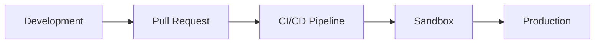

# Operaciones

Guías para implementar, monitorear y mantener omegaUp en entornos de desarrollo y producción.

## Navegación rápida

| Guía | Descripción |
|-------|-------------|
| [Implementación](deployment.md) | Proceso de liberación y procedimientos de implementación |
| [Configuración de Docker](docker-setup.md) | Desarrollo local con Docker Compose |
| [Configuración de Nginx](nginx-configuration.md) | Instalación y configuración del servidor web |
| [Monitoreo](monitoring.md) | Monitoreo y alerta del sistema |
| [Solución de problemas](troubleshooting.md) | Problemas comunes y soluciones |

## Descripción general del entorno

| Medio ambiente | Propósito | URL |
|-------------|---------|-----|
| **Locales** | Desarrollo | `localhost:8001` |
| **Caja de arena** | Pruebas de preproducción | `sandbox.omegaup.com` |
| **Producción** | Sistema en vivo | `omegaup.com` |

## Guías de implementación

### [Lanzamiento e implementación](deployment.md)

Conozca el proceso de implementación de omegaUp:

- Canalización de CI/CD con GitHub Actions
- Implementaciones automatizadas de fin de semana
- Procedimientos de revisión
- Estrategias de reversión

### [Configuración de Docker](docker-setup.md)

Configure su entorno de desarrollo local:

- Configuración de composición de Docker
- Arquitectura de servicio
- Gestión de volumen
- Comandos comunes

## Guías de infraestructura

### [Configuración de Nginx](nginx-configuration.md)

Configuración del servidor web que incluye:

- Configuraciones de desarrollo versus producción.
- Proxy PHP-FPM
- Configuración de WebSocket
- Configuración SSL/TLS
- Limitación de tasa

### [Monitoreo](monitoring.md)

Realice un seguimiento del estado del sistema:

- Métricas de Prometeo
- Tableros de Grafana
- Configuración de alerta
- Agregación de registros

## Guías de soporte

### [Solución de problemas](troubleshooting.md)

Resuelve problemas comunes:

- Problemas con Docker
- Problemas de base de datos
- Fallos de construcción
- Depuración de producción

## Documentación relacionada

- **[Arquitectura](../architecture/index.md)** - Detalles de la arquitectura del sistema
- **[Infraestructura](../architecture/infrastructure.md)** - Redis, RabbitMQ, servicios
- **[Configuración de desarrollo](../getting-started/development-setup.md)** - Guía de introducción
- **[Seguridad](../architecture/security.md)** - Configuración de seguridad
