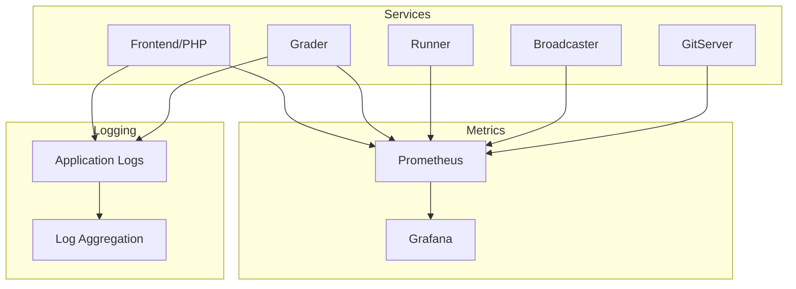

# Monitoreo

omegaUp utiliza varias herramientas de monitoreo para rastrear el estado, el rendimiento y la confiabilidad del sistema en todos los servicios.

## Descripción general


## Colección de métricas

### Métricas de calificación

Grader expone métricas en el puerto `6060`:

```bash
curl http://grader:6060/metrics
```
**Métricas clave**:

| Métrica | Tipo | Descripción |
|--------|------|-------------|
| `grader_queue_length` | Calibre | Número de envíos en cola |
| `grader_queue_total_wait_time_seconds` | Histograma | Tiempo que los envíos pasan en cola |
| `grader_runs_total` | Mostrador | Ejecuciones totales procesadas |
| `grader_run_duration_seconds` | Histograma | Tiempo para procesar cada ejecución |
| `grader_runners_available` | Calibre | Número de corredores disponibles |
| `grader_runners_total` | Calibre | Total de corredores inscritos |

### Métricas del corredor

Cada corredor informa su estado al evaluador:

| Métrica | Descripción |
|--------|-------------|
| `runner_cpu_usage` | Utilización actual de la CPU |
| `runner_memory_usage` | Consumo de memoria |
| `runner_executions_total` | Ejecuciones totales realizadas |
| `runner_compilation_errors` | Fallos de compilación |

### Métricas de aplicación (PHP)

Seguimiento de las métricas de la aplicación PHP:

| Métrica | Descripción |
|--------|-------------|
| `http_requests_total` | Total de solicitudes HTTP por punto final |
| `http_request_duration_seconds` | Solicitar histograma de latencia |
| `api_errors_total` | Recuento de errores de API por tipo |
| `db_query_duration_seconds` | Tiempos de consulta de la base de datos |
| `cache_hits_total` | Tasa de aciertos de la caché de Redis |

## Configuración de Prometeo

Ejemplo de configuración de raspado de Prometheus:

```yaml
# prometheus.yml
global:
  scrape_interval: 15s
  evaluation_interval: 15s

scrape_configs:
  - job_name: 'grader'
    static_configs:
      - targets: ['grader:6060']
    
  - job_name: 'broadcaster'
    static_configs:
      - targets: ['broadcaster:6061']
    
  - job_name: 'gitserver'
    static_configs:
      - targets: ['gitserver:6062']
    
  - job_name: 'frontend'
    static_configs:
      - targets: ['frontend:9090']
```
## Paneles clave

### Panel de control del calificador

Supervisar el procesamiento de envíos:

- **Profundidad de la cola**: envíos actuales en espera
- **Tasa de procesamiento**: ejecuciones por minuto
- **Utilización del corredor**: corredores activos versus inactivos
- **Distribución de veredicto**: desglose de AC/WA/TLE
- **Tiempo de espera promedio**: Tiempo en cola

### Panel del concurso

Durante concursos en vivo:

- **Participantes activos**: usuarios que actualmente envían
- **Tasa de envío**: Envíos por minuto
- **Actualizaciones del marcador**: frecuencia de actualización
- **Cola de Aclaraciones**: Aclaraciones pendientes

### Panel de infraestructura

Descripción general del estado del sistema:

- **Uso de CPU/memoria**: por servicio
- **E/S de disco**: base de datos y almacenamiento de problemas
- **Tráfico de red**: comunicación entre servicios
- **Tasas de error**: 5xx respuestas, tiempos de espera

## Reglas de alerta

### Alertas críticas

```yaml
# alerts.yml
groups:
  - name: critical
    rules:
      - alert: GraderQueueBacklog
        expr: grader_queue_length > 100
        for: 5m
        labels:
          severity: critical
        annotations:
          summary: "Grader queue backlog detected"
          description: "Queue has {{ $value }} pending submissions"
      
      - alert: NoRunnersAvailable
        expr: grader_runners_available == 0
        for: 1m
        labels:
          severity: critical
        annotations:
          summary: "No runners available"
          
      - alert: HighErrorRate
        expr: rate(api_errors_total[5m]) > 10
        for: 2m
        labels:
          severity: warning
        annotations:
          summary: "High API error rate"
```
### Alertas de advertencia

```yaml
      - alert: HighQueueLatency
        expr: histogram_quantile(0.95, grader_queue_total_wait_time_seconds) > 60
        for: 10m
        labels:
          severity: warning
        annotations:
          summary: "High queue wait time"
      
      - alert: DatabaseSlowQueries
        expr: histogram_quantile(0.99, db_query_duration_seconds) > 1
        for: 5m
        labels:
          severity: warning
```
## Registro

### Ubicaciones de registros

| Servicio | Ubicación del registro |
|---------|--------------|
| Interfaz (PHP) | `/var/log/omegaup/frontend.log` |
| Calificador | `/var/log/omegaup/grader.log` |
| Corredor | `/var/log/omegaup/runner.log` |
| Nginx | `/var/log/nginx/access.log`, `/var/log/nginx/error.log` |
| MySQL | `/var/log/mysql/error.log` |

### Formato de registro

Registro JSON estructurado:

```json
{
  "timestamp": "2025-01-23T10:30:00Z",
  "level": "INFO",
  "service": "grader",
  "message": "Run completed",
  "run_id": 12345,
  "verdict": "AC",
  "duration_ms": 450,
  "runner": "runner-1"
}
```
### Agregación de registros

Registro centralizado con pila ELK:

```yaml
# filebeat.yml
filebeat.inputs:
  - type: log
    enabled: true
    paths:
      - /var/log/omegaup/*.log
    json.keys_under_root: true
    
output.elasticsearch:
  hosts: ["elasticsearch:9200"]
  index: "omegaup-%{+yyyy.MM.dd}"
```
## Controles de salud

### Puntos finales de estado del servicio

| Servicio | Punto final | Respuesta esperada |
|---------|----------|-------------------|
| Interfaz | `GET /health/` | `200 OK` |
| Calificador | `GET /grader/status/` | JSON con información de cola |
| MySQL | Comprobación TCP en 3306 | Conexión exitosa |
| Redis | `PING` | `PONG` |

### Comprobaciones de estado de Docker

```yaml
services:
  frontend:
    healthcheck:
      test: ["CMD", "curl", "-f", "http://localhost/health/"]
      interval: 30s
      timeout: 10s
      retries: 3
      start_period: 40s
  
  mysql:
    healthcheck:
      test: ["CMD", "mysqladmin", "ping", "-h", "localhost"]
      interval: 10s
      timeout: 5s
      retries: 5
```
## Líneas base de desempeño

### Métricas esperadas (funcionamiento normal)

| Métrica | Rango normal | Advertencia | Crítico |
|--------|--------------|---------|----------|
| Longitud de la cola | 0-10 | >50 | >100 |
| Tiempo de espera en cola | <10s | >30s | >60 años |
| Latencia API (p95) | <200ms | >500ms | >1s |
| Tasa de errores | <0.1% | >1% | >5% |
| Utilización del corredor | 20-80% | >90% | 100% |

## Solución de problemas con métricas

### Envíos lentos

1. Verifique `grader_queue_length`: ¿acumulación de colas?
2. Verifique `grader_runners_available`: ¿suficientes corredores?
3. Verifique `grader_run_duration_seconds`: ¿problemas de lentitud?

### Altas tasas de error

1. Verifique `api_errors_total` por tipo de error
2. Verifique `db_query_duration_seconds`: ¿problemas con la base de datos?
3. Verifique los registros de servicio para detectar seguimientos de pila

### Problemas de memoria

1. Verifique los límites de memoria del contenedor
2. Revisar las métricas de `cache_size_bytes`
3. Compruebe si hay pérdidas de memoria en procesos de larga duración.

## Documentación relacionada

- **[Solución de problemas](troubleshooting.md)** - Problemas comunes y soluciones
- **[Infraestructura](../architecture/infrastructure.md)** - Arquitectura del servicio
- **[Implementación](deployment.md)** - Proceso de implementación
