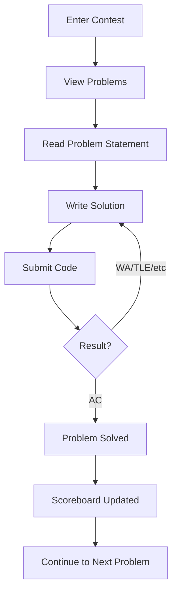

# Arena

Arena is the contest interface where participants solve problems during competitions. It provides a real-time problem-solving environment with live scoreboard updates.

## Features

- **Problem Display**: View problem statements, constraints, and examples
- **Code Editor**: Monaco editor with syntax highlighting
- **Submission**: Submit solutions and view results
- **Scoreboard**: Real-time contest rankings
- **Clarifications**: Ask and view contest clarifications
- **Timer**: Contest countdown timer

## User Flow

## Related Documentation

- **[Contests](contests/index.md)** - Contest management
- **[Problems](problems/index.md)** - Problem creation
- **[API Reference](../api/index.md)** - Arena API endpoints
